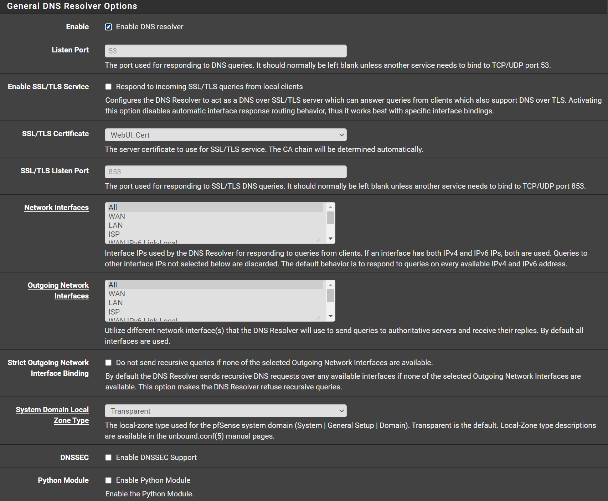
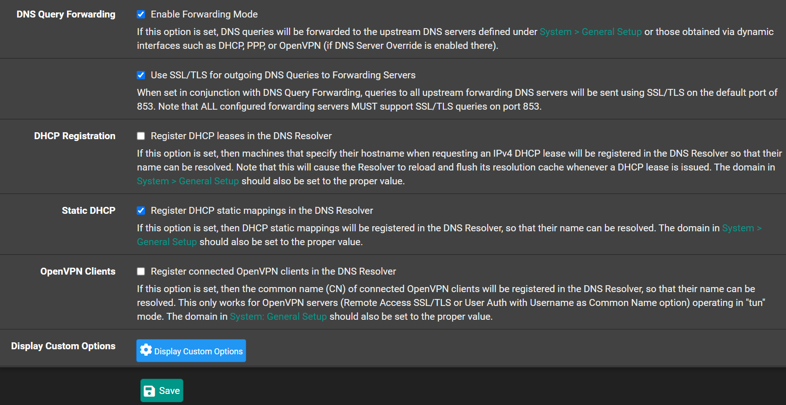

# Configuration

## General

Navigate to `Services` -> `DNS Resolver` -> `General Settings`

- Check `Enable DNS Resolver`
- Uncheck `Enable DNSSEC Support`
- Check `Enable Forwarding Mode`
- Check `Use SSL/TLS for outgoing DNS Queries to Forwarding Servers`
- Check `Register DHCP static mappings in the DNS Resolver`
- Click <kbd>💾Save</kbd>
- Click <kbd>✔️Apply Changes</kbd>

## Advanced

Navigate to `Services` -> `DNS Resolver` -> `Advanced Settings`

- Check `Prefetch Support`
- Uncheck `Harden DNSSEC Data`
- Check `Serve Expired`
- `Message Cache Size`: 50MB
- `Number of Hosts to Cache`: 20000
- Click <kbd>💾Save</kbd>
- Click <kbd>✔️Apply Changes</kbd>

