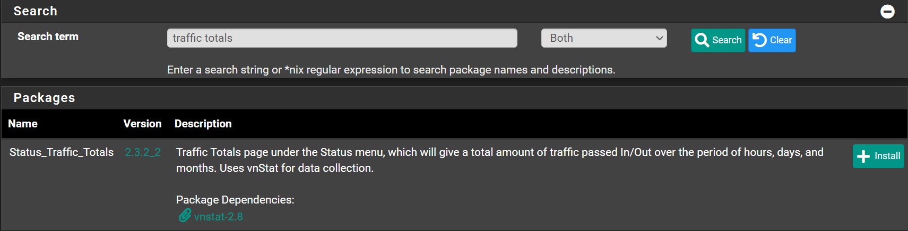

# Installation

Navigate to `System` -> `Package Manager` -> `Available Packages`

Search for `traffic totals` and click <kbd>➕Install</kbd>



Click <kbd>✔️Confirm</kbd>

Wait until you see `Success`

```shell
>>> Installing pfSense-pkg-Status_Traffic_Totals...
Updating pfSense-core repository catalogue...
pfSense-core repository is up to date.
Updating pfSense repository catalogue...
pfSense repository is up to date.
All repositories are up to date.
The following 2 package(s) will be affected (of 0 checked):

New packages to be INSTALLED:
  pfSense-pkg-Status_Traffic_Totals: 2.3.2_2 [pfSense]
  vnstat: 2.8 [pfSense]

Number of packages to be installed: 2

130 KiB to be downloaded.
[1/2] Fetching pfSense-pkg-Status_Traffic_Totals-2.3.2_2.pkg: .. done
[2/2] Fetching vnstat-2.8.pkg: .......... done
Checking integrity... done (0 conflicting)
[1/2] Installing vnstat-2.8...
===> Creating groups.
Creating group 'vnstat' with gid '284'.
===> Creating users
Creating user 'vnstat' with uid '284'.
[1/2] Extracting vnstat-2.8: .......... done
[2/2] Installing pfSense-pkg-Status_Traffic_Totals-2.3.2_2...
[2/2] Extracting pfSense-pkg-Status_Traffic_Totals-2.3.2_2: .......... done
Saving updated package information...
done.
Loading package configuration... done.
Configuring package components...
Loading package instructions...
Custom commands...
Executing custom_php_install_command()...done.
Executing custom_php_resync_config_command()...done.
Menu items... done.
Services... done.
Writing configuration... done.
=====
Message from vnstat-2.8:

--
vnstat has been installed.

A sample configuration file has been installed in /usr/local/etc/
Please add your default network interface in the 'Interface' line there
before starting vnstat service.

For more information about vnStat use "man vnstat" or visit:
http://humdi.net/vnstat/
>>> Cleaning up cache... done.
Success
```
