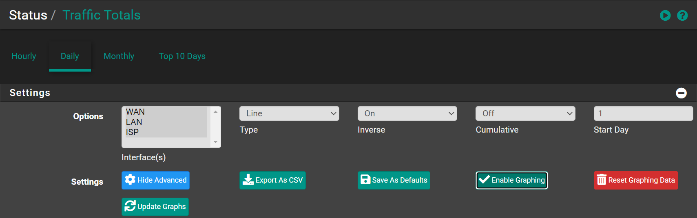
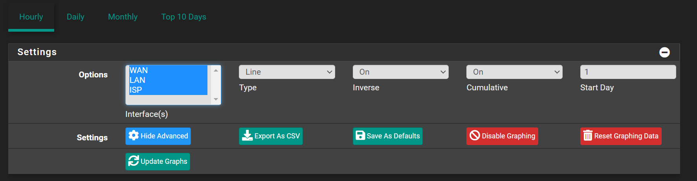
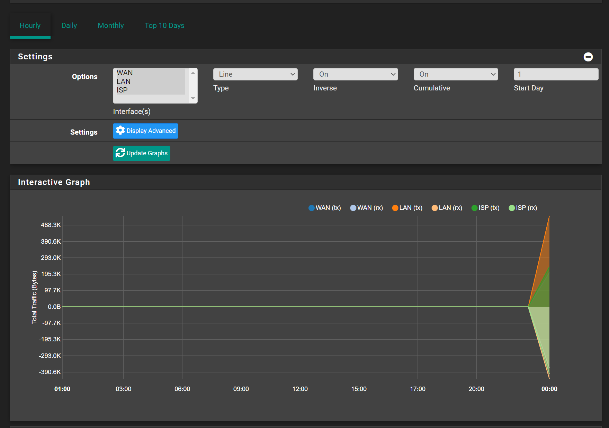

# Configuration

## Enable Graphs

Navigate to `Status` -> `Traffic Totals`

- Click <kbd>⚙️Display Advanced</kbd>
- Click <kbd>✔️Enable Graphing</kbd>

## Set Default Interfaces

- Select the interfaces you want to view graphs (Select multiple by pressing <kbd>CTRL</kbd>)
- Click <kbd>⚙️Display Advanced</kbd>
- Click <kbd>💾Save As Defaults</kbd>

## View Graphs

Wait for few minutes, you should now see some graphs!

