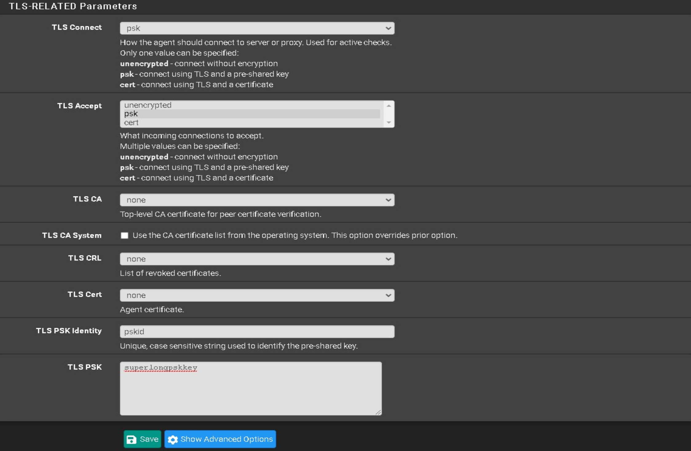

# Configuration

I'll setup mine in `Passive` mode

Navigate to `Services` -> `Zabbix Agent 6`

- Check `Enable Zabbix Agent service`
- Server: `YOUR.ZABBIX.SERVER.IP:10051`
- ServerActive: `YOUR.ZABBIX.SERVER.IP:10051`
- Hostname: `pfSense`
- ListenIP: `YOUR.FIREWALL.IP`

If you are using TLS-PSK:

- TLS Connect: `psk`
- TLS Accept: `psk`
- TLS PSK Identity: `YOURPSKID`
- TLK PSK: `YOUR TLS PSK KEY`

Click <kbd>💾Save</kbd>
