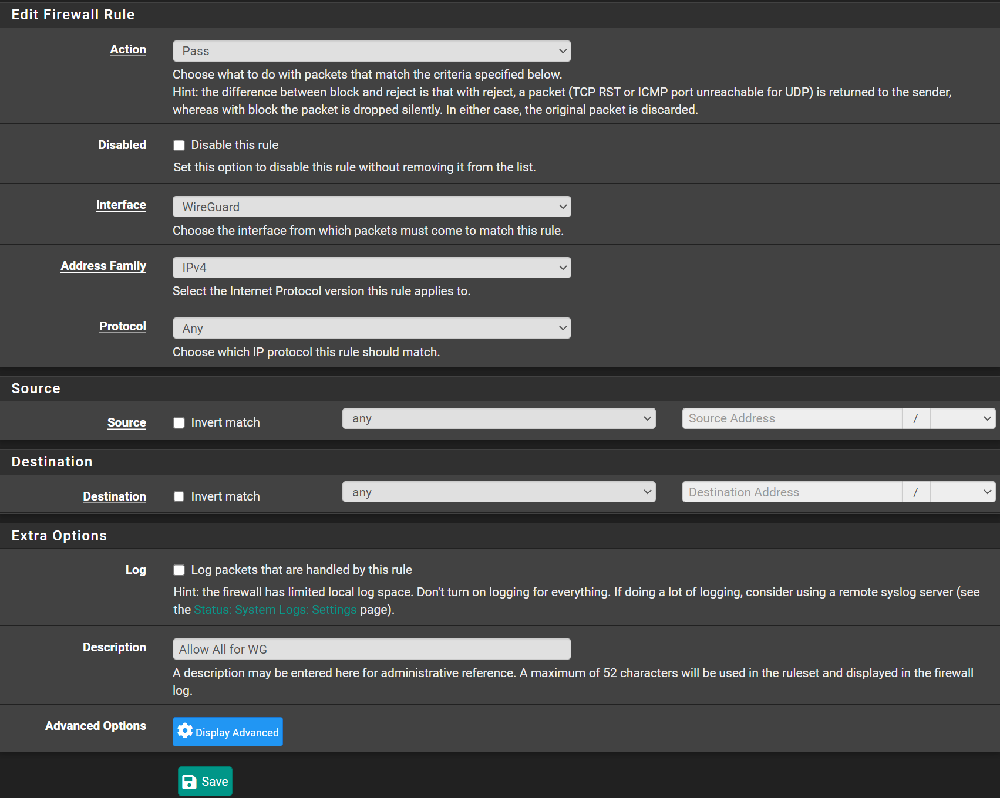

# Configuration

## Enable WireGuard

Navigate to `VPN` -> `Wireguard` -> `Settings`

- Check `Enable WireGuard`
- Click <kbd>💾Save</kbd>


## Create Firewall Rules

Navigate to `Firewall` -> `Rules` -> `WireGuard`

- Click <kbd>⤴️Add</kbd>
- Action: `Pass`
- Interface: `WireGuard`
- Address Family: `IPv4`
- Protocol: `Any`
- Source: `any`
- Destination: `any`
- Description: `Allow All for WireGuard`
- Click <kbd>💾Save</kbd>
- Click <kbd>✔️Apply Changes</kbd>

This is a very open rule, just start with this and later you can apply
stricter rules, if you want to.



Navigate to `Firewall` -> `Rules` -> `WAN`

- Click <kbd>⤴️Add</kbd>
- Action: `Pass`
- Interface: `WAN`
- Address Family: `IPv4`
- Protocol: `UDP`
- Source: `any`
- Destination: `WAN Address`
- Destination Port Range:
  - From: `51820`
  - To: `51820`
- Description: `Allow WireGuard`
- Click <kbd>💾Save</kbd>
- Click <kbd>✔️Apply Changes</kbd>


## Allow outbound traffic

This step is optional, doing this will enable your WireGuard connected devices,
to tunnel all the traffic through your pfSense firewall.
This is great if you use your devices on unsecure networks that you don't trust.

Navigate to `Firewall` -> `NAT` -> `Outbound`

- Click `Hybrid Outbound NAT`
- Click <kbd>💾Save</kbd>
- Click <kbd>✔️Apply Changes</kbd>
- Click <kbd>⤴️Add</kbd>
- Interface: `WAN`
- Address Family: `IPv4`
- Protocol: `any`
- Source: `Network` `10.30.0.0` / `24` (Choose a range that is not used on your network, Have to much with the tunnel)
- Destination: `Any`
- Address: `Interface Address`
- Description: `Allow WireGuard to WAN`
- Click <kbd>💾Save Tunnel</kbd>
- Click <kbd>✔️Apply Changes</kbd>


## Create Tunnel

Navigate to `VPN` -> `WireGuard` -> `Tunnels`

- Click <kbd>➕Add Tunnel</kbd>
- Description: `tun_01`
- Listen Post: `51820`
- Click <kbd>🔑Generate</kbd>
- Interface Address: `10.30.0.0` / `24` (Choose a range that is not used on your network)
- Click <kbd>💾Save Tunnel</kbd>
- Click <kbd>✔️Apply Changes</kbd>


## Create Peers

Navigate to `VPN` -> `WireGuard` -> `Peers`

- Tunnel: `tun_wg0 (tun_01)`
- Description: `My Device`
- Public Key: `Your Device's Public Key`
- Allowed IPs: `10.30.0.2` / `32`


### Connecting peers and generating their public keys

#### Windows

- Open WireGuard Application
- Click <kbd>⬇️</kbd> Right of `Add Tunnel`.
- Click `Empty Tunnel`
- Copy `Public Key`. Use this when creating a peer on pfSense.

Once you create th peer on pfSense, go back to Windows Application

##### Split Tunnel

This will only send traffic to your pfSense when it's destination
is in one of the `AllowedIPs` networks

```bash
[Interface]
PrivateKey = +BTMy8yLkq/yDQYFXZW1HGs7YqCFmG+gAxxS7uhWeGA=
# Put the IP you entered on Allowed IPs when creating the peer.
# Note that here we use "/24" instead of "/32"
Address = 10.30.0.2/24

[Peer]
# This is the Public Key from your pfSense Tunnel.
# Go edit your tunnel and get the public key
PublicKey = thisisa/publickey=
# This is your pfSense's WAN IP (Public IP)
Endpoint = vpn.domain.com:51820
# Here list all the networks you want this peer to reach inside your network
AllowedIPs = 10.1.1.0/24, 10.2.2.0/24
```

##### Full Tunnel

This will force all your traffic to go through your pfSense and then
out to internet.

```bash
[Interface]
PrivateKey = +BTMy8yLkq/yDQYFXZW1HGs7YqCFmG+gAxxS7uhWeGA=
# Put the IP you entered on Allowed IPs when creating the peer.
# Note that here we use "/24" instead of "/32"
Address = 10.30.0.2/24
# This is the DNS of your pfSense
DNS = 10.1.1.1

[Peer]
# This is the Public Key from your pfSense Tunnel.
# Go edit your tunnel and get the public key
PublicKey = thisisa/publickey=
# This is your pfSense's WAN IP (Public IP)
Endpoint = vpn.domain.com:51820
# Here list all the networks you want this peer to reach inside your network
AllowedIPs = 0.0.0.0/0
```

Also check the box `Block untunneled traffic (kill-switch)`
