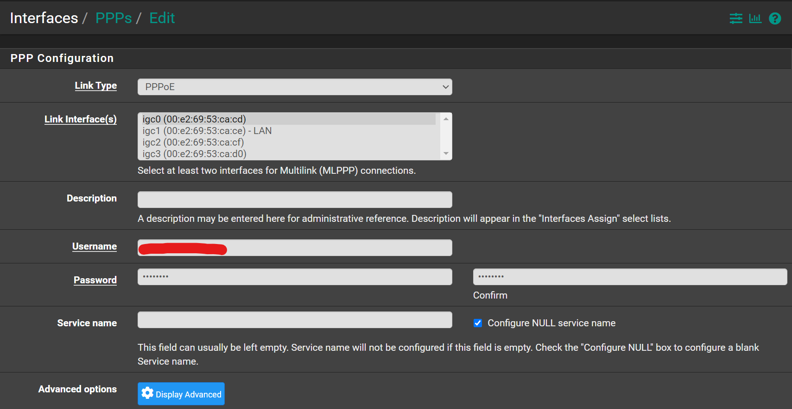

# Configuration

Navigate to `Interfaces` -> `Assignments` -> `PPPs`

Click <kbd>➕Add</kbd>

- Link Type: `PPPoE`
- Link Interface(s): (Select the NIC where the cable from your ISP's modem/rotuer is connected)
- Username: `YOURUSERNAME`
- Password: `YOURPASSWORD`
- Check `Configure NULL service name`

Click <kbd>💾Save</kbd>

Navigate to `Interfaces` -> `Assignments`

For the `WAN` Interface select under `Network port`
the `PPPOE0(NIC) - YOURUSERNAME`

Click <kbd>💾Save</kbd>

Navigate to `Interfaces` -> `WAN`

- IPv4 Configuration Type: `PPPoE`
- Username: `YOURUSERNAME`
- Password: `YOURPASSWORD`
- Check `Block private networks and loopback addresses`
- Check `Block bogon networks`

Click <kbd>💾Save</kbd>

You might have to navigate to `System` -> `Routing` -> `Gateways`

And make sure there is only one gateway for the `WAN` interface. Mine is named `WAN_PPPOE`.

I had a faced a problem at some point, where there was more than one gateways.
It had something to do with how I had configured my WAN before.
Deleted the extra one, gone back to the interfaces we addded/edited,
hit <kbd>💾Save</kbd> one more time and everything worked.

Also, I had to set `Default gateway IPv4` to `WAN_PPPOE` <kbd>Save</kbd>
and reset it back to `Automatic` and <kbd>Save</kbd> again.

