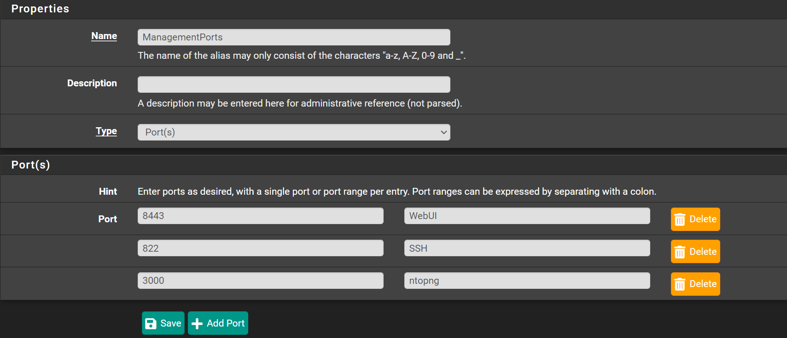

# Alias

You can create Aliases, grouping multiple IPs, Ports, URLS, etc
making it easier to apply rules to them later

## Ports

Navigate to `Firewall` -> `Aliases` -> `Ports`

I'll create an alias for all management ports.
I recommend to first change SSH and WebUI Ports first

- Click <kbd>➕Add</kbd>
- Name: `Management Ports`
- Port: `8443` - Description: `WebUI`
- Click <kbd>➕Add Port</kbd>
- Port: `822` - Description: `SSH`
- Click <kbd>➕Add Port</kbd>
- Port: `3000` - Description: `ntopng`
- Click <kbd>💾Save</kbd>
- Click <kbd>✔️Apply Changes</kbd>

Now you can use this Alias to rules
