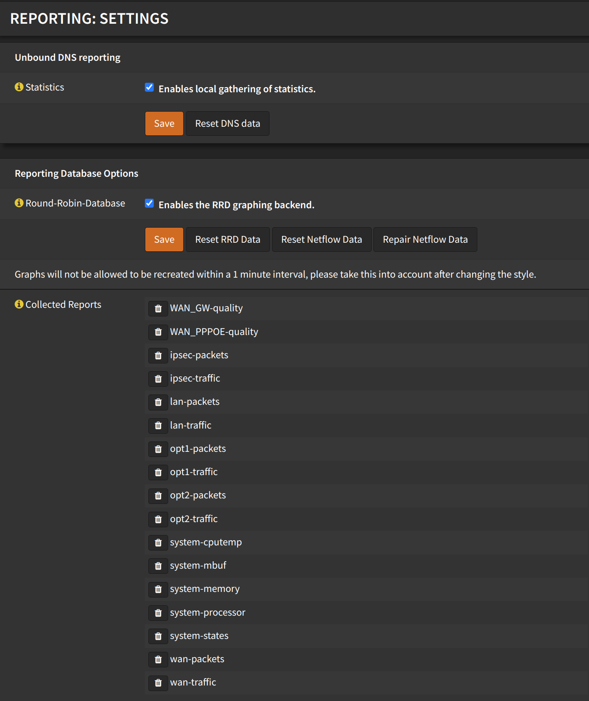

# Reporting

## Settings

Navigate to `Reporting` -> `Settings`

- Under `Unbound DNS reporting`
  - Check `Enables local gathering of statistics
  - Click <kbd>Save</kbd>
- Under `Reporting Database Options`
  - Check `Enables the RRD graphing backend`
  - Click <kbd>Save</kbd>

