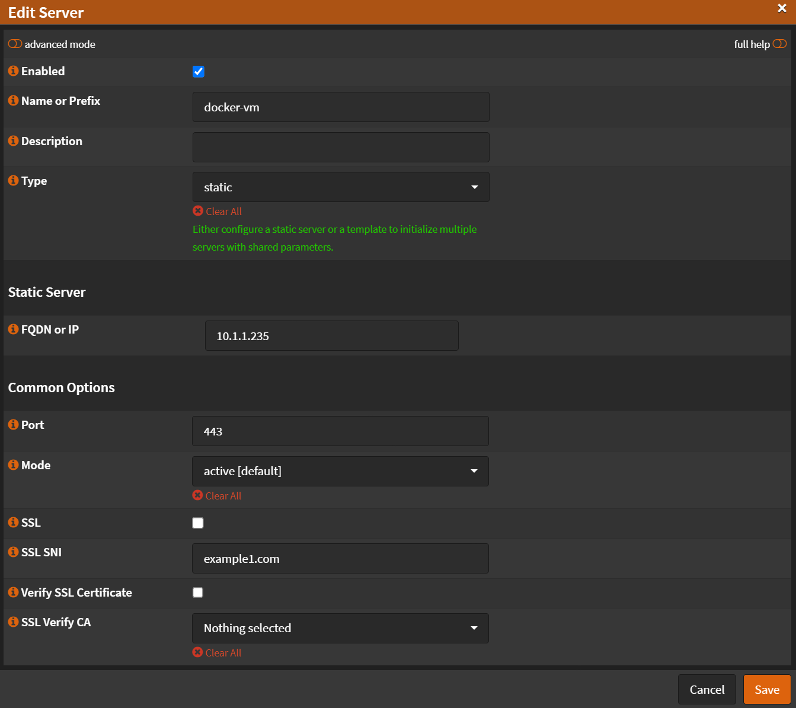
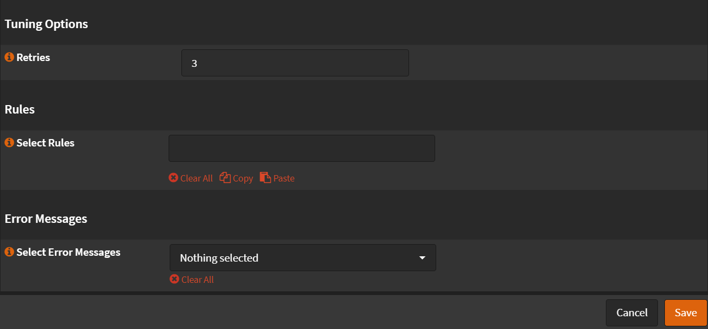
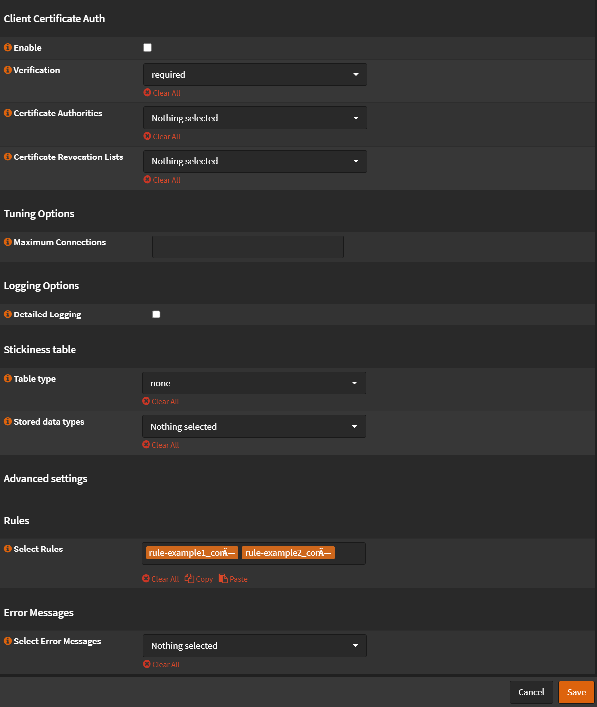

# SNI

## Overview

We will redirect multiple domains to multiple local servers using SNI

In this guide we will configure multiple domains (`example1.com`, `example2.com`) to redirect to specific local server
(`10.1.1.235`, `10.1.1.234`) using the same port (`HTTPS/443`)

For this example our local servers are using reverse proxies and each server issue it's own certs using let's encrypt
and only accepting HTTPS traffic.

(I have setup Let's encrypt to use DNS validation (Cloudflare) so I don't need `HTTP/80` port open)

## Real Servers

Navigate to `Services` -> `HAProxy` -> `Settings`

- Click `Real Servers`

### Server 1

- Click <kbd>➕</kbd>
- Name or Prefix: `docker-vm`
- Type: `static`
- Port `443`
- Uncheck `SSL`
- Uncheck `Verify SSL Certificate`

- Click <kbd>Save</kbd>
- Click <kbd>Apply</kbd>

### Server 2

- Click <kbd>➕</kbd>
- Name or Prefix: `other-docker-vm`
- Type: `static`
- Port `443`
- Uncheck `SSL`
- Uncheck `Verify SSL Certificate`

- Click <kbd>Save</kbd>
- Click <kbd>Apply</kbd>

## Rules & Checks - Health Monitors

Navigate to `Services` -> `HAProxy` -> `Settings`

- Click <kbd>🔽</kbd> next to `Rules & Checks`
- Click `Health Monitors`

### SSL Check

- Click <kbd>➕</kbd>
- Name: `SSL Check`
- Check type: `SSL`
- SSL preferences: `Use server settings`
- Check interval: `2s`

- Click <kbd>Save</kbd>
- Click <kbd>Apply</kbd>

## Virtual Services - Backend Pools

Navigate to `Services` -> `HAProxy` -> `Settings`

- Click <kbd>🔽</kbd> next to `Virtual Services`
- Click `Backend Pools`

### Backend Pool 1

- Click <kbd>➕</kbd>
- Check `Enabled`
- Name: `example1_pool`
- Mode: `TCP (Layer4)`
- Servers: `docker-vm`
- Check `Enable Health Checking`
- Health Monitor: `SSL Check`
- Retries: `3`

- Click <kbd>Save</kbd>
- Click <kbd>Apply</kbd>

### Backend Pool 2

- Click <kbd>➕</kbd>
- Check `Enabled`
- Name: `example1_pool`
- Mode: `TCP (Layer4)`
- Servers: `other-docker-vm`
- Check `Enable Health Checking`
- Health Monitor: `SSL Check`
- Retries: `3`

- Click <kbd>Save</kbd>
- Click <kbd>Apply</kbd>

## Rules & Checks

### Conditions

Navigate to `Services` -> `HAProxy` -> `Settings`

- Click <kbd>🔽</kbd> next to `Rules & Checks`
- Click `Conditions`

#### Condition Contains SSL Hello Message

- Click <kbd>➕</kbd>
- Name: `Contains SSL Hello Message`
- Condition Type: `Custom condition (option pass-through`
- Option pass-through: `req.ssl_hello_type 1`

- Click <kbd>Save</kbd>
- Click <kbd>Apply</kbd>

#### Condition SNI 1

- Click <kbd>➕</kbd>
- Name: `sni-example1_com`
- Description: `SNI Match all example1.com domain`
- Condition type: `SNI TLS extension contains (TCP request content inspection)`
- SNI Contains: `example1.com`

- Click <kbd>Save</kbd>
- Click <kbd>Apply</kbd>

#### Condition SNI 2

- Click <kbd>➕</kbd>
- Name: `sni-example1_com`
- Description: `SNI Match all example1.com domain`
- Condition type: `SNI TLS extension contains (TCP request content inspection)`
- SNI Contains: `example2.com`

- Click <kbd>Save</kbd>
- Click <kbd>Apply</kbd>

### Rules

Navigate to `Services` -> `HAProxy` -> `Settings`

- Click <kbd>🔽</kbd> next to `Rules & Checks`
- Click `Rules`

#### Rule TCP Inspect Delay

- Click <kbd>➕</kbd>
- Name: `TCP Inspect Delay`
- Execute function: `tcp-request inspect-delay`
- TCP inspection delay: `5s`

- Click <kbd>Save</kbd>
- Click <kbd>Apply</kbd>

#### Rule Accept Content if Contains SSL Hello

- Click <kbd>➕</kbd>
- Name: `Accept Content if Contains SSL Hello`
- Select conditions: `Contains SSL Hello Message`
- Execute function: `tcp-request content accept`

- Click <kbd>Save</kbd>
- Click <kbd>Apply</kbd>

#### Rule Backend 1

- Click <kbd>➕</kbd>
- Name: `rule-example1_com`
- Select conditions: `sni-example1_com`
- Execute function: `Use specified Backend Pool`
- Use backend pool: `example1_pool`

- Click <kbd>Save</kbd>
- Click <kbd>Apply</kbd>

#### Rule Backend 2

- Click <kbd>➕</kbd>
- Name: `rule-example1_com`
- Select conditions: `sni-example2_com`
- Execute function: `Use specified Backend Pool`
- Use backend pool: `example2_pool`

- Click <kbd>Save</kbd>
- Click <kbd>Apply</kbd>

## Virtual Services - Public Services

Navigate to `Services` -> `HAProxy` -> `Settings`

- Click <kbd>🔽</kbd> next to `Virtual Services`
- Click `Public Services`
- Click <kbd>➕</kbd>
- Name: `public`
- Listen Addresses: `127.0.0.1:443`
- Type: `SSL/HTTPS (TCP Mode)`
- Default Backend Pool: `none`
- Uncheck `Enable SSL offloading`
- Select Rules:
  - `Accept Content if Contains SSL Hello`
  - `TCP Inspect Delay`
  - `rule-example1_com`
  - `rule-example2_com`

:::note

Order on rules matter!

:::

- Click <kbd>Save</kbd>
- Click <kbd>Apply</kbd>
