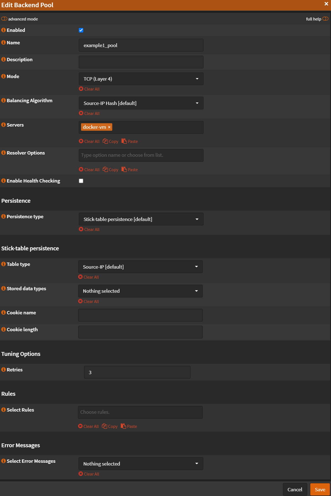
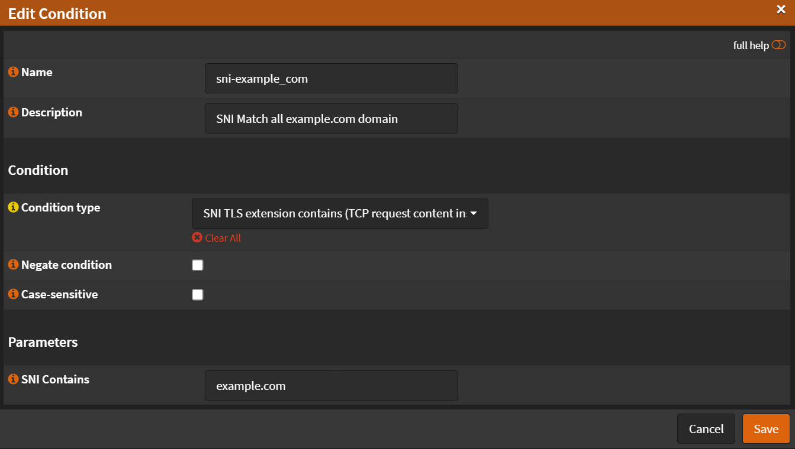

# SNI

## Overview

We will redirect multiple domains to multiple local servers using SNI

In this guide we will configure multiple domains (`example1.com`, `example2.com`) to redirect to specific local server
(`10.1.1.235`, `10.1.1.234`) using the same port (`HTTPS/443`)

For this example our local servers are using reverse proxies and each server issue it's own certs using let's encrypt
and only accepting HTTPS traffic.

(I have setup Let's encrypt to use DNS validation (Cloudflare) so I don't need `HTTP/80` port open)

## Real Servers

Navigate to `Services` -> `HAProxy` -> `Settings`

### Server 1

- Click `Real Servers`
- Click <kbd>➕</kbd>
- Name or Prefix: `docker-vm`
- Type: `static`
- Port `443`
- Uncheck `SSL`
- Uncheck `Verify SSL Certificate`

- Click <kbd>Save</kbd>
- Click <kbd>Apply</kbd>

### Server 2

- Click <kbd>➕</kbd>
- Name or Prefix: `other-docker-vm`
- Type: `static`
- Port `443`
- Uncheck `SSL`
- Uncheck `Verify SSL Certificate`

- Click <kbd>Save</kbd>
- Click <kbd>Apply</kbd>

## Virtual Services - Backend Pools

Navigate to `Services` -> `HAProxy` -> `Settings`

- Click <kbd>🔽</kbd> next to `Virtual Services`
- Click `Backend Pools`
- Click <kbd>➕</kbd>
- Check `Enabled`
- Name: `example1_pool`
- Mode: `TCP (Layer4)`
- Servers: `docker-vm`
- Uncheck `Health Checking`
- Retries: `3`

- Click <kbd>Save</kbd>
- Click <kbd>Apply</kbd>

## Rules & Checks

### Conditions

Navigate to `Services` -> `HAProxy` -> `Settings`

- Click <kbd>🔽</kbd> next to `Rules & Checks`
- Click `Conditions`
- Click <kbd>➕</kbd>
- Name: `sni-example1_com`
- Description: `SNI Match all example1.com domain`
- Condition type: `SNI TLS extension contains (TCP request content inspection)`
- SNI Contains: `example.com`

- Click <kbd>Save</kbd>
- Click <kbd>Apply</kbd>

### Rules

Navigate to `Services` -> `HAProxy` -> `Settings`

- Click <kbd>🔽</kbd> next to `Rules & Checks`
- Click `Rules`
- Click <kbd>➕</kbd>
- Name: `rule-example1_com`
- Select conditions: `sni-example1_com`
- Execute function: `Use specified Backend Pool`
- Use backend pool: `example1_pool`

- Click <kbd>Save</kbd>
- Click <kbd>Apply</kbd>

## Virtual Services - Public Services

Navigate to `Services` -> `HAProxy` -> `Settings`

- Click <kbd>🔽</kbd> next to `Virtual Services`
- Click `Public Services`
- Click <kbd>➕</kbd>
- Name: `public`
- Listen Addresses: `127.0.0.1:443`
- Type: `SSL/HTTPS (TCP Mode)`
- Default Backend Pool: `none`
- Uncheck `Enable SSL offloading`
- Select Rules: `rule-example1_com`

- Click <kbd>Save</kbd>
- Click <kbd>Apply</kbd>
