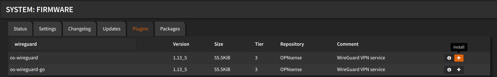

# Installation

Navigate to `System` > `Firmware` > `Plugins`

Search for `wireguard` and click <kbd>➕</kbd>

:::warning

Install the `os-wireguard`, **not** `os-wireguard-go`

:::



Wait until you see `**DONE**`

```shell
***GOT REQUEST TO INSTALL***
Currently running OPNsense 23.1.9 at Tue Jun  6 12:54:55 EEST 2023
Updating OPNsense repository catalogue...
OPNsense repository is up to date.
All repositories are up to date.
The following 4 package(s) will be affected (of 0 checked):

New packages to be INSTALLED:
  bash: 5.2.15
  os-wireguard: 1.13_5
  wireguard-kmod: 0.0.20220615_1
  wireguard-tools: 1.0.20210914_1

Number of packages to be installed: 4

The process will require 3 MiB more space.
816 KiB to be downloaded.
[1/4] Fetching wireguard-kmod-0.0.20220615_1.pkg: ..... done
[2/4] Fetching bash-5.2.15.pkg: .......... done
[3/4] Fetching wireguard-tools-1.0.20210914_1.pkg: ....... done
[4/4] Fetching os-wireguard-1.13_5.pkg: .. done
Checking integrity... done (0 conflicting)
[1/4] Installing bash-5.2.15...
[1/4] Extracting bash-5.2.15: .......... done
[2/4] Installing wireguard-kmod-0.0.20220615_1...
[2/4] Extracting wireguard-kmod-0.0.20220615_1: .... done
[3/4] Installing wireguard-tools-1.0.20210914_1...
[3/4] Extracting wireguard-tools-1.0.20210914_1: .......... done
[4/4] Installing os-wireguard-1.13_5...
[4/4] Extracting os-wireguard-1.13_5: .......... done
Stopping configd...done
Starting configd.
Migrated OPNsense\Wireguard\Server from 0.0.0 to 0.0.4
Migrated OPNsense\Wireguard\General from 0.0.0 to 0.0.1
Migrated OPNsense\Wireguard\Client from 0.0.0 to 0.0.7
Reloading plugin configuration
Configuring system logging...done.
Reloading template OPNsense/Wireguard: OK
=====
Message from wireguard-kmod-0.0.20220615_1:

--
At this time this code is new, unvetted, possibly buggy, and should be
considered "experimental". It might contain security issues. We gladly
welcome your testing and bug reports, but do keep in mind that this code
is new, so some caution should be exercised at the moment for using it
in mission critical environments.
Checking integrity... done (0 conflicting)
Nothing to do.
***DONE***
```
