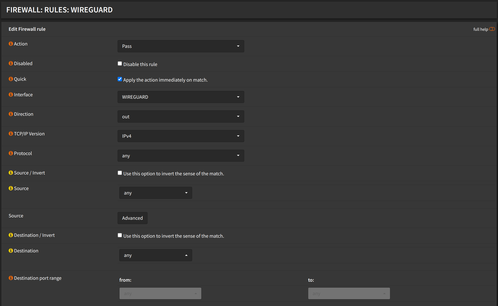
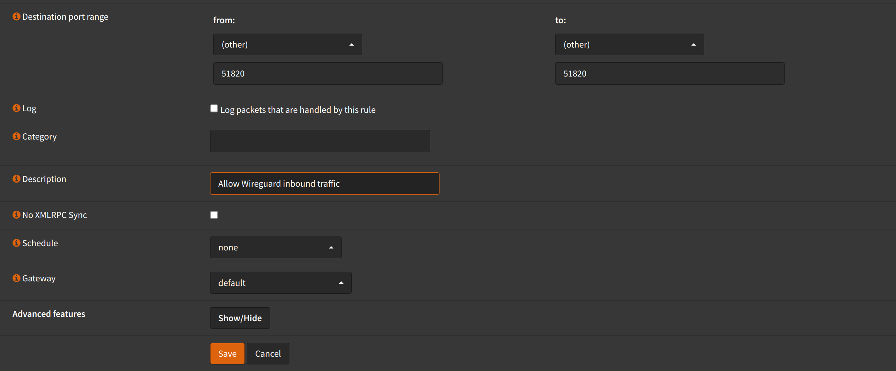

# Configuration

## Enable WireGuard

Navigate to `VPN` -> `WireGuard` -> `General`

:::tip

If you just installed `Wireguard`, you might have to refresh the page.

:::

- Check `Enable WireGuard`
- Click <kbd>Apply</kbd>


## Local Configuration

Navigate to `VPN` -> `WireGuard` -> `Local`

- Click <kbd>➕</kbd>
- Check `Enabled`
- Name: `Wireguard`
- Public Key: (Leave empty, it will be generated automatically)
- Private Key: (Leave empty, it will be generated automatically)
- Listen Port: `51820`
- Tunnel Address: `10.200.0.1/24`
- Peers: (Leave empty, we will add them later)
- Uncheck `Disable routes`
- Click <kbd>Save</kbd>


- Click <kbd>Apply</kbd>


## Interfaces

We will create an interface for wireguard, so we can use it in firewall rules.

Navigate to `Interfaces` -> `Assignments`

- New Interface: Select `wg1` (or the interface name that was generated)
- Description: `WIREGUARD`
- Click <kbd>➕</kbd>
- Click <kbd>Save</kbd>


- Click `WIREGUARD` interface
- Check `Enable interface`
- Click <kbd>Save</kbd>
- Click <kbd>Apply changes</kbd>

## Firewall

:::warning

These rules will allow all traffic from wireguard interface to
the firewall. You might want to change this to your needs.

:::

### Wireguard Inbound Rule

Navigate to `Firewall` -> `Rules` -> `WIREGUARD`


- Click <kbd>➕</kbd>
- Action: `Pass`
- Interface: `WIREGUARD`
- Direction: `in`
- Address Family: `IPv4`
- Protocol: `any`
- Source: `any`
- Destination: `any`
- Click <kbd>Save</kbd>


### Wireguard Outbound Rule

Navigate to `Firewall` -> `Rules` -> `WIREGUARD`

- Click <kbd>➕</kbd>
- Action: `Pass`
- Interface: `WIREGUARD`
- Direction: `out`
- Address Family: `IPv4`
- Protocol: `any`
- Source: `any`
- Destination: `any`
- Click <kbd>Save</kbd>




- Click <kbd>Apply changes</kbd>

### WAN Rule

Navigate to `Firewall` -> `Rules` -> `WAN`

- Click <kbd>➕</kbd>
- Action: `Pass`
- Interface: `WAN`
- Direction: `in`
- Address Family: `IPv4` (or `IPv4+IPv6` if you want to allow IPv6)
- Protocol: `UDP`
- Source: `any`
- Destination: `WAN address`
- Destination port range:
  - from: `(other) 51820`
  - to: `(other) 51820`
- Click <kbd>Save</kbd>




- Click <kbd>Apply changes</kbd>

## Endpoints

### Copy Server Public Key

Navigate to `VPN` -> `WireGuard` -> `Local`

- Click <kbd>✏️</kbd>
- Copy `Public Key`, we will need it later
- Click <kbd>Save</kbd>

### Create Endpoint(s)

Navigate to `VPN` -> `WireGuard` -> `Endpoints`

- Click <kbd>➕</kbd>
- Name: (Choose a name for your endpoint)
- Public Key: (Generate `Public Key`, see below)
- Shared Secret: Leave empty
- Allowed IPs: `10.200.0.2/32`
  - Enter the IP of the client in CIDR notation
  - Press <kbd>Enter</kbd>
- Endpoint Address: (Enter the public IP address or DNS of your server)
- Endpoint Port: (Enter the port of your server)
- Keep alive interval: `25`
- Click <kbd>Save</kbd>
- Repeat for each client
- Click <kbd>Apply</kbd>


### Add Endpoint(s) to Local Configuration

Navigate to `VPN` -> `WireGuard` -> `Local`

- Click <kbd>✏️</kbd>
- Peers: Select the endpoints you created
- Click <kbd>Save</kbd>
- Click <kbd>Apply</kbd>


## Generate Public and Private Keys and import them to clients

You can generate keys for a client from any OS that has `Wireguard` installed.
Use whatever you have available.

### Linux

```shell
wg genkey | tee >(awk '{print "Private Key:", $0}') |\
            wg pubkey | awk '{print "Public Key:", $0}'
```

It should print something like this:

```shell
Private Key: KCqn8yEUsiJKWrXk8cfjW9liYGprmBs79gZ9hhHLIVA=
Public Key: HGmMJdr9iZAatwAQkwLAIW6r710RNwrVNV/PszL5CiI=
```

Config file should look like this:

```ini
[Interface]
# (Client Private Key that you generated earlier)
PrivateKey = KCqn8yEUsiJKWrXk8cfjW9liYGprmBs79gZ9hhHLIVA=
Address = 10.200.0.2/32
DNS = 10.0.0.1/16

[Peer]
PublicKey = (Server Public Key that you copied earlier)
Endpoint = (Server Public IP or DNS):(51820 or the port you chose)
# - AllowedIPs = (Network(s) that you want to route through the VPN in CIDR notation)
# Full Tunnel (All traffic through VPN)
AllowedIPs = 0.0.0.0/0
# Split Tunnel (Only traffic specific networks through VPN)
AllowedIPs = 10.0.0.0/16, 192.168.12.0/24, 192.168.11.0/24
```

Save the above in a file, for example `/etc/wireguard/wg0.conf`.

Then run:

```shell
sudo wg-quick up wg0
```

You should now be connected to the VPN.

### Windows
