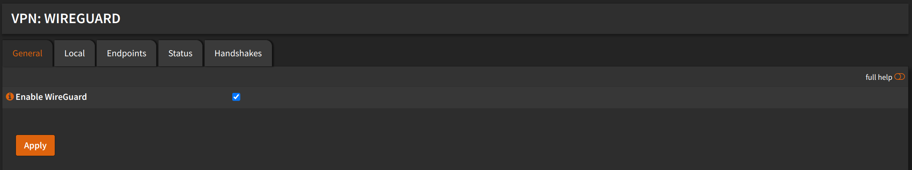
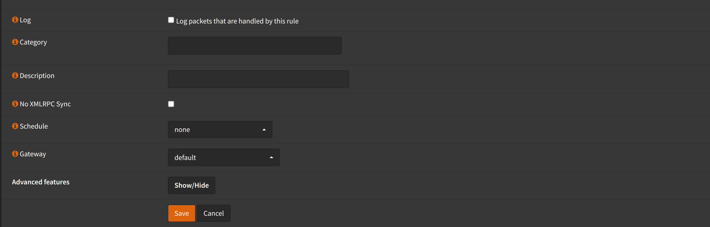

# Configuration

## Enable WireGuard

Navigate to `VPN` -> `WireGuard` -> `General`

:::tip

If you just installed `Wireguard`, you might have to refresh the page.

:::

- Check `Enable WireGuard`
- Click <kbd>Apply</kbd>

## Local Configuration

Navigate to `VPN` -> `WireGuard` -> `Local`

- Click <kbd>➕</kbd>
- Check `Enabled`
- Name: `Wireguard`
- Public Key: (Leave empty, it will be generated automatically)
- Private Key: (Leave empty, it will be generated automatically)
- Listen Port: `51820`
- Tunnel Address: `10.200.0.0/24`
- Peers: (Leave empty, we will add them later)
- Uncheck `Disable routes`
- Click <kbd>Save</kbd>

- Click <kbd>Apply</kbd>

## Interfaces

We will create an interface for wireguard, so we can use it in firewall rules.

Navigate to `Interfaces` -> `Assignments`

- New Interface: Select `wg1` (or the interface name that was generated)
- Description: `WIREGUARD`
- Click <kbd>➕</kbd>
- Click <kbd>Save</kbd>

- Click `WIREGUARD` interface
- Check `Enable interface`
- Click <kbd>Save</kbd>
- Click <kbd>Apply changes</kbd>

## Firewall

Navigate to `Firewall` -> `Rules` -> `WIREGUARD`

:::warning

These rules will allow all traffic from wireguard interface to
the firewall. You might want to change this to your needs.

:::

- Click <kbd>➕</kbd>
- Action: `Pass`
- Interface: `WIREGUARD`
- Direction: `in`
- Address Family: `IPv4`
- Protocol: `any`
- Source: `any`
- Destination: `any`
- Click <kbd>Save</kbd>

- Click <kbd>Apply changes</kbd>

Navigate to `Firewall` -> `Rules` -> `WAN`

- Click <kbd>➕</kbd>
- Action: `Pass`
- Interface: `WAN`
- Direction: `in`
- Address Family: `IPv4` (or `IPv4+IPv6` if you want to allow IPv6)
- Protocol: `UDP`
- Source: `any`
- Destination: `WAN address`
- Destination port range:
  - from: `(other) 51820`
  - to: `(other) 51820`
- Click <kbd>Save</kbd>

- Click <kbd>Apply changes</kbd>

## Endpoints

TODO:
