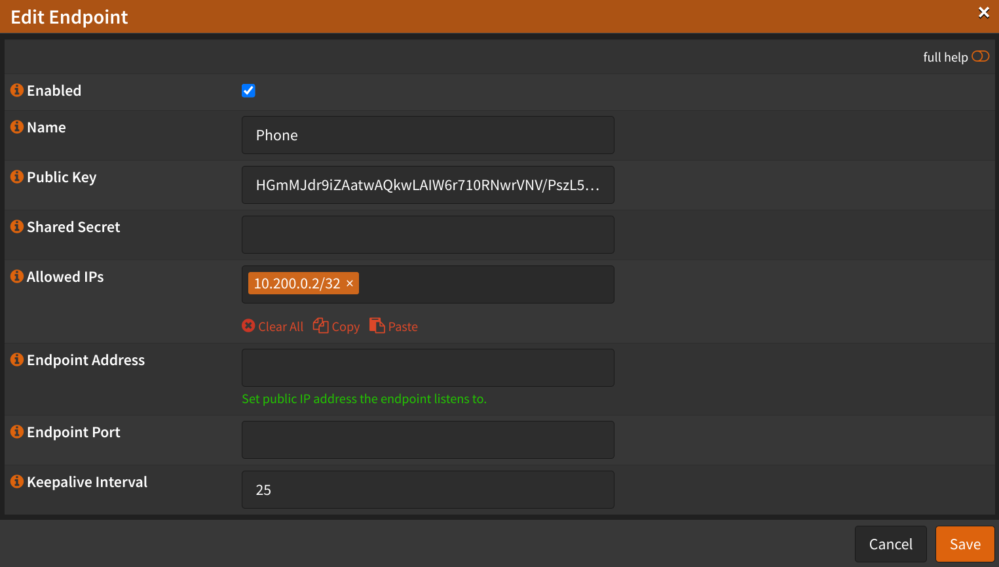
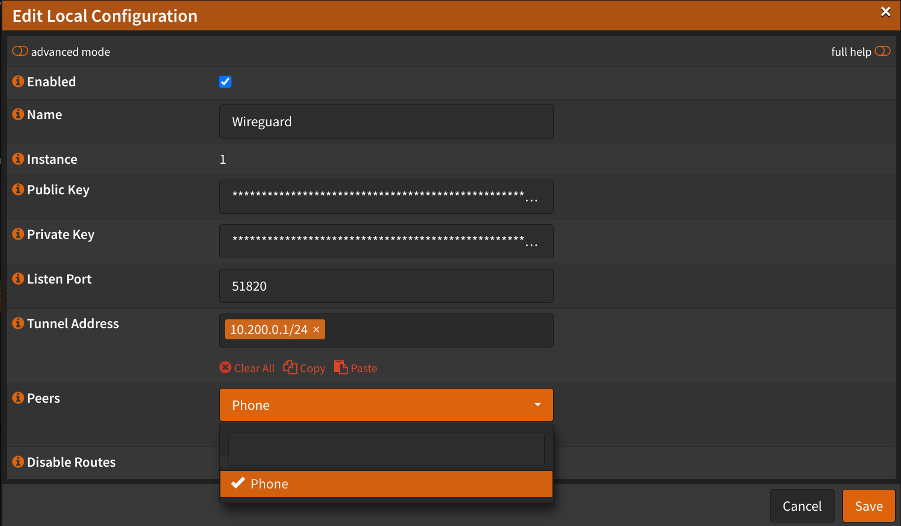

# Endpoint Configuration

## Copy Server Public Key

Navigate to `VPN` -> `WireGuard` -> `Local`

- Click <kbd>✏️</kbd>
- Copy `Public Key`, we will need it later
- Click <kbd>Save</kbd>

## Create Endpoint(s)

Navigate to `VPN` -> `WireGuard` -> `Endpoints`

- Click <kbd>➕</kbd>
- Name: (Choose a name for your endpoint)
- Public Key: (Generate `Public Key`, see below)
- Shared Secret: Leave empty
- Allowed IPs: `10.200.0.2/32`
  - Enter the IP of the client in CIDR notation
  - Press <kbd>Enter</kbd>
- Endpoint Address: (Enter the public IP address or DNS of your server)
- Endpoint Port: (Enter the port of your server)
- Keep alive interval: `25`
- Click <kbd>Save</kbd>
- Repeat for each client
- Click <kbd>Apply</kbd>

## Add Endpoint(s) to Local Configuration

Navigate to `VPN` -> `WireGuard` -> `Local`

- Click <kbd>✏️</kbd>
- Peers: Select the endpoints you created
- Click <kbd>Save</kbd>
- Click <kbd>Apply</kbd>

