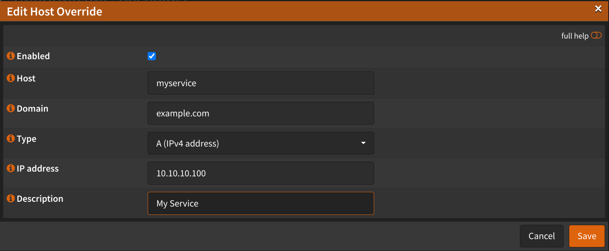
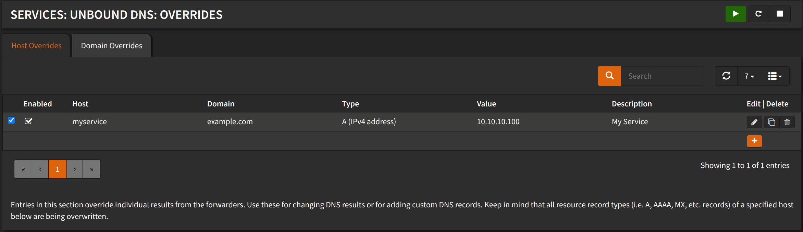

# Firewall & NAT

When you want to reach a service hosted in the same network via it's FQDN,
you have to either user `Split DNS` or enable `NAT Reflection` (also known as NAT Hairpinning).

Without this, you won't be able to reach it at all, or you can reach it but all
the traffic goes out to the internet and get back in.

`Split DNS` is the **preferred** method, so that the firewall is not involved
when using internal services, but requires an entry for each service.

## Split DNS

- Setup [Unbound DNS](../6-dns/1-resolver/1-configuration.md)
- (Optional) Setup [Force DNS Redirection](1-redirect-dns.md)

:::tip

Make sure your clients are using the OPNsense as their DNS server.

:::

Navigate to `Services` -> `Unbound DNS` -> `Overrides`

- Click <kbd>+</kbd> to add a new override
- Host: `myservice`
- Domain: `example.com`
- Type: `A`
- IP Address: `10.10.10.150` (Internal IP of the service)
- Description: `My Service`
- Click <kbd>Save</kbd>

Do the above for each service you want to reach via it's FQDN.

Now all the clients in your network will be able to reach `myservice.example.com`

:::tip

You might need to restart the Unbound DNS Service for the changes to take effect.

:::

## NAT Reflection

Navigate to `Firewall` -> `Settings` -> `Advanced`

- Check `Reflection for port forwards`

- Click <kbd>Save</kbd>
