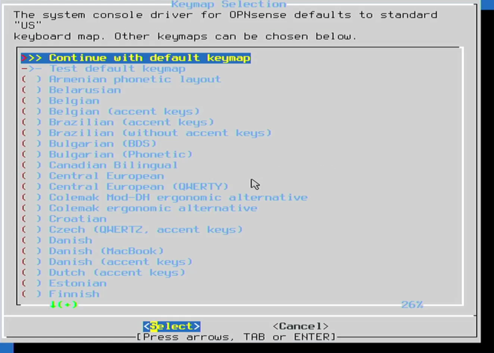
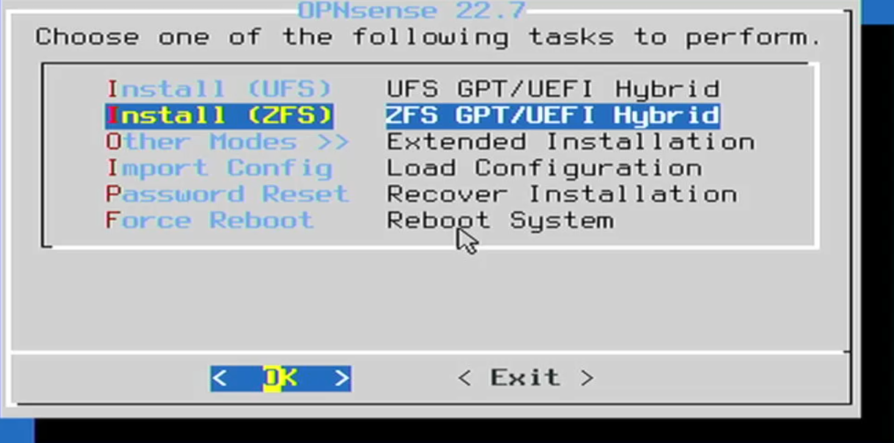
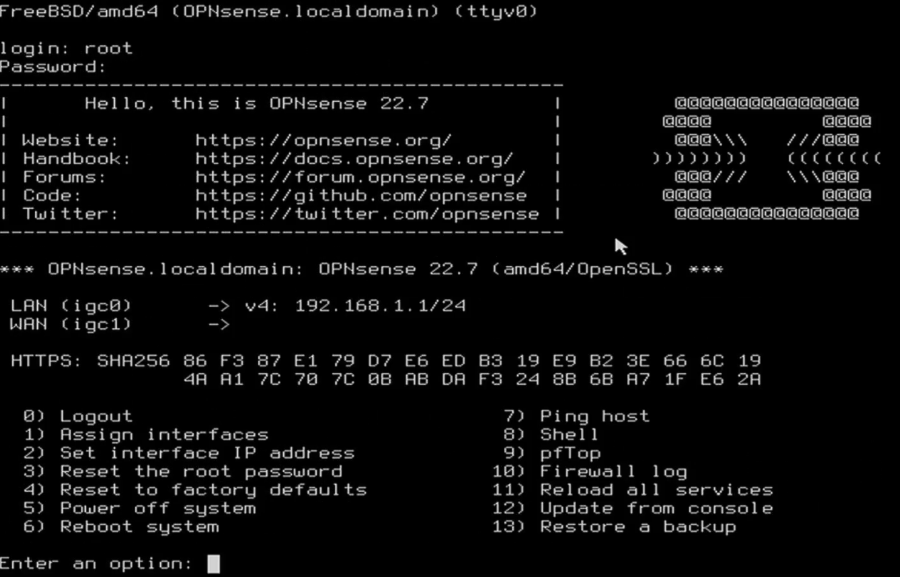
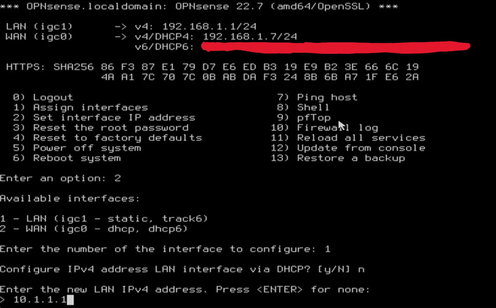
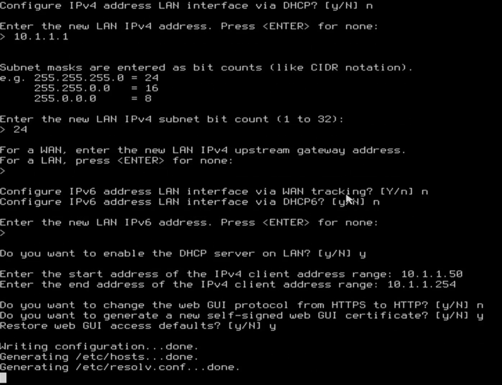

## Download installer and tools

### OPNsense

Download the installer from OPNsense official download [page](https://opnsense.org/download/)

- Select `amd64` for system architecture
- Select `vga` for bare metal installation or `iso` for virtualized installation
- Select the mirror closest to you
- Click <kbd>Download</kbd>

:::info

You can skip `Rufus` and `Prepare the installation media (USB)`
if you plan to do a virtualized installation

:::

### Rufus

Download rufus from their official [site](https://rufus.ie/en/)
Select either the portable version or the installer, both will work.

## Prepare the installation media (USB)

:::danger

This process will **DELETE** any data in your USB stick.

:::

- Run `Rufus`
- Select your USB Stick on the `Device` drop down list
- On `Boot selection` Click <kbd>SELECT</kbd> and select the OPNsense installer we downloaded earlier
- Check again that you selected the correct `Device` on previous step
- Click <kbd>START</kbd>
- Accept the **WARNING** saying that will **DESTROY** your data on this device

Once the process is finished you are ready to install OPNsense to your machine.

## Prepare the installation media (Virtualized)

- Mount the ISO file into your VM
- Set it as primary boot device

## Installation on bare metal

- Boot your machine from the prepared USB stick.

It will give you some timers to select if you want to manually configure things.
Let everything on automatic. Once you reach the login prompt, use the following credentials.

- Username: `installer`
- Password: `opnsense`

- Select `Continue with default keymap`

  

- Select `Install (ZFS)`

  

- Select the disk you want to install it into. (Press <kbd>Space</kbd>).

  :::danger

  This process will **DELETE** any data in your disk.

  :::

  

- Select `OK`
- Read the `Warning` and Select `YES`

  If you want to change root password now select `Root Password`

  Alternatively change `Complete Install` and you can change it later on the Web GUI.

- Remove USB and let machine boot into `OPNSense`

  Depending on your network, you probably will have to configure your interfaces
  directly on the `OPNSense` machine.

  If that's the case, login with `root` and `opnsense` (or the new root password if you changed it).

  

  If it didn't auto configured the LAN interface at least select option `1` and follow onscreen instructions
  Prefer using the `a` option. It's easier.

  Let's configure the `LAN` interface address.

  - Select option `2`
  - Select the `LAN` interface. Usually option `1`
  - Enter your preferred `LAN` IP (eg. 10.1.1.1)

  

  - Enter your preferred subnet mask. (Usually `24`)
  - Configure `IPv6` for LAN via WAN tracking: `n`
  - Configure `IPv6` for LAN via DHCP6: `n`
  - Enter new `IPv6` address: Leave empty, Press <kbd>Enter</kbd>
  - Do you want to enable `DHCP` server on `LAN`: `y`
  - Enter start `DHCP` IPv4 address: `10.1.1.50` (I keep a range for static mappings)
  - Enter end `DHCP` IPv4 address: `10.1.1.254`
  - Do you want to change Web GUI protocol to `HTTP`: `n`
  - Do you want to generate new self-singed cert: `y`
  - Restore Web GUI access to defaults: `y`

  

- Now you are ready to access Web GUI on `https://10.1.1.1`

## Installation on Virtual Machine

TODO: Guide
