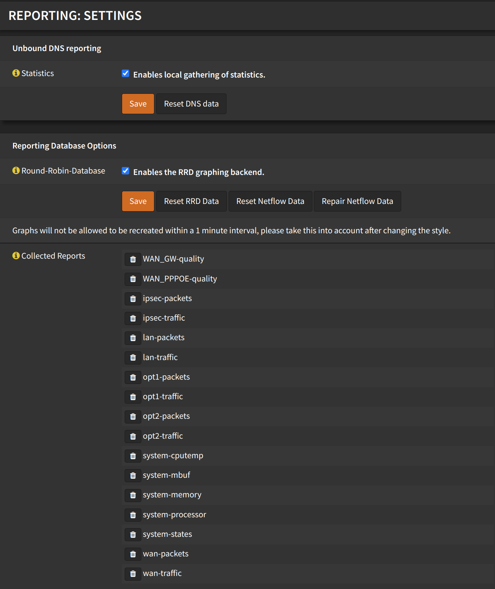
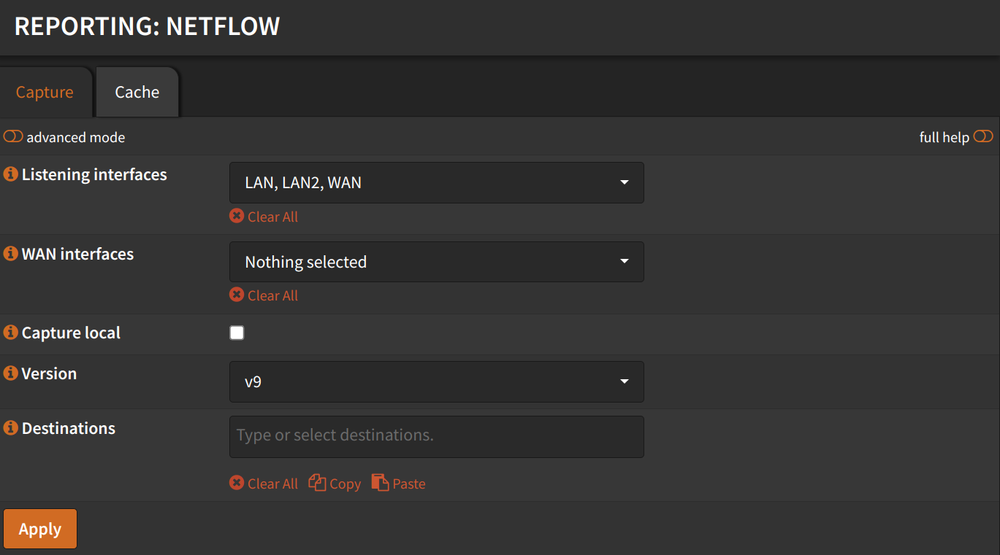
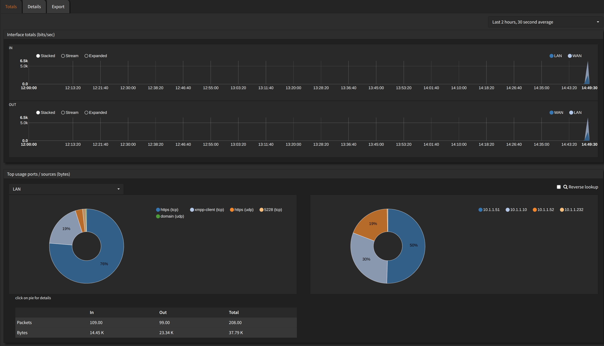

## Settings

Navigate to `Reporting` -> `Settings`

- Under `Unbound DNS reporting`
  - Check `Enables local gathering of statistics`
  - Click <kbd>Save</kbd>
- Under `Reporting Database Options`
  - Check `Enables the RRD graphing backend`
  - Click <kbd>Save</kbd>

## NetFlow

Navigate to `Reporting` -> `NetFlow`

- Listening interfaces: Select all the interfaces you want to monitor
  (Including `WAN`)
- WAN Interfaces: Select your `WAN` interface
- Check `Capture local`

Click <kbd>Apply</kbd>

Now you can go to `Reporting` -> `Insight` and see the graphs.

