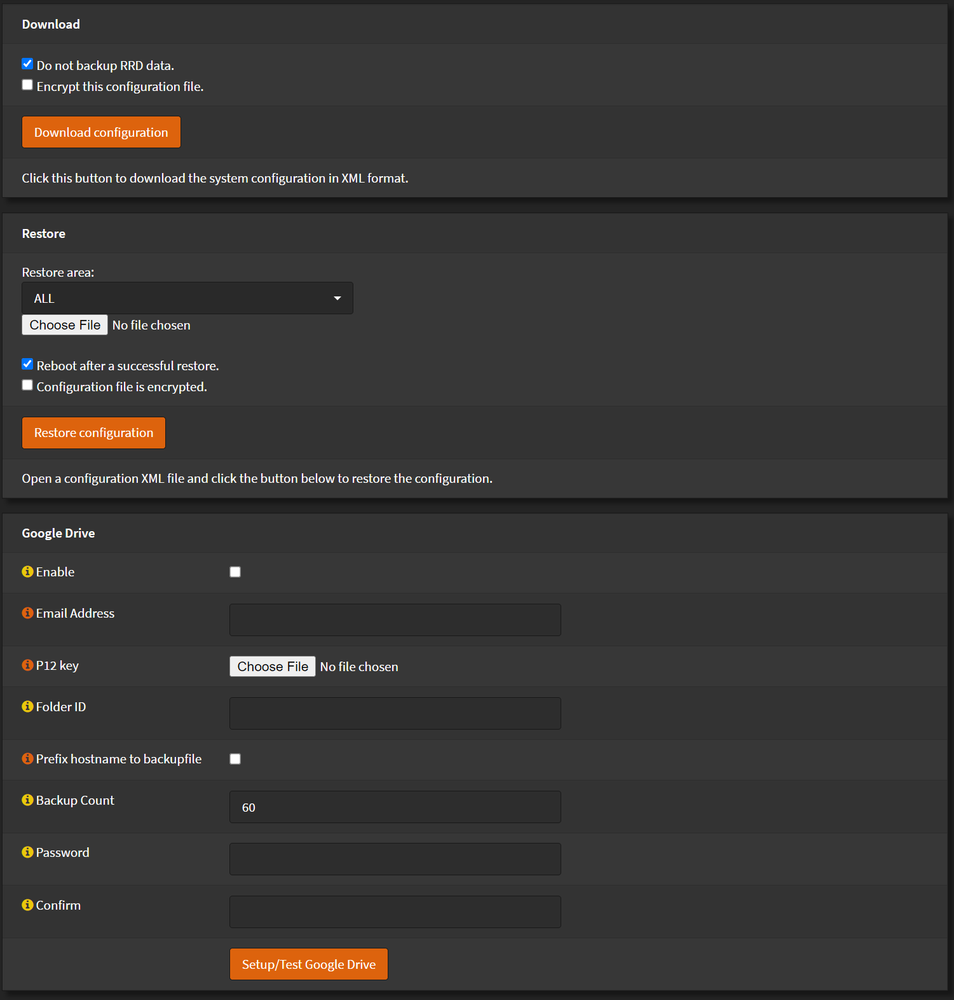

# System Configuration

## Backups

Go to `System` > `Configuration` > `Backups`

Here you can backup your configuration.

Click <kbd>Download configuration</kbd> to do so

Or restore a configuration from backup.

By selecting your configuration file and clicking <kbd>Restore configuration</kbd>

## History

Go to `System` > `Configuration` > `History`

Here you can rollback any changes you made, as OPNsense saves each change.

