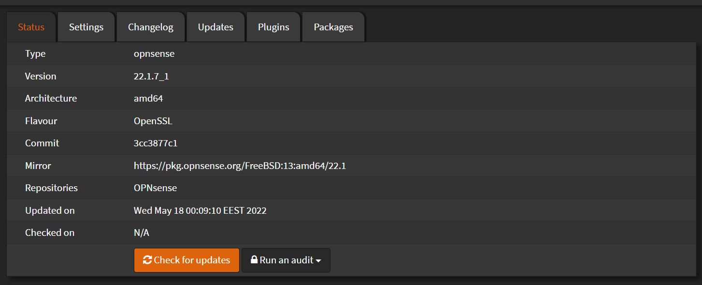

# System Firmware

## Status

Navigate to `System` > `Firmware` > `Status`

Shows the current Version of the system.

Click `Check for updates` to see if there is newer version.

If a newer version exists, it will show a pop up and prompt you to upgrade.

## Plugins

Navigate to `System` > `Firmware` > `Plugins`

This is a list of the available plugins.

On the top usually is your installed plugins.

From here you can install packages like themes, wireguard, haproxy
#TODO: haproxy
