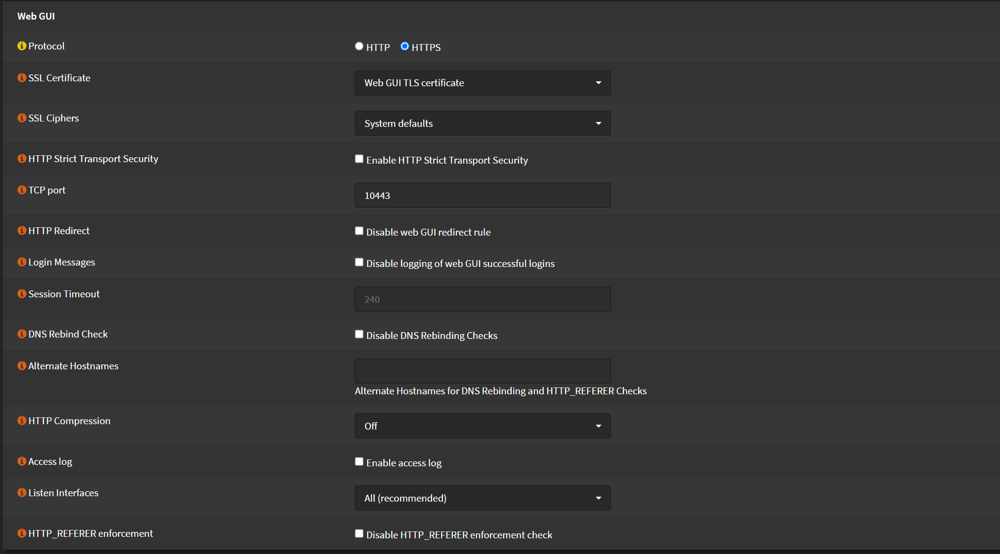
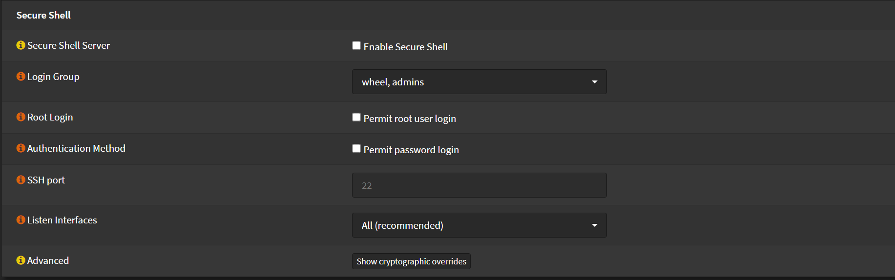

# System Settings

## Basic Security Settings

Navigate to `System` > `Settings` > `Administration`

### HSTS

- Check `Enable HTTP Strict Transport Security` (HSTS)

_This will help to protect against cookie hijacking and protocol downgrade_

### Web GUI

- Change `TCP Port` of Web UI to something other than `443`
- Check `Disable web GUI redirect rule`
_Checking this, OPNsense will only serve Web GUI on `HTTPS`_
- Change `Listen Interface` to an interface that you will use for Administration only.

### SSH

- Keep Secure Shell Disabled, if you enabled, change `SSH Port` to something other than `22`
- Change `Listen Interface` to an interface that you will use for Administration only.
- Keep `Permit password login` disabled and use ssh keys.

Click <kbd>Save</kbd> when you done.

## General

Navigate to `System` > `Settings` > `General`

- Change `Hostname`
I like to change it to something like `fw` or `firewall`
So it's easier to type it's address
- Change `Domain` if you want to use your domain, or leave it `localhost`
I'm will use my domain. Later will show how to also get a valid cert for it #TODO:
- Change `Time zone` to your local timezone, this will also be used by log times
- Change `Language` if you want
- Now you only have one Theme. Later will see how to add more. #TODO:

- Leave DNS Server(s) empty. Later will configure DNS over TLS. #TODO:
- Uncheck `Allow DNS server list to be overridden by DHCP/PPP on WAN`

Click <kbd>Save</kbd> when you done

## Loggging

Navigate to `System` > `Settings` > `Logging`

- Increase `Preserve logs (Days)` if you want.
_Setting this too high will need some storage space also_
- Uncheck `Log packets matched from the default block rules put in the ruleset`
- Uncheck `Log packets matched from the default pass rules put in the ruleset`
_These outputs a lot of noise, which generally I find I don't need._
_These might be useful to keep it enabled when troubleshooting_

Click <kbd>Save</kbd> when you done

## Miscellaneous

Navigate to `System` > `Settings` > `Miscellaneous`

- Change `Hardware` on `Thermal Sensors` depending on your system.
- Backups will config later #TODO:

Click <kbd>Save</kbd> when you done
