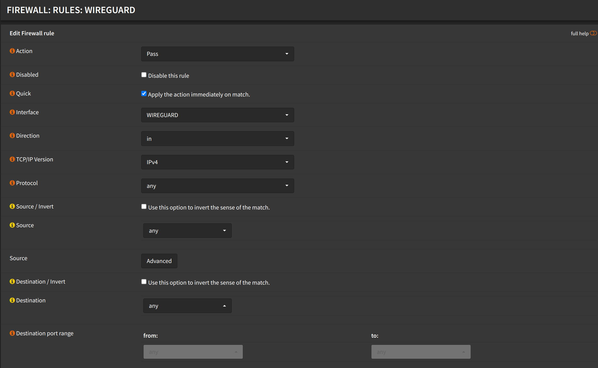

:::warning

These rules will allow all traffic from wireguard interface to
the firewall. You might want to change this to your needs.

:::

## Wireguard Inbound Rule

Navigate to `Firewall` -> `Rules` -> `WIREGUARD`

- Click <kbd>➕</kbd>
- Action: `Pass`
- Interface: `WIREGUARD`
- Direction: `in`
- Address Family: `IPv4`
- Protocol: `any`
- Source: `any`
- Destination: `any`
- Click <kbd>Save</kbd>

## WAN Rule

Navigate to `Firewall` -> `Rules` -> `WAN`

- Click <kbd>➕</kbd>
- Action: `Pass`
- Interface: `WAN`
- Direction: `in`
- Address Family: `IPv4` (or `IPv4+IPv6` if you want to allow IPv6)
- Protocol: `UDP`
- Source: `any`
- Destination: `WAN address`
- Destination port range:
  - from: `(other) 51820`
  - to: `(other) 51820`
- Click <kbd>Save</kbd>

- Click <kbd>Apply changes</kbd>
