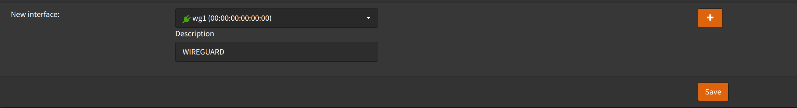

We will create an interface for wireguard, so we can use it in firewall rules.

Navigate to `Interfaces` -> `Assignments`

- New Interface: Select `wg1` (or the interface name that was generated)
- Description: `WIREGUARD`
- Click <kbd>➕</kbd>
- Click <kbd>Save</kbd>

- Click `WIREGUARD` interface
- Check `Enable interface`
- Click <kbd>Save</kbd>
- Click <kbd>Apply changes</kbd>
