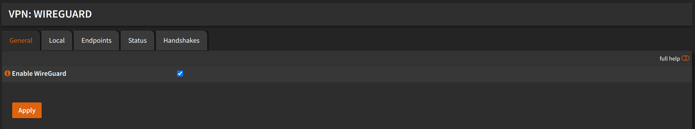
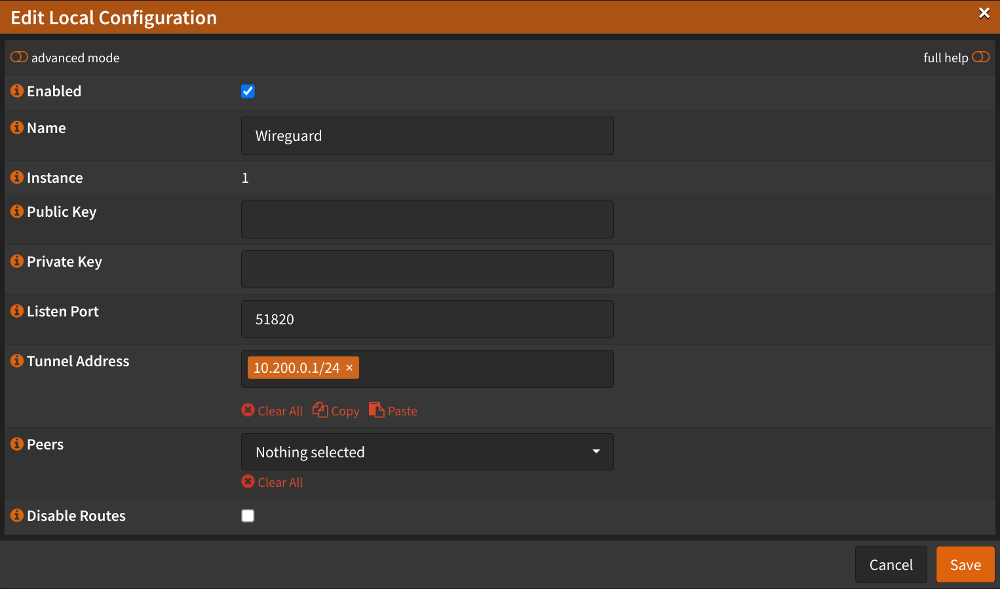
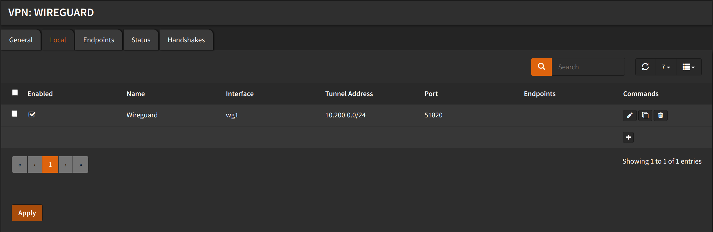

## Enable WireGuard

Navigate to `VPN` -> `WireGuard` -> `General`

:::tip

If you just installed `Wireguard`, you might have to refresh the page.

:::

- Check `Enable WireGuard`
- Click <kbd>Apply</kbd>
- Click <kbd>Apply changes</kbd>

## Local Configuration

Navigate to `VPN` -> `WireGuard` -> `Local`

- Click <kbd>➕</kbd>
- Check `Enabled`
- Name: `Wireguard`
- Public Key: (Leave empty, it will be generated automatically)
- Private Key: (Leave empty, it will be generated automatically)
- Listen Port: `51820`
- Tunnel Address: `10.200.0.1/24`
- Peers: (Leave empty, we will add them later)
- Uncheck `Disable routes`
- Click <kbd>Save</kbd>

- Click <kbd>Apply</kbd>

