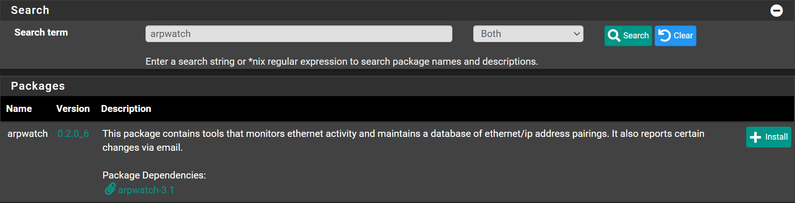
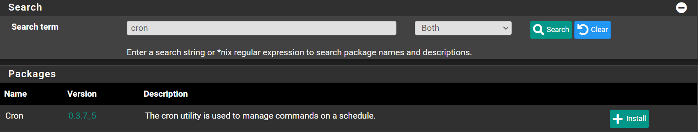

# Setup

## Install arpwatch

Navigate to `System` -> `Package Manager` -> `Available Packages`

Search for `aprwatch` and click <kbd>➕Install</kbd>



Click <kbd>✔️Confirm</kbd>

Wait until you see `Success`

```shell
>>> Installing pfSense-pkg-arpwatch...
Updating pfSense-core repository catalogue...
pfSense-core repository is up to date.
Updating pfSense repository catalogue...
pfSense repository is up to date.
All repositories are up to date.
The following 3 package(s) will be affected (of 0 checked):

New packages to be INSTALLED:
	arpwatch: 3.1 [pfSense]
	libpcap: 1.10.1_2 [pfSense]
	pfSense-pkg-arpwatch: 0.2.0_6 [pfSense]

Number of packages to be installed: 3

The process will require 1 MiB more space.
322 KiB to be downloaded.
[1/3] Fetching pfSense-pkg-arpwatch-0.2.0_6.pkg: .. done
[2/3] Fetching arpwatch-3.1.pkg: .... done
[3/3] Fetching libpcap-1.10.1_2.pkg: .......... done
Checking integrity... done (0 conflicting)
[1/3] Installing libpcap-1.10.1_2...
[1/3] Extracting libpcap-1.10.1_2: .......... done
[2/3] Installing arpwatch-3.1...
[2/3] Extracting arpwatch-3.1: .......... done
[3/3] Installing pfSense-pkg-arpwatch-0.2.0_6...
[3/3] Extracting pfSense-pkg-arpwatch-0.2.0_6: ......... done
Saving updated package information...
done.
Loading package configuration... done.
Configuring package components...
Loading package instructions...
Custom commands...
Executing custom_php_install_command()...done.
Executing custom_php_resync_config_command()...done.
Menu items... done.
Services... done.
Writing configuration... done.
=====
Message from arpwatch-3.1:

--
You can create an ethercodes.dat file by running this script:

    /usr/local/arpwatch/update-ethercodes

Here's a example crontab entry to update it every night:

    00 0 * * * root sleep `jot -r 1 0 600` ; /usr/local/arpwatch/update-ethercodes

The -m flag is deprecated. If you are using the -m watcher flag,
please switch to -w.
>>> Cleaning up cache... done.
Success
```

As you can see the output shows an example of how to automatically update the ethercodes.
This file contains the mappings between mac address and vendors.

You can skip both `Install Cron` and `Setup Cron` if you do not want it to update automatically.
You can do it manual, by checking `Updates the ethernet vendor database` and clicking <kbd>💾Save</kbd>


## Install Cron

Navigate to `System` -> `Package Manager` -> `Available Packages`

Search for `cron` and click <kbd>➕Install</kbd>



Click <kbd>✔️Confirm</kbd>

Wait until you see `Success`

```shell
>>> Installing pfSense-pkg-Cron...
Updating pfSense-core repository catalogue...
pfSense-core repository is up to date.
Updating pfSense repository catalogue...
pfSense repository is up to date.
All repositories are up to date.
The following 1 package(s) will be affected (of 0 checked):

New packages to be INSTALLED:
	pfSense-pkg-Cron: 0.3.7_5 [pfSense]

Number of packages to be installed: 1

7 KiB to be downloaded.
[1/1] Fetching pfSense-pkg-Cron-0.3.7_5.pkg: . done
Checking integrity... done (0 conflicting)
[1/1] Installing pfSense-pkg-Cron-0.3.7_5...
[1/1] Extracting pfSense-pkg-Cron-0.3.7_5: .......... done
Saving updated package information...
done.
Loading package configuration... done.
Configuring package components...
Loading package instructions...
Custom commands...
Executing custom_php_resync_config_command()...done.
Menu items... done.
Writing configuration... done.
>>> Cleaning up cache... done.
Success
```

## Configure Cron

Navigate to `Services` -> `Cron`

- Click <kbd>➕Add</kbd>
- Minute: `00`
- Hour: `0`
- Day of the Month: `*`
- Month of the Year: `*`
- Day of the Week:`*`
- User: `root`
- Command: `sleep `jot -r 1 0 600` ; /usr/local/arpwatch/update-ethercodes`
- Click <kbd>💾Save</kbd>


## Configure ArpWatch

Navigate to `Services` -> `Arpwatch`

- Check `Enable Arpwatch`
- Interfaces: `Select interfaces you want to monitor` (Hold <kbd>CTRL</kbd> to select multiple)
- Notifications recipient: `my-mail@outlook.com` (The mail to receive the notifications)
- Click <kbd>💾Save</kbd>


