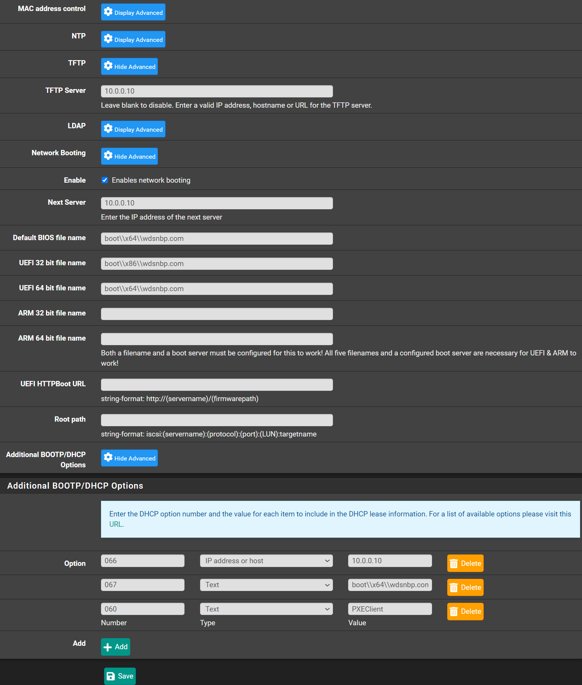

If you have a [WDS](https://docs.microsoft.com/en-us/windows/win32/wds/windows-deployment-services-portal) on your network
you might notice that VLANs or networks not in the same range as your WDS server, might not be able to detect it for booting.

In pfSense you can fix that by doing some configuration on your DHCP server for that VLAN/Network.

Navigate to `Services` -> `DHCP Server` -> `YOUR_INTERFACE-VLAN`

Under `Other Options`

- TFTP
  - TFTP Server: `IP.OF.WDS.SERVER`
- Network Booting
  - Check `Enable network booting`
  - Next Server: `IP.OF.WDS.SERVER`
  - Default BIOS file name: `boot\\x64\\wdsnbp.com`
  - UEFI 86 bit file name: `boot\\x86\\wdsnbp.com`
  - UEFI 64 bit file name: `boot\\x64\\wdsnbp.com`
- Additional BOOTP/DHCP Options
  - Option `066` - `IP address or host` `IP.OF.WDS.SERVER`
  - Click <kbd>➕Add</kbd>
  - Option `067` - `Text` `boot\\x64\\wdsnbp.com`
  - Click <kbd>➕Add</kbd>
  - Option `060` - `Text` `PXEClient`

- Click <kbd>💾Save</kbd>
