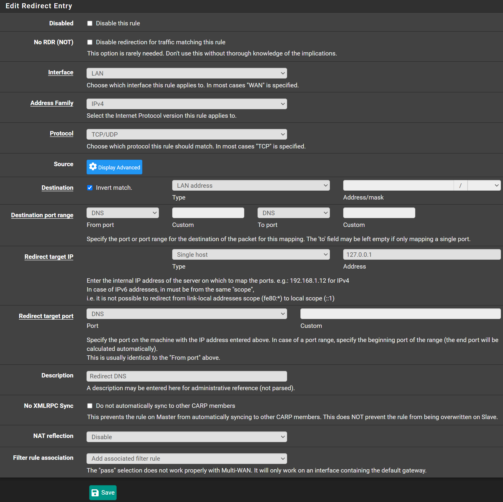
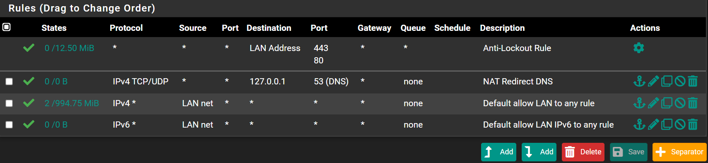

You can force all clients to use pfSense as the DNS server,
even if they manually set a different DNS on their machine

Navigate to `Firewall` -> `NAT` -> `Port Forward`

For every non-WAN interface you want to force this, do the following.
On each interface the `Interface` and `Destination Type`, will be different.

- Click <kbd>⤴️Add</kbd>
- Interface: `LAN`
- Address Family: `IPv4`
- Protocol: `TCP/UDP`
- Destination:
  - Check `Invert match`
  - Type: `LAN Address`
- Destination port range
  - From port: `DNS`
  - To port: `DNS`
- Redirect target IP:
  - Type: `Single host`
  - Address: `127.0.0.1`
- Redirect target port:
  - Port: `DNS`
- Description: `Redirect DNS`
- NAT reflection: `Disable`
- Filter rule association: `Add associated filter rule`

- Click <kbd>💾Save</kbd>
- Click <kbd>✔️Apply Changes</kbd>

Navigate to `Firewall` -> `Rules` -> `LAN`

Do this for all non-WAN interfaces as well.

- Drag `NAT Redirect DNS` rule to the top.
- Click <kbd>💾Save</kbd>
- Click <kbd>✔️Apply Changes</kbd>

:::note

If clients use DNS over TLS, this will not have any effect

:::

You can block DNS queries to port `853`, but this also will not work in all scenarios.
There are many ways that a client can bypass the DNS queries.
