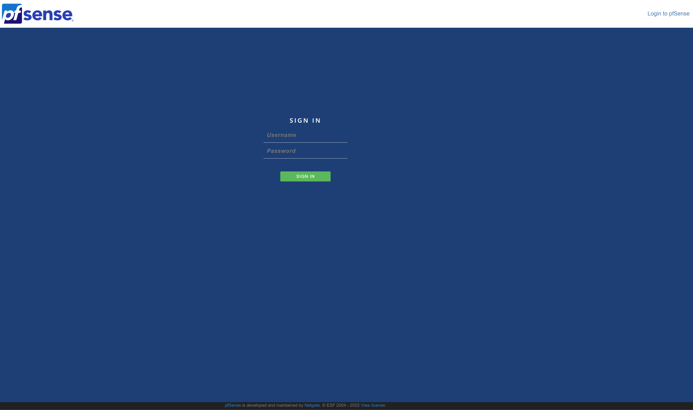
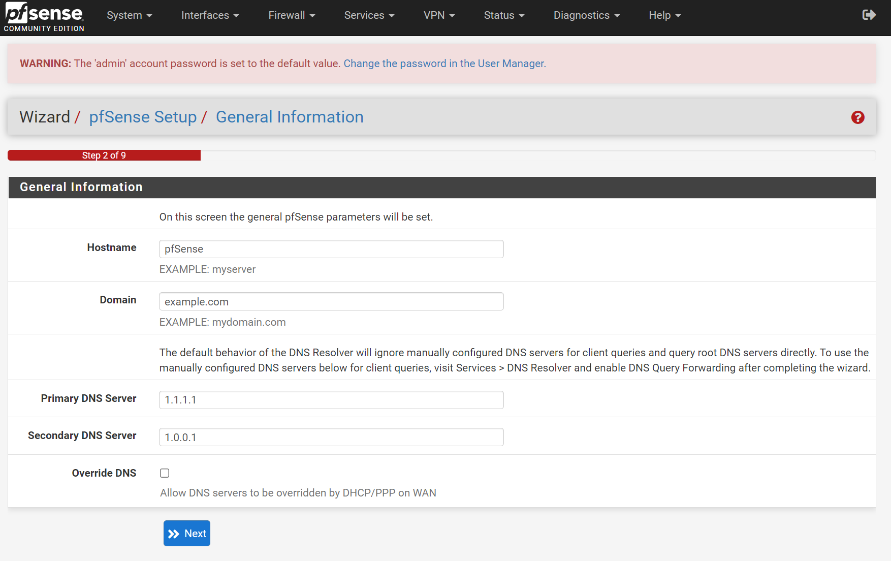

# Setup

This is the first screen you will see after completing the [installation](./install).

Default credentials are:
Username: `admin`
Password: `pfsense`

Once you are logged in you probably will land in the setup wizard. In case you don't. Just Navigate to `System` > `Setup Wizard`

Click <kbd>Next</kbd>

In this screen you can set the `Hostname` of your pfSense firewall.

If you have a domain, you can type it in the `Domain` field.
Maybe it will be better to use something like `lan.your-domain.com`.
So you don't end up creating conflicts later in your local DNS.

You can use `localdomain` if you don't own a domain.
(Don't worry, you can change it later).

Set a `Primary DNS Server` and a `Secondary DNS Server`.
I like to use [Cloudflare](https://www.cloudflare.com/)'s servers. Also I disable `Override DNS` so, my ISP's DNS won't be used.

Click <kbd>Next</kbd>

There are a few more steps, which is setting up `NTP Servers`, `WAN Interface`, `LAN Interface`, `Admin Password`.

The defaults should work just fine.

If you have connected pfSense behind your already running modem/router, for `WAN` you can leave it to `DHCP` for now.
Don't forget to set a different Network address than your ISP's modem/router on LAN interface.
Also remember to set a strong Admin Password.

## General

Now you should be in the `Dashboard`.

First thing I like to do is change the theme.

Go `System` > `General Setup`

Scroll to `webConfigurator`

Change `Theme` to your prefered color. I prefer `pfSense-dark`
You can also change `Login page color` to your prefered color. I prefer again `pfSense-dark`

