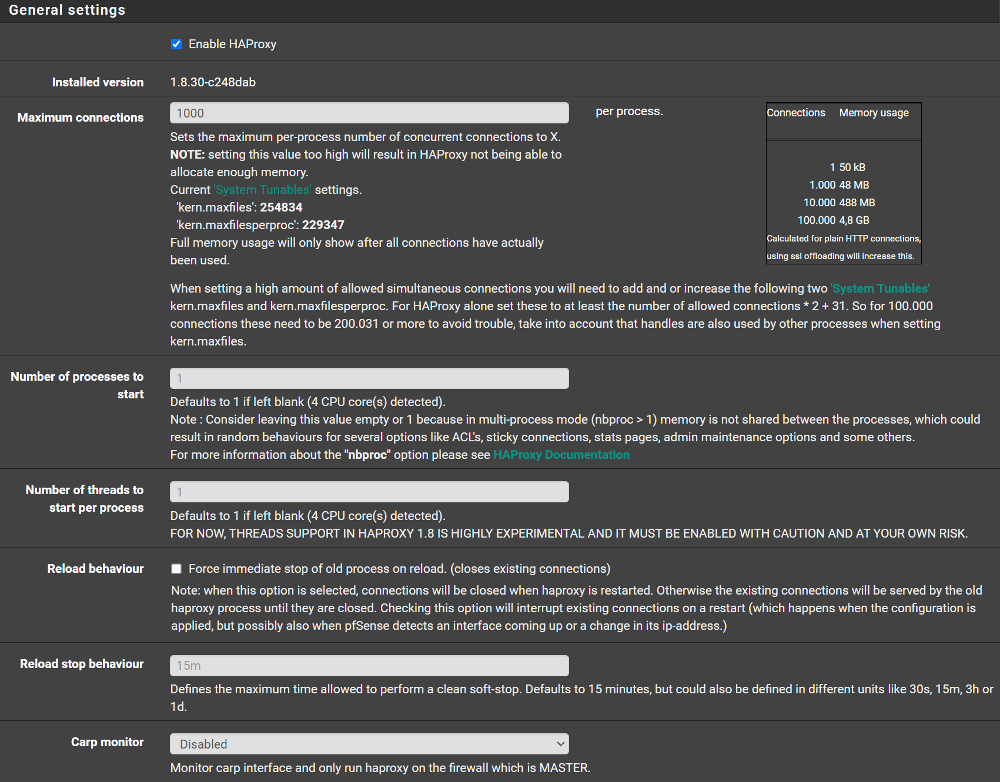
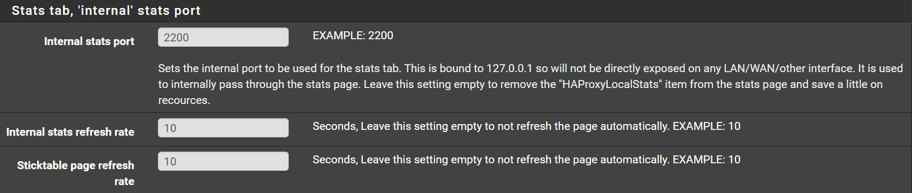
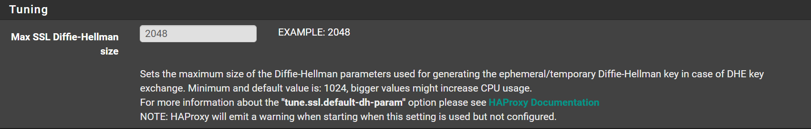
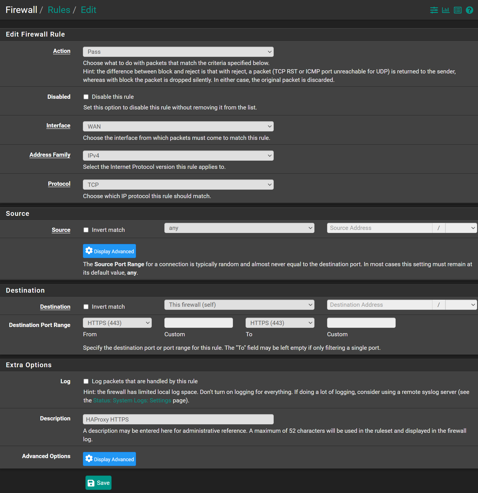
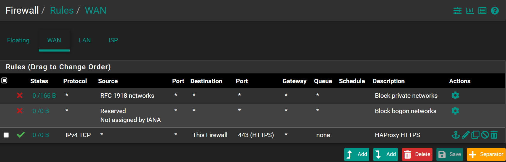

## Enable HAProxy

Navigate to `Services` -> `HAProxy` -> `Settings`

- Check `Enable HAProxy`
- Maximum connections: `1000` (I use 1000, as I have enough memory, you can choose as many as you want)
- Internal stats port: `2200` (or any port you have free, you can also add this port in the management ports alias)
- Internal stats refresh rate: `10`
- Sticktable page refresh rate: `10`
- Max SSL Diffie-Hellman size: `2048`
- Click <kbd>💾Save</kbd>
- Click <kbd>✔️Apply Changes</kbd>

## Firewall Rules

We need to open `HTTPS/443` port

Navigate to `Firewall` -> `Rules` -> `WAN`

- Click <kbd>⤵️Add</kbd>
- Destination: `This firewall (self)`
- Destination Port Range From: `HTTPS(443)`
- Destination Port Range To: `HTTPS(443)`
- Give it a Description if you want

- Click <kbd>💾Save</kbd>
- Click <kbd>✔️Apply Changes</kbd>

