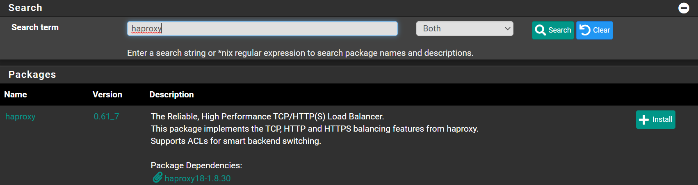

Navigate to `System` -> `Package Manager` -> `Available Packages`

Search for `haproxy` and click <kbd>➕Install</kbd>



Click <kbd>✔️Confirm</kbd>

Wait until you see `Success`

```shell
>>> Installing pfSense-pkg-haproxy...
Updating pfSense-core repository catalogue...
pfSense-core repository is up to date.
Updating pfSense repository catalogue...
pfSense repository is up to date.
All repositories are up to date.
The following 2 package(s) will be affected (of 0 checked):

New packages to be INSTALLED:
  haproxy18: 1.8.30 [pfSense]
  pfSense-pkg-haproxy: 0.61_7 [pfSense]

Number of packages to be installed: 2

The process will require 3 MiB more space.
768 KiB to be downloaded.
[1/2] Fetching pfSense-pkg-haproxy-0.61_7.pkg: .......... done
[2/2] Fetching haproxy18-1.8.30.pkg: .......... done
Checking integrity... done (0 conflicting)
[1/2] Installing haproxy18-1.8.30...
[1/2] Extracting haproxy18-1.8.30: ........ done
[2/2] Installing pfSense-pkg-haproxy-0.61_7...
[2/2] Extracting pfSense-pkg-haproxy-0.61_7: .......... done
Saving updated package information...
done.
Loading package configuration... done.
Configuring package components...
Loading package instructions...
Custom commands...
Executing custom_php_install_command()...done.
Menu items... done.
Services... done.
Writing configuration... done.
>>> Cleaning up cache... done.
Success
```
