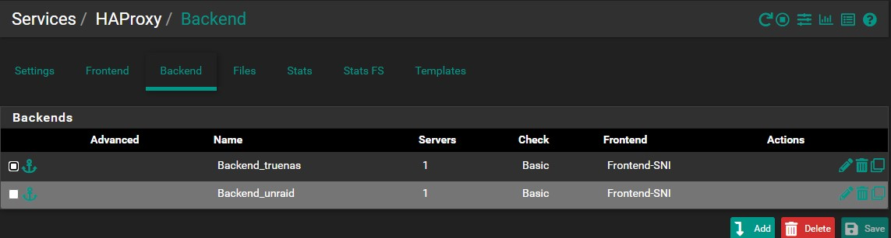
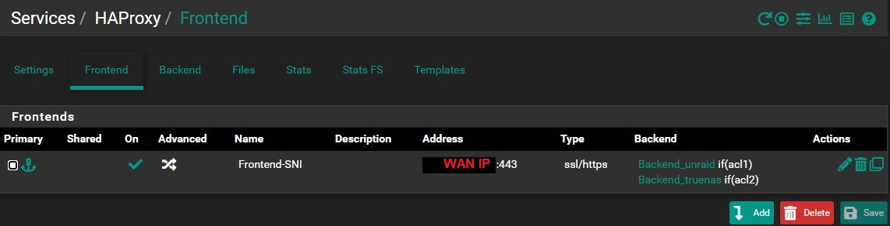
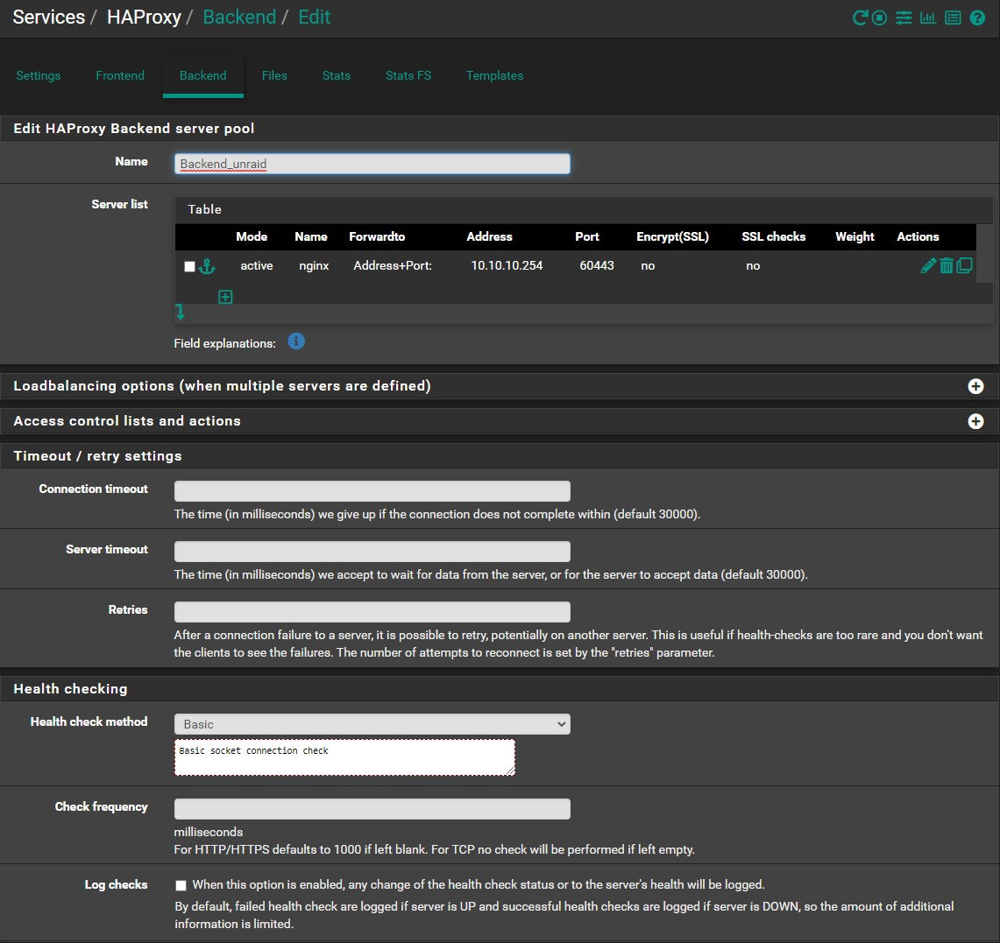
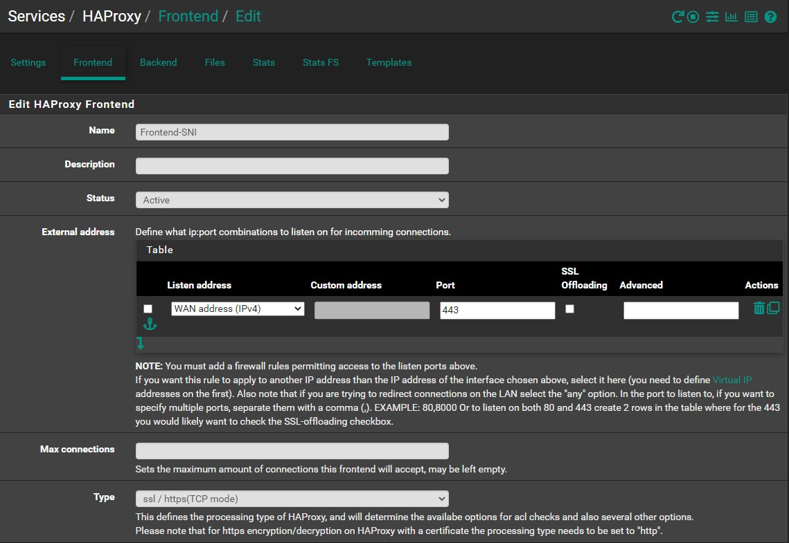
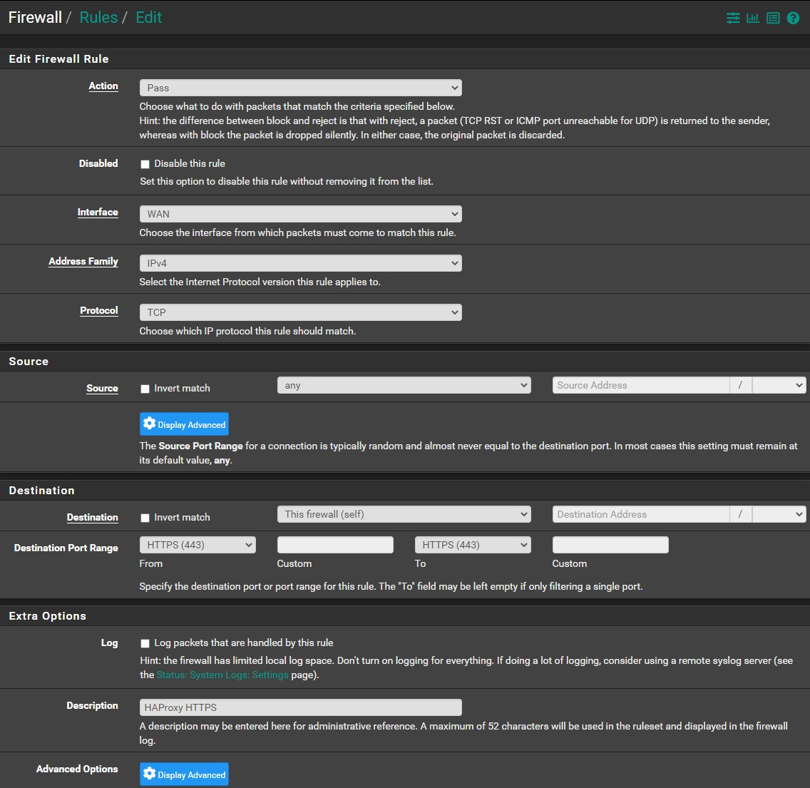
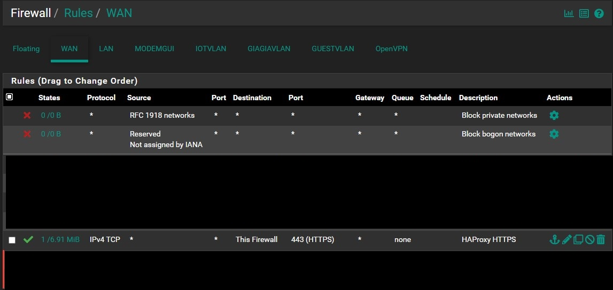
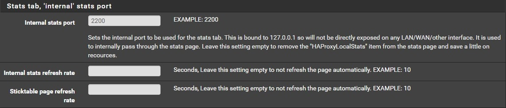
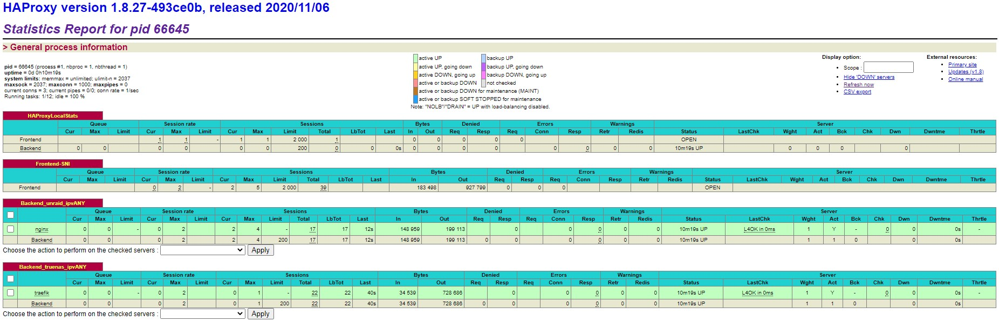

# Setup

## Overview
This is how it will look in the end

**Backend**

**Frontend**

## Backends
`Backends` is the local servers

Navigate to `Services` -> `HAProxy` -> `Backends` -> `Add`

* Name your backend (eg. `Backend_truenas`)
* Click ⤵️ on Server List
  * Name your server
  * Put the local IP (eg. `10.10.10.230`)
  * Put the HTTPS port your server is listening (eg. `443`)
  * Encrypt(SSL) - `Unchecked`
  * SSL Checks - `Unchecked`
* Health check method -> `Basic`
* <kbd>Save</kbd>

Repeat for the other servers

## Frontends

Frontend is where the redirect is happening

Navigate to `Services` -> `HAProxy` -> `Frontends` -> `Add`

* Name your frontend (eg. `Frontend-SNI`)
* External Address
  * Port: `443`
* Type: `ssl / https(TCP Mode)`

* Access Control lists
  * Click ⤵️
  * Name your ACL (eg. `acl2`)
  * Expression (to match whole domain): `Server Name Indication TLS extension contains:`
  * CS: `Unchecked`
  * Not: `Unchecked`
  * Value: `example2.com` (put your domain here)
  * Repeat ACL steps for all your domains
* Actions
  * Click ⤵️
  * Action: `Use Backend`
  * Condition acl names: `acl2` (Here you have to use the exact name of one of the ACL's you configured)
  * backend: `Backend_truenas` (Here select the backend you want to redirect when the ACL matches the domain)
  * Repeat Action steps for all your backends

## Firewall Rules

Now we need to open `HTTPS/443` port

Navigate to `Firewall` -> `Rules` -> ⤵️`Add`

* Destination: `This firewall (self)`
* Destination Port Range From: `HTTPS(443)`
* Destination Port Range To: `HTTPS(443)`
* Give it a Description if you want
* <kbd>Save</kbd>

## Enable HAProxy

Navigate to `Services` -> `HAProxy` -> `Settings`

* Enable HAProxy: `Checked`
* Maximum connections: `1000` (I use 1000, as I have enough memory, you can choose as many as you want)
* Internal stats port: `2200` (or any port you have free)
* <kbd>Save</kbd>

## Check if everything is working

Navigate to `Status` -> `HAProxy Status`

If everything is setup correctly, you should have Green Lines for each backend.
If you see Red Line for any backend, you probably have missed something.

