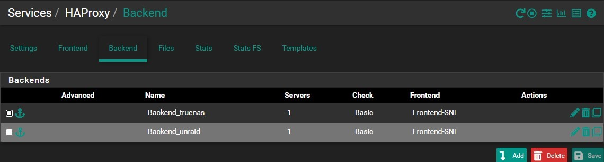
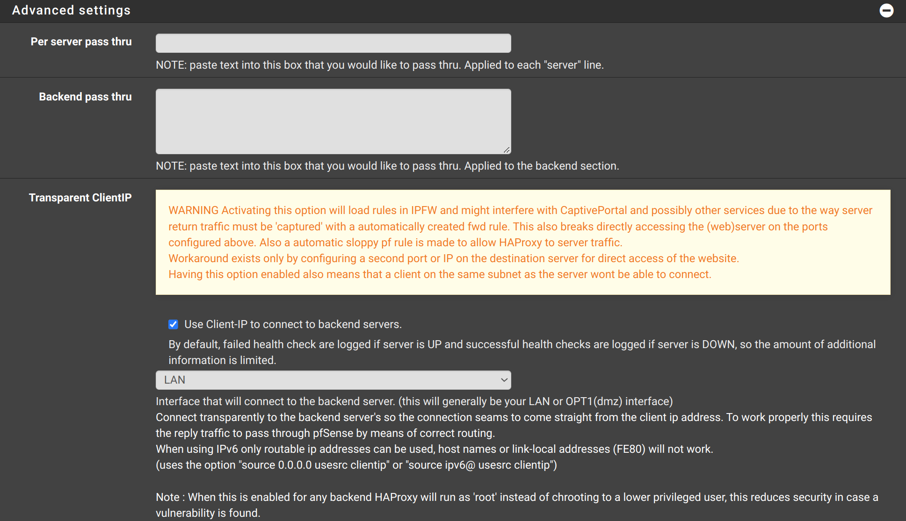
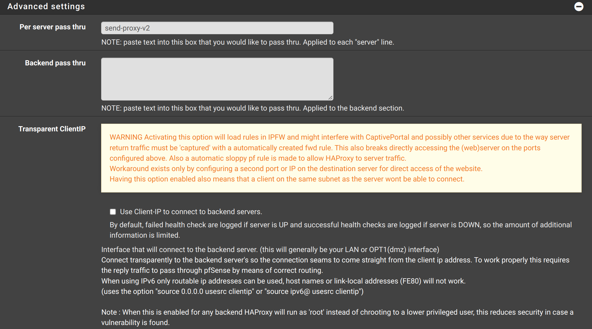
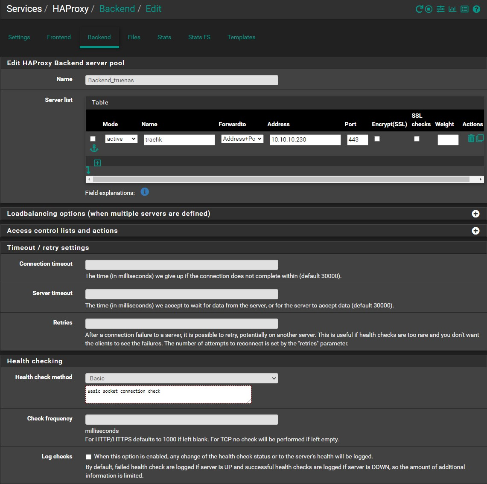
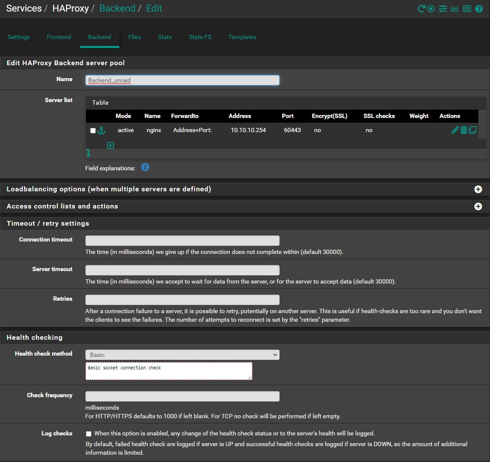
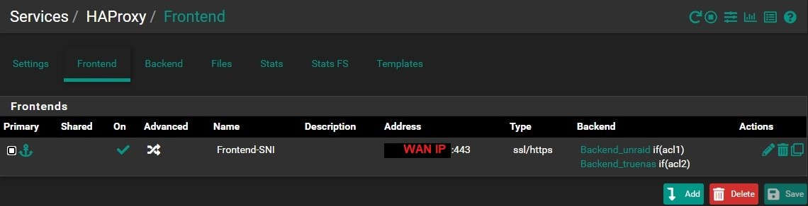
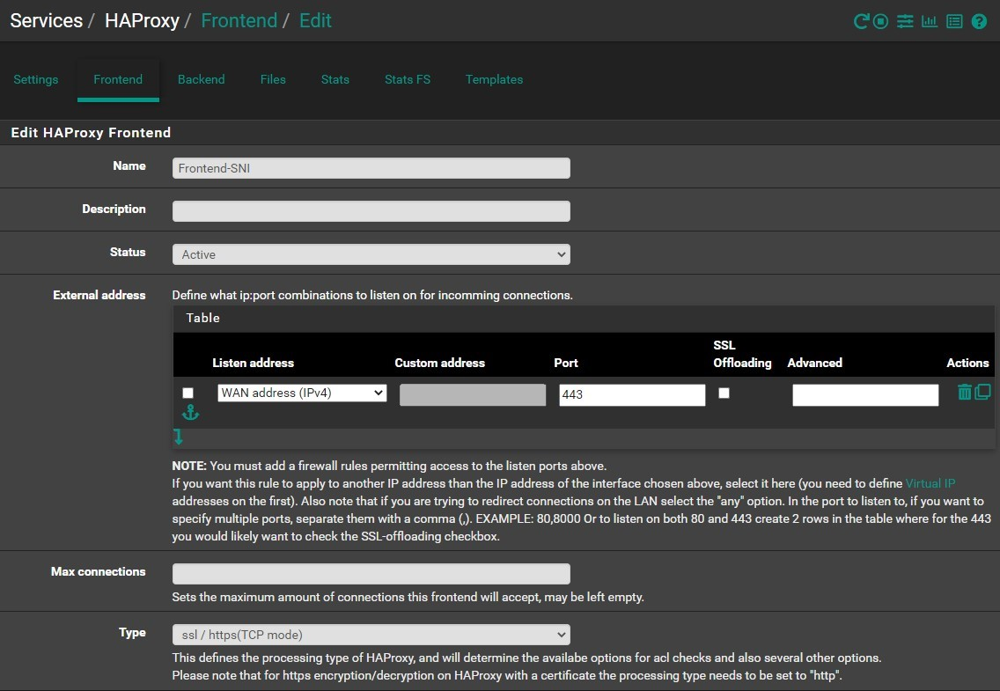
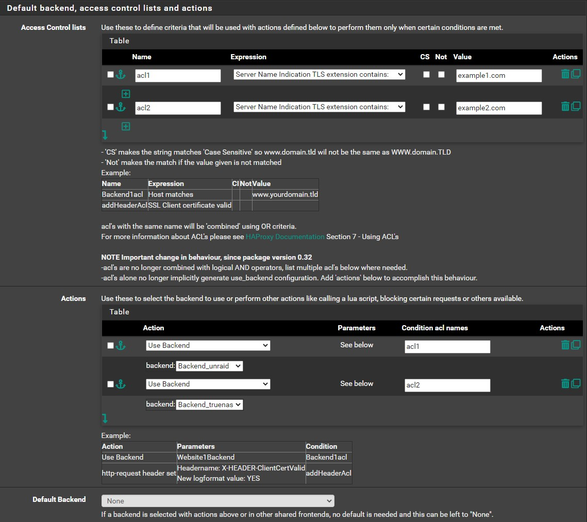
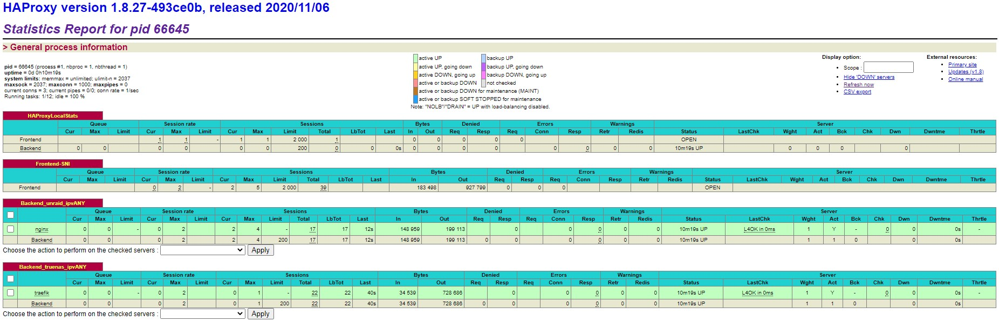

## Overview

We will redirect multiple domains to multiple local servers using SNI

In this guide we will configure multiple domains (`example1.com`, `example2.com`) to redirect to specific local server
(`10.10.10.254`, `10.10.10.230`) using the same port (`HTTPS/443`)

For this example our local servers are using reverse proxies and each server issue it's own certs using let's encrypt
and only accepting HTTPS traffic.

(I have setup Let's encrypt to use DNS validation (Cloudflare) so I don't need `HTTP/80` port open)

## Backend

Navigate to `Services` -> `HAProxy` -> `Backend` -> `Add`

- Name your backend (eg. `Backend_truenas`)
- Click ⤵️ on Server List
  - Name: `traefik`
  - Address: `10.10.10.230` (Put here the address of your server)
  - Port: `443`
  - Encrypt(SSL): `Unchecked`
  - SSL Checks: `Unchecked`
- Health checking
  - Health check method: `SSL` (or `Basic`, or `none`)
- Click <kbd>💾Save</kbd>

### Transparent ClientIP

One way to get real client IP on the backend is to use `Transparent ClientIP`.

:::caution

But this can cause more issues that the ones that will solve.
For example, I couldn't get devices from other VLANS to reach the server.
Also, if you have this enabled, and disable HAProxy, it still applies some rules and can keep causing trouble.

:::

### Proxy Protocol

The other way (preferred) is to use the `Proxy Protocol`.
To enable this, add `send-proxy-v2` on `Per server pass thru`, in `Advanced Settings`.

:::caution

For this to work, your backend reverse proxy server must support also the `Proxy Protocol`.

:::

:::tip

Set health check to `none`, until you got it working, then come back and change if you want to.

I encountered some timeouts with services running with web sockets.
Increasing Connection timeout to `3000000`, Server timeout to `3000000` and Retries to `3` fixed it.
:::

Repeat for the other servers

## Frontend

Navigate to `Services` -> `HAProxy` -> `Frontend` -> `Add`

- Name your frontend (eg. `Frontend-SNI`)
- External Address
  - Listen Address: `WAN address (IPv4)`
  - Port: `443`
- Type: `ssl / https(TCP Mode)`

- Access Control lists
  - Click ⤵️
  - Name: `acl2` (Pick any name you want)
  - Expression (to match whole domain): `Server Name Indication TLS extension contains:`
  - CS: `Unchecked`
  - Not: `Unchecked`
  - Value: `example2.com` (put your domain here)
  - Repeat ACL steps for all your domains
- Actions
  - Click ⤵️
  - Action: `Use Backend`
  - Condition acl names: `acl2` (Here you have to use the exact name of one of the ACL's you configured)
  - backend: `Backend_truenas` (Here select the backend you want to redirect when the ACL matches the domain)
  - Repeat Action steps for all your backends

> I encountered some timeouts with services running with web sockets.
> Increasing Client timeout to `3000000`

## Check if everything is working

Navigate to `Status` -> `HAProxy Status`

If everything is setup correctly, you should have Green Lines for each backend.
If you see Red Line for any backend, you probably have missed something.

