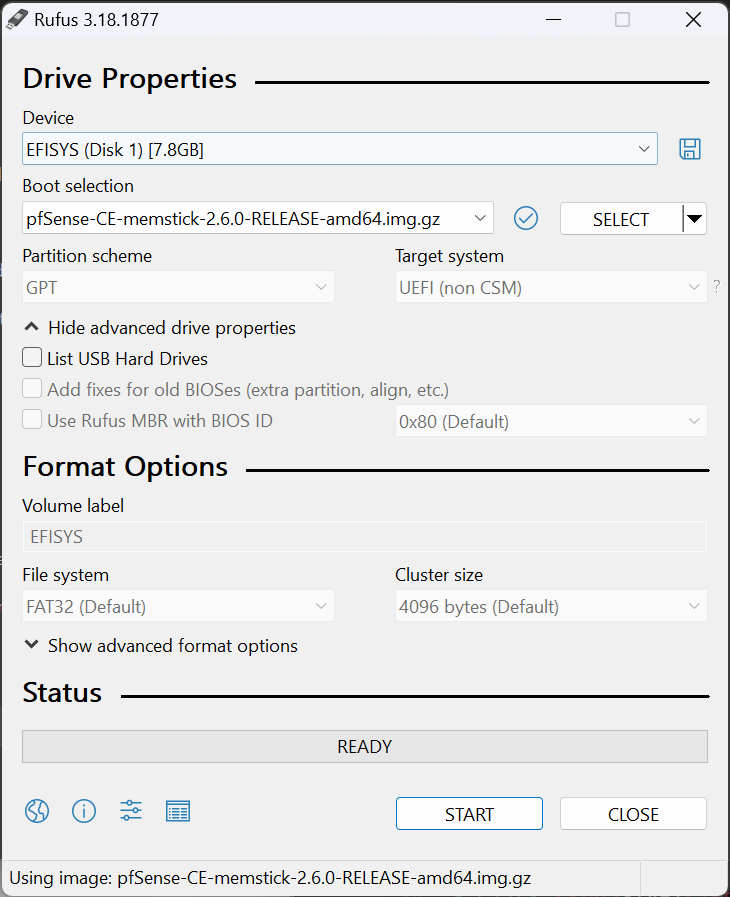

# pfSense Installation

## Download installer and tools

### pfSense
Download the installer from pfSense official download [page](https://www.pfsense.org/download/)

* Select `AMD64 (64-bit)` as `Architecture`
* Select `USB Memstick Installer` as `Installer` for bare metal installation or `DVD Image (ISO) Installer` for virtualized installation
* Select `VGA` as `Console`
* Select the `Mirror` closest to you
* Click <kbd>Download</kbd>

> You can skip `Rufus` and `Prepare the installation media (USB)`
if you plan to do a virtualized installation
{.is-info}
### Rufus
Download rufus from their official [site](https://rufus.ie/en/)
Select either the portable version or the installer, both will work.

## Prepare the installation media (USB)

> This process will **DELETE** any data in your USB stick.
{.is-warning}

* Run `Rufus`
* Select your USB Stick on the `Device` drop down list
* On `Boot selection` Click <kbd>SELECT</kbd> and select the OPNsense installer we downloaded earlier
* Check again that you selected the correct `Device` on previous step
* Click <kbd>START</kbd>
* Accept the **WARNING** saying that will **DESTROY** your data on this device

Once the process is finished you are ready to install OPNsense to your machine.

## Prepare the installation media (Virtualized)

* Mount the ISO file into your VM
* Set it as primary boot device

## Installation on bare metal

* Boot your machine from the prepared USB stick.

*TODO: Installlation Instructions*

## Initial Setup

This is the first screen you will see after completing the installation.

Default credentials are:
Username: `admin`
Password: `pfsense`

Once you are logged in you probably will land in the setup wizard. In case you don't. Just go to `System` > `Setup Wizard`

Click <kbd>Next</kbd>

In this screen you can set the `Hostname` of your pfSense firewall.

If you have a domain, you can type it in the `Domain` field.
You can use `localdomain` if you don't own a domain.
(Don't worry, you can change it later).

Set a `Primary DNS Server` and a `Secondary DNS Server`.
I like to use [Cloudflare](https://www.cloudflare.com/)'s servers. Also I disable `Override DNS` so, my ISP's DNS won't be used.

Click <kbd>Next</kbd>

There are a few more steps, which is setting up `NTP Servers`, `WAN Interface`, `Lan Interface`, `Admin Password`.

The defaults should work just fine.

You really have to setup WAN interface, which is something that I can't help, as each ISP will have different requirements.

Also remember to set a strong Admin Password.

## General

Now you should be in the `Dashboard`.

First thing I like to do is change the theme.

Go `System` > `General Setup`

Scroll to `webConfigurator`

Change `Theme` to your prefered color. I prefer `pfSense-dark`
You can also change `Login page color` to your prefered color. I prefer again `pfSense-dark`

