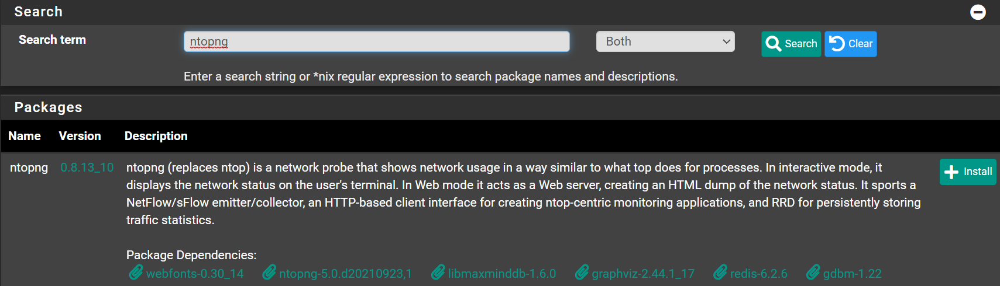

Navigate to `System` -> `Package Manager` -> `Available Packages`

Search for `ntopng` and click <kbd>➕Install</kbd>



Click <kbd>✔️Confirm</kbd>

Wait until you see `Success`

```shell
>>> Installing pfSense-pkg-ntopng...
Updating pfSense-core repository catalogue...
pfSense-core repository is up to date.
Updating pfSense repository catalogue...
pfSense repository is up to date.
All repositories are up to date.
The following 31 package(s) will be affected (of 0 checked):

New packages to be INSTALLED:
  fontconfig: 2.13.94_1,1 [pfSense]
  freetype2: 2.11.0 [pfSense]
  gdbm: 1.22 [pfSense]
  giflib: 5.2.1 [pfSense]
  graphviz: 2.44.1_17 [pfSense]
  groff: 1.22.4_4 [pfSense]
  jbigkit: 2.1_1 [pfSense]
  jpeg-turbo: 2.1.1_1 [pfSense]
  libfontenc: 1.1.4 [pfSense]
  libgd: 2.3.1,1 [pfSense]
  libmaxminddb: 1.6.0 [pfSense]
  libpaper: 1.1.28 [pfSense]
  libsodium: 1.0.18 [pfSense]
  libzmq4: 4.3.4 [pfSense]
  lua53: 5.3.6 [pfSense]
  mkfontscale: 1.2.1 [pfSense]
  mysql57-client: 5.7.36 [pfSense]
  ndpi: 4.0.d20210818,1 [pfSense]
  norm: 1.5r6_1 [pfSense]
  ntopng: 5.0.d20210923,1 [pfSense]
  openpgm: 5.2.122_6 [pfSense]
  pfSense-pkg-ntopng: 0.8.13_10 [pfSense]
  png: 1.6.37_1 [pfSense]
  protobuf: 3.17.3,1 [pfSense]
  psutils: 1.17_5 [pfSense]
  redis: 6.2.6 [pfSense]
  tiff: 4.3.0 [pfSense]
  uchardet: 0.0.7 [pfSense]
  webfonts: 0.30_14 [pfSense]
  webp: 1.2.1 [pfSense]
  zstd: 1.5.0 [pfSense]

Number of packages to be installed: 31

The process will require 188 MiB more space.
25 MiB to be downloaded.
[1/31] Fetching pfSense-pkg-ntopng-0.8.13_10.pkg: .. done
[2/31] Fetching webfonts-0.30_14.pkg: .......... done
[3/31] Fetching mkfontscale-1.2.1.pkg: ... done
[4/31] Fetching libfontenc-1.1.4.pkg: ... done
[5/31] Fetching freetype2-2.11.0.pkg: .......... done
[6/31] Fetching png-1.6.37_1.pkg: .......... done
[7/31] Fetching fontconfig-2.13.94_1,1.pkg: .......... done
[8/31] Fetching ntopng-5.0.d20210923,1.pkg: .......... done
[9/31] Fetching libsodium-1.0.18.pkg: .......... done
[10/31] Fetching ndpi-4.0.d20210818,1.pkg: .......... done
[11/31] Fetching libzmq4-4.3.4.pkg: .......... done
[12/31] Fetching openpgm-5.2.122_6.pkg: .......... done
[13/31] Fetching norm-1.5r6_1.pkg: .......... done
[14/31] Fetching libmaxminddb-1.6.0.pkg: ..... done
[15/31] Fetching lua53-5.3.6.pkg: .......... done
[16/31] Fetching mysql57-client-5.7.36.pkg: .......... done
[17/31] Fetching groff-1.22.4_4.pkg: .......... done
[18/31] Fetching uchardet-0.0.7.pkg: .......... done
[19/31] Fetching psutils-1.17_5.pkg: ........ done
[20/31] Fetching libpaper-1.1.28.pkg: .... done
[21/31] Fetching protobuf-3.17.3,1.pkg: .......... done
[22/31] Fetching zstd-1.5.0.pkg: .......... done
[23/31] Fetching graphviz-2.44.1_17.pkg: .......... done
[24/31] Fetching webp-1.2.1.pkg: .......... done
[25/31] Fetching tiff-4.3.0.pkg: .......... done
[26/31] Fetching jpeg-turbo-2.1.1_1.pkg: .......... done
[27/31] Fetching jbigkit-2.1_1.pkg: ........ done
[28/31] Fetching giflib-5.2.1.pkg: ......... done
[29/31] Fetching libgd-2.3.1,1.pkg: .......... done
[30/31] Fetching redis-6.2.6.pkg: .......... done
[31/31] Fetching gdbm-1.22.pkg: .......... done
Checking integrity... done (0 conflicting)
[1/31] Installing libpaper-1.1.28...
[1/31] Extracting libpaper-1.1.28: .......... done
[2/31] Installing jpeg-turbo-2.1.1_1...
[2/31] Extracting jpeg-turbo-2.1.1_1: .......... done
[3/31] Installing jbigkit-2.1_1...
[3/31] Extracting jbigkit-2.1_1: .......... done
[4/31] Installing png-1.6.37_1...
[4/31] Extracting png-1.6.37_1: .......... done
[5/31] Installing uchardet-0.0.7...
[5/31] Extracting uchardet-0.0.7: .......... done
[6/31] Installing psutils-1.17_5...
[6/31] Extracting psutils-1.17_5: .......... done
[7/31] Installing tiff-4.3.0...
[7/31] Extracting tiff-4.3.0: .......... done
[8/31] Installing giflib-5.2.1...
[8/31] Extracting giflib-5.2.1: .......... done
[9/31] Installing libfontenc-1.1.4...
[9/31] Extracting libfontenc-1.1.4: ......... done
[10/31] Installing freetype2-2.11.0...
[10/31] Extracting freetype2-2.11.0: .......... done
[11/31] Installing openpgm-5.2.122_6...
[11/31] Extracting openpgm-5.2.122_6: .......... done
[12/31] Installing norm-1.5r6_1...
[12/31] Extracting norm-1.5r6_1: .... done
[13/31] Installing groff-1.22.4_4...
[13/31] Extracting groff-1.22.4_4: .......... done
[14/31] Installing protobuf-3.17.3,1...
[14/31] Extracting protobuf-3.17.3,1: .......... done
[15/31] Installing webp-1.2.1...
[15/31] Extracting webp-1.2.1: .......... done
[16/31] Installing mkfontscale-1.2.1...
[16/31] Extracting mkfontscale-1.2.1: ....... done
[17/31] Installing fontconfig-2.13.94_1,1...
[17/31] Extracting fontconfig-2.13.94_1,1: .......... done
Running fc-cache to build fontconfig cache...
Font directories:
  /usr/local/share/fonts
  /usr/local/lib/X11/fonts
/usr/local/share/fonts: skipping, no such directory
/usr/local/lib/X11/fonts: skipping, no such directory
/var/db/fontconfig: cleaning cache directory
fc-cache: succeeded
[18/31] Installing libsodium-1.0.18...
[18/31] Extracting libsodium-1.0.18: .......... done
[19/31] Installing ndpi-4.0.d20210818,1...
[19/31] Extracting ndpi-4.0.d20210818,1: .......... done
[20/31] Installing libzmq4-4.3.4...
[20/31] Extracting libzmq4-4.3.4: .......... done
[21/31] Installing libmaxminddb-1.6.0...
[21/31] Extracting libmaxminddb-1.6.0: .......... done
[22/31] Installing lua53-5.3.6...
[22/31] Extracting lua53-5.3.6: ......... done
[23/31] Installing mysql57-client-5.7.36...
[23/31] Extracting mysql57-client-5.7.36: .......... done
[24/31] Installing zstd-1.5.0...
[24/31] Extracting zstd-1.5.0: .......... done
[25/31] Installing libgd-2.3.1,1...
[25/31] Extracting libgd-2.3.1,1: .......... done
[26/31] Installing webfonts-0.30_14...
[26/31] Extracting webfonts-0.30_14: .......... done
[27/31] Installing ntopng-5.0.d20210923,1...
===> Creating groups.
Creating group 'ntopng' with gid '288'.
===> Creating users
Creating user 'ntopng' with uid '288'.
[27/31] Extracting ntopng-5.0.d20210923,1: .......... done
[28/31] Installing graphviz-2.44.1_17...
[28/31] Extracting graphviz-2.44.1_17: .......... done
[29/31] Installing redis-6.2.6...
===> Creating groups.
Creating group 'redis' with gid '535'.
===> Creating users
Creating user 'redis' with uid '535'.
[29/31] Extracting redis-6.2.6: ......... done
[30/31] Installing gdbm-1.22...
[30/31] Extracting gdbm-1.22: .......... done
[31/31] Installing pfSense-pkg-ntopng-0.8.13_10...
[31/31] Extracting pfSense-pkg-ntopng-0.8.13_10: ......... done
Saving updated package information...
done.
Loading package configuration... done.
Configuring package components...
Loading package instructions...
Custom commands...
Executing custom_php_install_command()...done.
Executing custom_php_resync_config_command()...done.
Menu items... done.
Services... done.
Writing configuration... done.
=====
Message from freetype2-2.11.0:

--
The 2.7.x series now uses the new subpixel hinting mode (V40 port's option) as
the default, emulating a modern version of ClearType. This change inevitably
leads to different rendering results, and you might change port's options to
adapt it to your taste (or use the new "FREETYPE_PROPERTIES" environment
variable).

The environment variable "FREETYPE_PROPERTIES" can be used to control the
driver properties. Example:

FREETYPE_PROPERTIES=truetype:interpreter-version=35 \
  cff:no-stem-darkening=1 \
  autofitter:warping=1

This allows to select, say, the subpixel hinting mode at runtime for a given
application.

If LONG_PCF_NAMES port's option was enabled, the PCF family names may include
the foundry and information whether they contain wide characters. For example,
"Sony Fixed" or "Misc Fixed Wide", instead of "Fixed". This can be disabled at
run time with using pcf:no-long-family-names property, if needed. Example:

FREETYPE_PROPERTIES=pcf:no-long-family-names=1

How to recreate fontconfig cache with using such environment variable,
if needed:
# env FREETYPE_PROPERTIES=pcf:no-long-family-names=1 fc-cache -fsv

The controllable properties are listed in the section "Controlling FreeType
Modules" in the reference's table of contents
(/usr/local/share/doc/freetype2/reference/index.html, if documentation was installed).
=====
Message from openpgm-5.2.122_6:

--
===>   NOTICE:

The openpgm port currently does not have a maintainer. As a result, it is
more likely to have unresolved issues, not be up-to-date, or even be removed in
the future. To volunteer to maintain this port, please create an issue at:

https://bugs.freebsd.org/bugzilla

More information about port maintainership is available at:

https://docs.freebsd.org/en/articles/contributing/#ports-contributing
=====
Message from groff-1.22.4_4:

--
In order to be able to use the html driver, you need to install the following
packages:
 - ghostscript
 - netpbm
=====
Message from mysql57-client-5.7.36:

--
This is the mysql CLIENT without the server.
for complete server and client, please install databases/mysql57-server
=====
Message from webfonts-0.30_14:

--
IMPORTANT - READ CAREFULLY: You may not use these fonts if you do not agree to
the terms of the Microsoft End-User License Agreement ("EULA").  You will find
the EULA at /usr/local/share/doc/webfonts/LICENSE.  If you read and agree
to the EULA, you can start using the fonts by following these instructions:

Make sure that the freetype module is loaded.  If it is not, add the following
line to the "Modules" section of xorg.conf or XF86Config:

  Load "freetype"

Add the following line to the "Files" section of xorg.conf or XF86Config:

  FontPath "/usr/local/share/fonts/webfonts/"

NOTE: Due to known freetype bug some glyphs (N, W) of y2006 Verdana Bold
      font are not rendered correctly in anti-aliased mode within the range
      9-16 ppem
=====
Message from ntopng-5.0.d20210923,1:

--
ntopng runs a web interface service by default, it is suggested to protect
such network accessible services with packet filters or TCP wrappers.

ntopng requires to connect to a redis server to work. Please install redis
server from databases/redis or use -r option via ntopng_flags to specify a
remote one.

ntopng supports IP geolocation, to enable this you should use the
ntopng-geoip2update.sh script to update the maxminddb geolocation
data to the latest version.

To pass a configuration file to ntopng, which overrides any command
line arguments, add something like the following to rc.conf:

ntopng_flags="/path/to/file.conf"
=====
Message from redis-6.2.6:

--
To setup "redis" you need to edit the configuration file:
      /usr/local/etc/redis.conf

      To run redis from startup, add redis_enable="YES"
      in your /etc/rc.conf.
>>> Cleaning up cache... done.
Success
```
