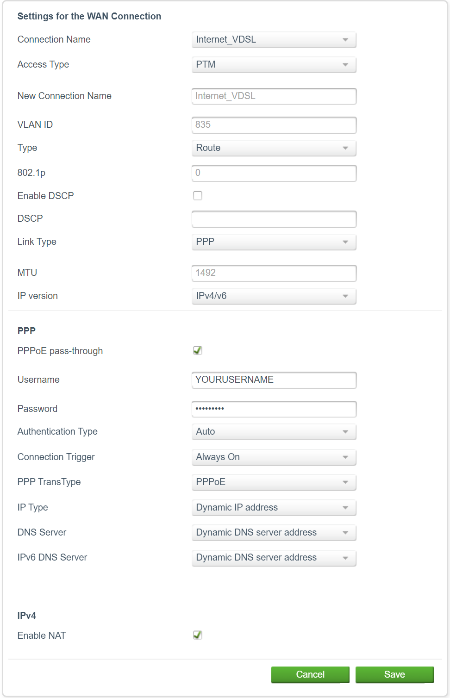

This guide is for those that their ISP utilizes `PPPoE` for connecting your modem/router to the internet.
Usually you will see this on DSL lines.

There are 2 solutions here,

1. Turn your modem/router (the one from your ISP) to bridge mode.
2. Turn your modem/router (the one from your ISP) to PPPoE Passthrough mode.

Both should work equally.

My ISP provides VOIP, via the same modem/router, which means I can't use bridge mode, as I'll lose VOIP.
There are ways to get the credentials and setup a VOIP server, but I don't really care.

So, I'll go with the second option.

Luckily, everything needed is enabled by default from my ISP on their modem/router.
But just in case, here is a screenshot of my ISP's UI.

This is under `Internet` -> `Internet Configuration`.

There was a time that the preferred way (for my ISP), was to use some generic credentials on the ISP's modem/router.
And the personal credentials on `pfSense`.

At the time I was writing this, I used my personal credentials on both pfSense and ISP's modem/router.

It works as expected.
