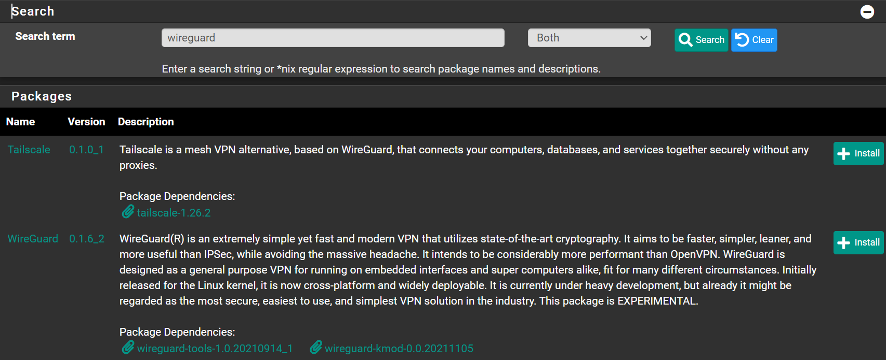

Navigate to `System` -> `Package Manager` -> `Available Packages`

Search for `wireguard` and click <kbd>➕Install</kbd>



Click <kbd>✔️Confirm</kbd>

Wait until you see `Success`

```shell
>>> Installing pfSense-pkg-WireGuard...
Updating pfSense-core repository catalogue...
pfSense-core repository is up to date.
Updating pfSense repository catalogue...
pfSense repository is up to date.
All repositories are up to date.
The following 3 package(s) will be affected (of 0 checked):

New packages to be INSTALLED:
  pfSense-pkg-WireGuard: 0.1.6_2 [pfSense]
  wireguard-kmod: 0.0.20211105 [pfSense]
  wireguard-tools-lite: 1.0.20210914_1 [pfSense]

Number of packages to be installed: 3

126 KiB to be downloaded.
[1/3] Fetching pfSense-pkg-WireGuard-0.1.6_2.pkg: ..... done
[2/3] Fetching wireguard-tools-lite-1.0.20210914_1.pkg: ...... done
[3/3] Fetching wireguard-kmod-0.0.20211105.pkg: ...... done
Checking integrity... done (0 conflicting)
[1/3] Installing wireguard-tools-lite-1.0.20210914_1...
[1/3] Extracting wireguard-tools-lite-1.0.20210914_1: ....... done
[2/3] Installing wireguard-kmod-0.0.20211105...
[2/3] Extracting wireguard-kmod-0.0.20211105: .... done
[3/3] Installing pfSense-pkg-WireGuard-0.1.6_2...
[3/3] Extracting pfSense-pkg-WireGuard-0.1.6_2: .......... done
Saving updated package information...
done.
Loading package configuration... done.
Configuring package components...
Loading package instructions...
Custom commands...
Executing custom_php_install_command()...done.
  Installing WireGuard early shell commands...done.
  Creating WireGuard interface group...done.
  Creating WireGuard Unbound access list...done.
  Installing WireGuard service...done.
  Applying WireGuard default settings as necessary...done.
done.
Executing custom_php_resync_config_command()...done.
Menu items... done.
Services... done.
Writing configuration... done.
=====
Message from wireguard-kmod-0.0.20211105:

--
At this time this code is new, unvetted, possibly buggy, and should be
considered "experimental". It might contain security issues. We gladly
welcome your testing and bug reports, but do keep in mind that this code
is new, so some caution should be exercised at the moment for using it
in mission critical environments.
>>> Cleaning up cache... done.
Success

```
