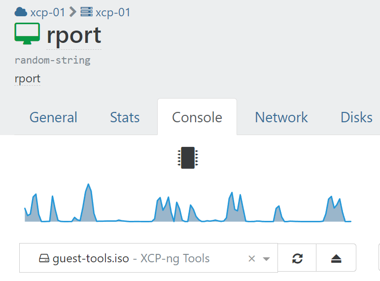

# Installation

You will need a linux VM (or bare metal), I tested this on `Ubuntu 22.04`.
I just did a basic install.

- Update the system

  ```shell
  sudo apt update
  sudo apt upgrade -y
  ```

- Install guest tools (Optional)
  - On XenOrchestra navigate to the console tab of your VM
  - Mount the `guest-tools.iso` on the dropdown

  

  ```shell
  sudo mount /dev/cdrom /mnt
  sudo /mnt/Linux/install.sh
  sudo umount /dev/cdrom
  sudo reboot
  ```

  Example output:

  ```shell
  user@rport:~$   sudo mount /dev/cdrom /mnt
  sudo /mnt/Linux/install.sh
  sudo umount /dev/cdrom
  mount: /mnt: WARNING: source write-protected, mounted read-only.
  Detected `Ubuntu 22.04 LTS' (ubuntu version 22).

  The following changes will be made to this Virtual Machine:
    * packages to be installed/upgraded:
      - xe-guest-utilities_7.20.0-9_amd64.deb

  Continue? [y/n] y

  (Reading database ... 74231 files and directories currently installed.)
  Preparing to unpack .../xe-guest-utilities_7.20.0-9_amd64.deb ...
  Unpacking xe-guest-utilities (7.20.0-9) over (7.20.0-9) ...
  Setting up xe-guest-utilities (7.20.0-9) ...

  You should now reboot this Virtual Machine.
  ```

- Set static IP

  You need to create a file `/etc/netplan/01-netcfg.yaml` with your static IP configuration

  ```shell
  sudo nano /etc/netplan/01-netcfg.yaml
  ```

  Paste the following inside and change to match your network setup
  `10.1.1.233` is the IP I want for this server
  `10.1.1.1` is the IP of my firewall

  ```yaml
  network:
  version: 2
  renderer: networkd
  ethernets:
    eth0:
      dhcp4: no
      dhcp6: no
      addresses:
        - 10.1.1.233/24
      routes:
        - to: default
          via: 10.1.1.1
      nameservers:
        addresses:
          - 10.1.1.1
  ```

  Apply the configuration...

  ```shell
  sudo netplan generate
  sudo netplan apply
  ```

- Install `RPort`

  I opted for `topt` instead of email login.
  If you plan to use this with clients on remote locations,
  you will need to port forward ports 20000-20050/tcp and 8000/tcp on your firewall
  Port 5000 is also the WebUI, if you also want this to be accessible remotely,
  I'd recommend using a reverse proxy like `HAProxy`

  ```shell
  cd $HOME
  curl -o rportd-installer.sh https://get.rport.io
  sudo bash rportd-installer.sh \
  --totp \
  --client-port 8000 \
  --api-port 5000 \
  --fqdn rport.yourdomain.com \
  --port-range 20000-20050
  ```

  Example output:

  ```shell
  user@rport:~$   sudo bash rportd-installer.sh \
  --totp \
  --client-port 8000 \
  --api-port 5000 \
  --fqdn rport.yourdomain.com \
  --port-range 20000-20050
  [*] Setting CLIENT_PORT to 8000
  [*] Setting API_PORT to 5000
  [-] Using tunnel port range 20000-20050
  [*] Installing Dependencies ... be patient.
  [-] The following packages will be installed: pwgen apache2-utils unzip curl sqlite3 netcat
  Hit:1 http://gr.archive.ubuntu.com/ubuntu jammy InRelease
  Get:2 http://gr.archive.ubuntu.com/ubuntu jammy-updates InRelease [109 kB]
  Get:3 http://gr.archive.ubuntu.com/ubuntu jammy-backports InRelease [99.8 kB]
  Get:4 http://gr.archive.ubuntu.com/ubuntu jammy-security InRelease [110 kB]
  Fetched 320 kB in 1s (449 kB/s)
  Reading package lists... Done
  ##################
  [*] Dependencies installed.
  [*] UFW firewall detected. Adding rules now.
  [-] Allowing API Port 5000
  Skipping adding existing rule
  Skipping adding existing rule (v6)
  [-] Allowing Client Port 8000
  Skipping adding existing rule
  Skipping adding existing rule (v6)
  [-] Allowing Tunnel Port Range 20000-20050
  Skipping adding existing rule
  Skipping adding existing rule (v6)
  [-] Downloading https://download.rport.io/rportd/stable/latest.php?arch=x86_64
  rportd
  rportd.example.conf
  Service installed
  [-] Service file /etc/systemd/system/rportd.service created
  version 0.7.0
  ------------------------------------------------------------------------------
  [*] The RPort server has been installed from the latest stable release.

  [*] Name of your RPort server: rport.yourdomain.com You can change it later.
  [*] Skipping Let's encrypt because ACME does not support none default ports.
  [*] Creating self-signed certificate for rport.yourdomain.com
  [-] Certificate Authority created in /etc/rport/ssl/ca/export/rport.yourdomain.com-ca-root-cert.crt.
  Import this file into OS and/or browser.
  [*] Read https://kb.rport.io/ carefully.
  Certificate request self-signature ok
  subject=C = GB, ST = London, L = London, O = Global Security, OU = IT Department, CN = rport.yourdomain.com

  [-] SSL key and self-signed certificate created.
  [-] Configuration file /etc/rport/rportd.conf written.
  [-] RPort Database /var/lib/rport/user-auth.db created.
  [-] Client auth file /var/lib/rport/client-auth.json written.
  [*] totp-based two factor authentication installed.
  [*] The RPort Frontend has been installed from the latest stable release.
  [-] Downloading https://github.com/novnc/noVNC/archive/refs/tags/v1.3.0.zip
  [*] NoVNC Addon installed to /var/lib/rport/noVNC-1.3.0
  [*] Going to install the Guacamole Proxy Daemon for RPort using Debian/Ubuntu Packages
  [-] Downloading rport-guacamole_1.4.0_ubuntu_jammy_x86_64.deb
  [-] Installing rport-guacamole_1.4.0_ubuntu_jammy_x86_64.deb via apt-get
  ###################
  [*] Guacamole Proxy Daemon for RPort installed.
  [-] Guacamole Proxy Daemon registered in /etc/rport/rportd.conf
  What's next
  Status of your RPort server: Running :-)
  ------------------------------------------------------------------------------
  TATAA!!  All finished

  ----> Let's get started <----
  Point your browser to https://rport.yourdomain.com:5000
  Login with:
      User     = admin
      Password = GeFatea3b

  After the log in, you must set up your TOTP authenticator app.
  ------------------------------------------------------------------------------
  ```

As you can see on end it shows you the default, random generated credentials.
Consider changing them once you login
