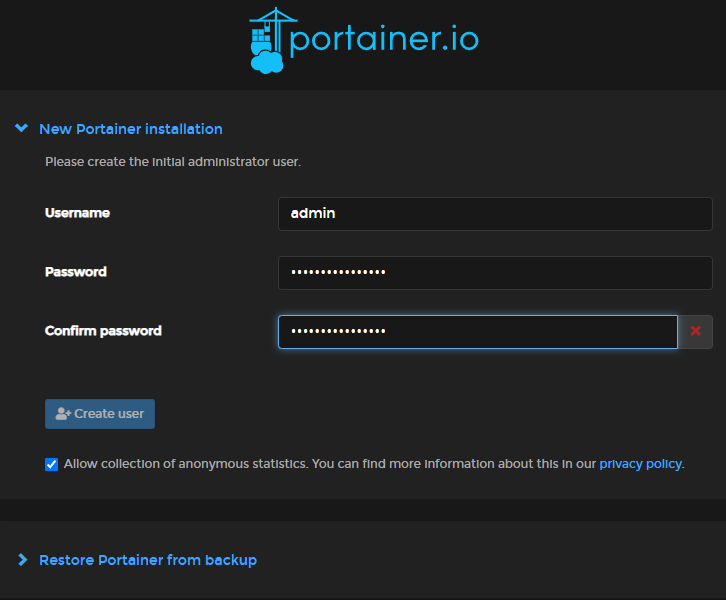
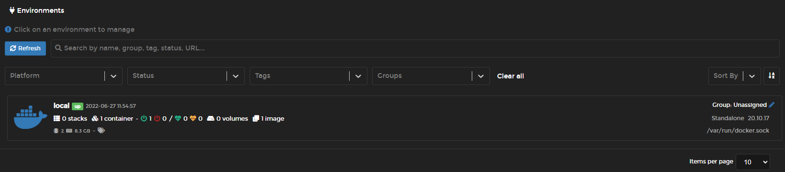

Assuming you have a running [Ubuntu VM](../../operating-systems/ubuntu/installation.md)
and installed [docker](../../software/docker/install-docker.md)

```shell
mkdir -p $HOME/docker/portainer
cd $HOME/docker
docker run -d \
--name portainer \
--restart=always \
-p 8000:8000 \
-p 9443:9443 \
-v /var/run/docker.sock:/var/run/docker.sock \
-v $PWD/portainer:/data \
portainer/portainer-ce:2.13.1
```

Example output:

```shell
user@vm:~/docker$ docker run -d \
--name portainer \
--restart=always \
-p 8000:8000 \
-p 9443:9443 \
-v /var/run/docker.sock:/var/run/docker.sock \
-v $PWD/portainer:/data \
portainer/portainer-ce:2.13.1
825dbaa272113f1d15c7df917f26e67228481172eaef8be91c007d3f582e92e0
```

Visit `https://YOUR.VM.IP.HERE:9443`

Create a username and password.



Click <kbd>Home 🏠</kbd>

You should see the `local` environment connected!



You are done!
