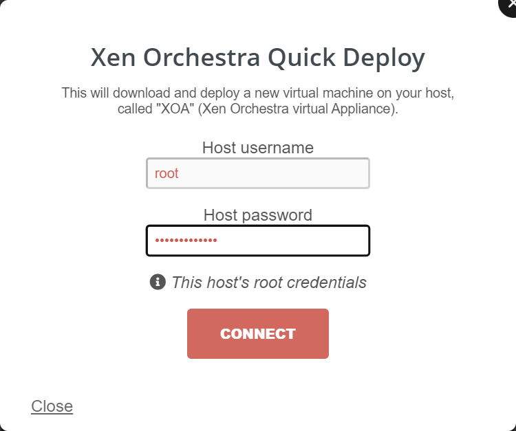
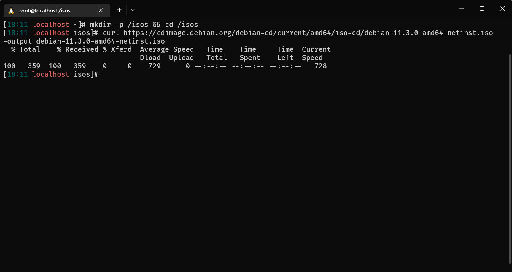
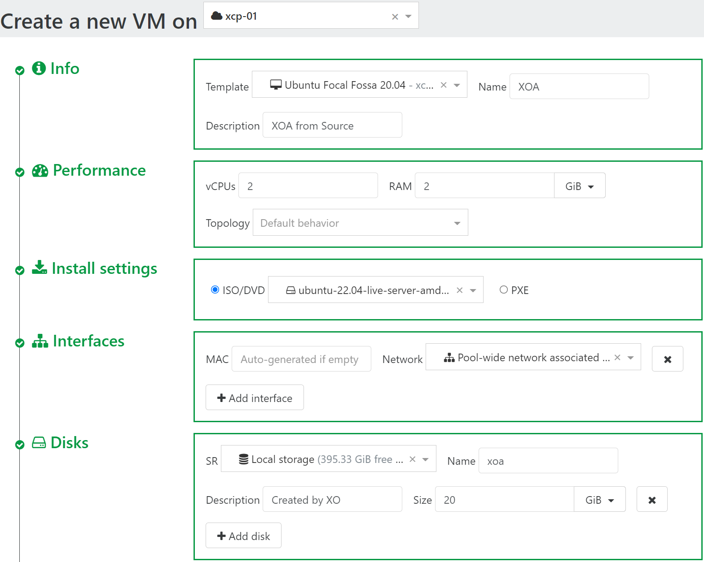

# XOA

## Xen Orchestra Appliance

Deploying XOA the first time is very easy.
Grab the IP of your xcp-ng host, and visit `https://<xpc-ng-host-ip>`

You will see a webpage like below

- Click <kbd>Quick Deploy</kbd>
- Type the root password you entered while installing xcp-ng
- Click <kbd>Connect</kbd>

- Leave everything empty if you want to use DHCP.
- Click <kbd>Next</kbd>

- Leave everything empty and change password later

or

- Create XOA Admin Account now
- Click <kbd>Deploy</kbd>

It will take a while to deploy XOA VM, depending on your hardware.
Once it's done it will redirect you to XOA's web login

Default Username/Password is:

Username: `admin@admin.net`
Password: `admin`

## XOA from source

Installing XOA from source gives you all the pro features available.

### Download the ISO

- Visit Debian's web [page](https://www.debian.org/CD/netinst/)
- Right click `amd64` under `netinst CD image` and click `Copy link address`
- SSH to your `xcp-ng` host
- Run `mkdir -p /isos && cd /isos`
- Run `curl https://cdimage.debian.org/debian-cd/current/amd64/iso-cd/debian-11.3.0-amd64-netinst.iso --output debian-11.3.0-amd64-netinst.iso`

### Create storage

Navigate to `➕New` > `💿Storage`

- Host: Select your host
- Name: `ISOs`
- Description: `Local storage for ISOs`
- Storage type: `ISO SR Local`
- Path: `/isos
- Click <kbd>▶️Create</kbd>

### Create VM

Navigate to `➕New > `🖥️VMs`

- Click <kbd>New VM</kbd>
- On the top select a pool
- **Info**
  - Template: `Debian Bullseye 11`
  - Name: `XOA`
  - Description: `XOA from Source`
- **Performance**
  - vCPUs: `2`
  - RAM: `2`
- **Install settings**
  - ISO/DVD: Select the debian netisntall iso
- **Disks**
  - Name: `xoa`
  - Size: `20GiB`
- **Advanced**
- Click <kbd>Show Advanced Settings</kbd>
- Check `Auto power on`
- Click <kbd>▶️Create</kbd>

### Install OS to VM

Navigate to `🏠Home` > `🖥️VMs`

- Click the <kbd>✖️</kbd> on the filter bar
- Click the stopped `XOA` VM
- Click <kbd>▶️</kbd> to start the VM
- Follow the on-screen instructions to install Debian

### Build XOA from source

TODO:

## Cleanup

Navigate to `🏠Home` > `🖥️VMs`

- Click `XOA` (The one with description of `Xen Orchestra virtual Appliance`)
- Click `Advanced`
- Click <kbd>Force shutdown</kbd>
- Click <kbd>Remove</kbd>
