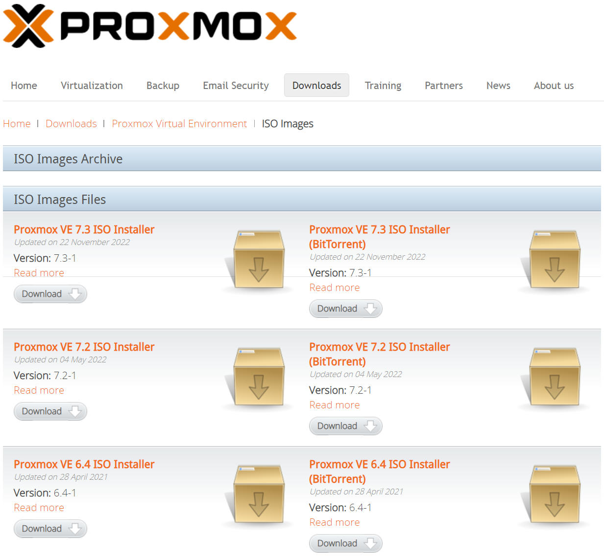

# Preparation

We will prepare a boot-able USB for installing Proxmox.

## Download installer and tools

### Proxmox

- Visit `Proxmox` [download](https://www.proxmox.com/en/downloads) page.
- Click `Proxmox Virtual Environment`
  
- Click `ISO Images`
  
- Click <kbd>Download</kbd> under `Proxmox VE 7.3 ISO Installer` (Or whatever the latest is)
  

### Rufus

Download rufus from their official [site](https://rufus.ie/en/)
Select either the portable version or the installer, both will work.

## Prepare the installation media (USB)

:::danger Destructive move

This process will **DELETE** any data in your USB stick.

:::

- Run `Rufus`
- Select your USB Stick on the `Device` drop down list
- On `Boot selection` Click <kbd>SELECT</kbd> and select the Proxmox ISO we downloaded earlier
- Check again that you selected the correct `Device` on previous step
- Click <kbd>START</kbd>
- Accept the **WARNING** saying that will **DESTROY** your data on this device

Once the process is finished you are ready to install `Proxmox` to your machine.
