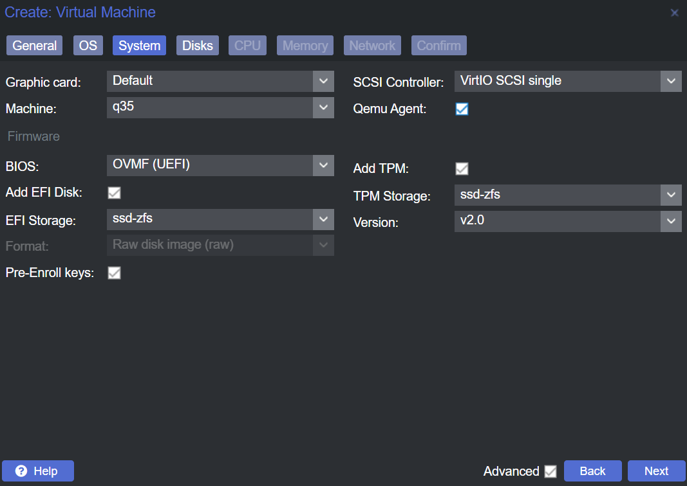
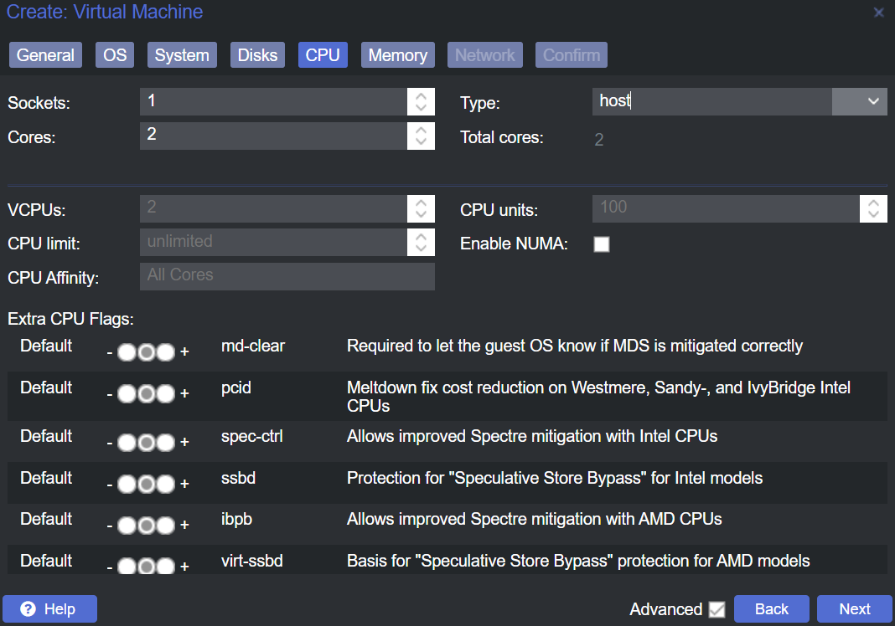
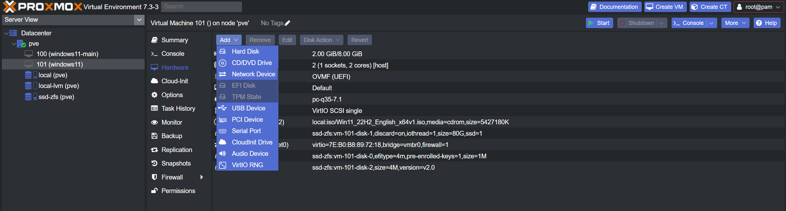
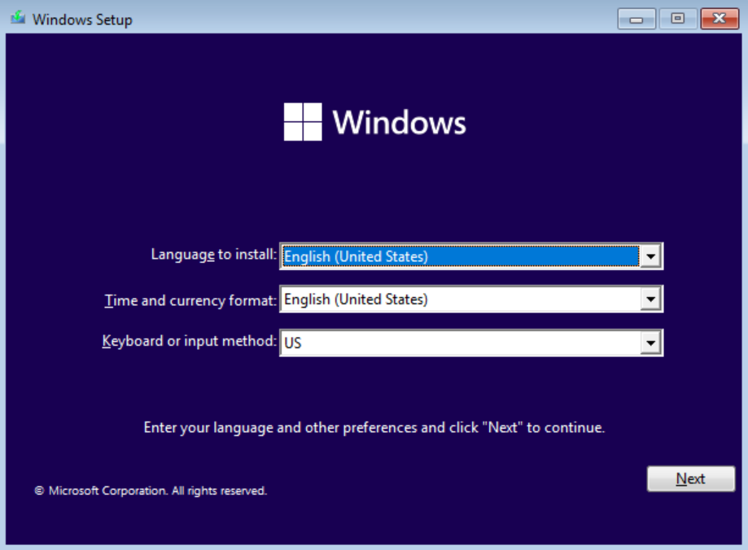
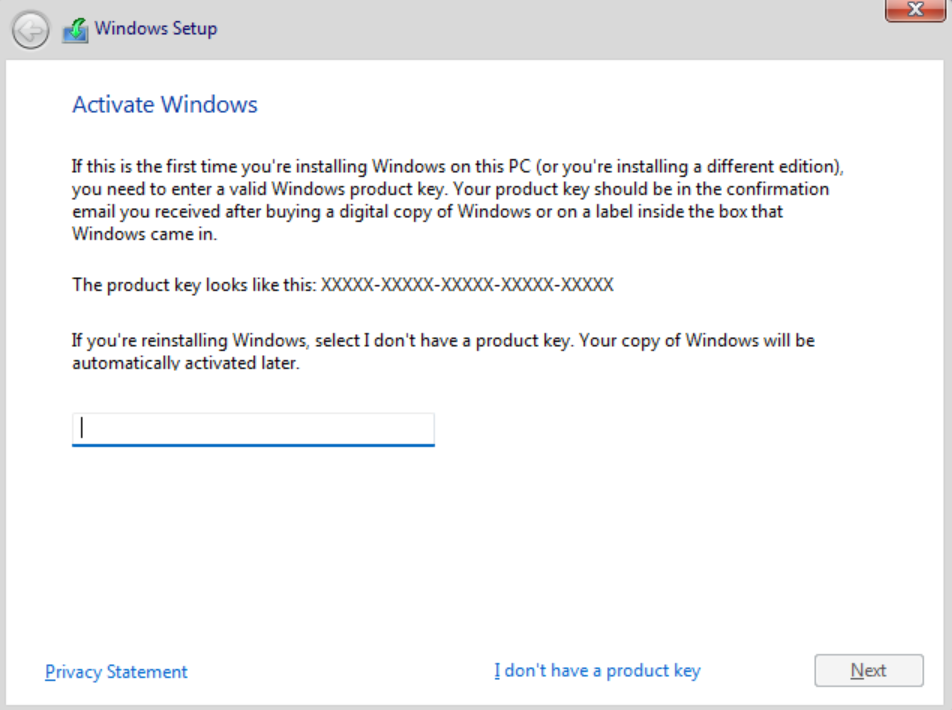
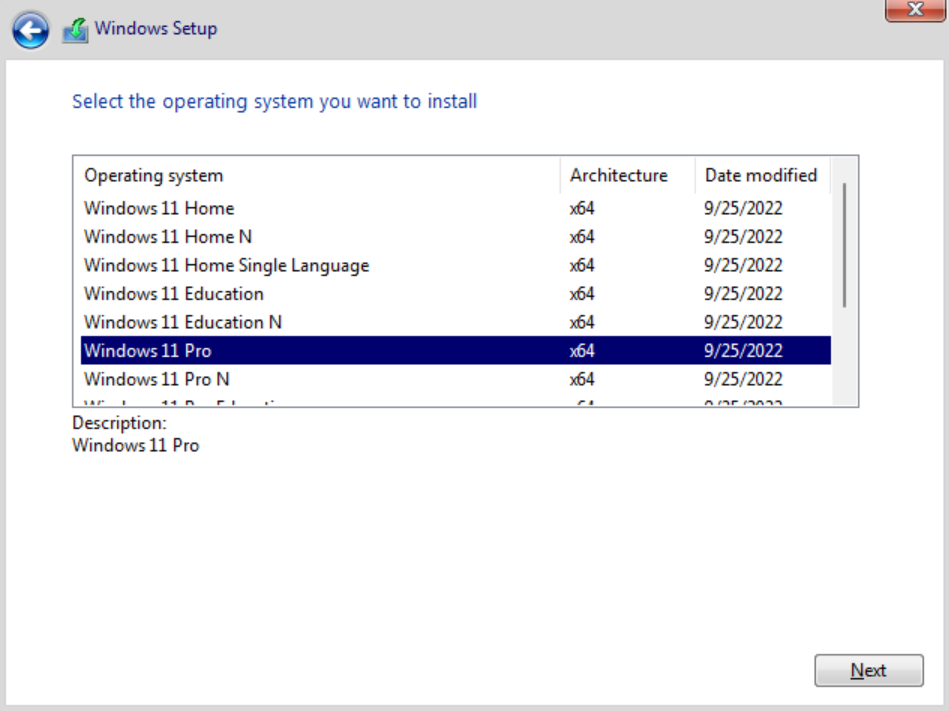
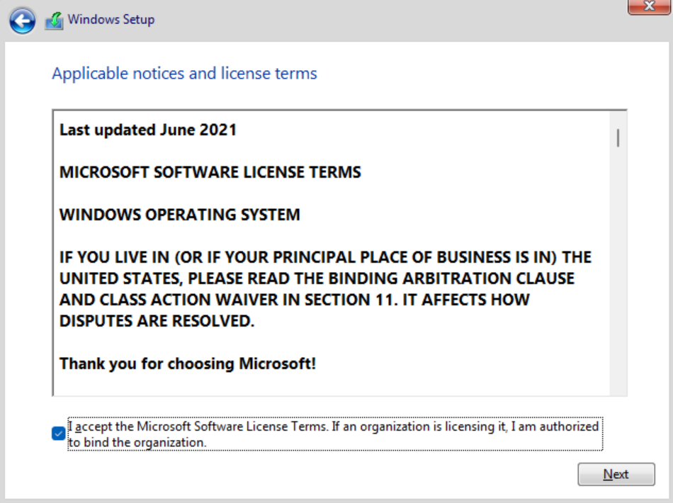
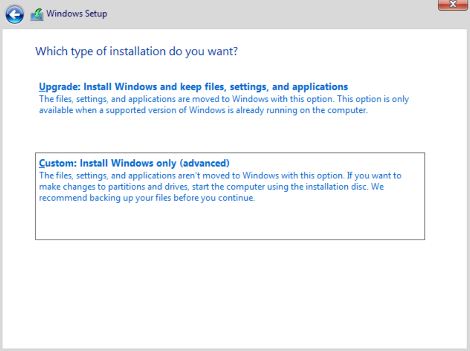
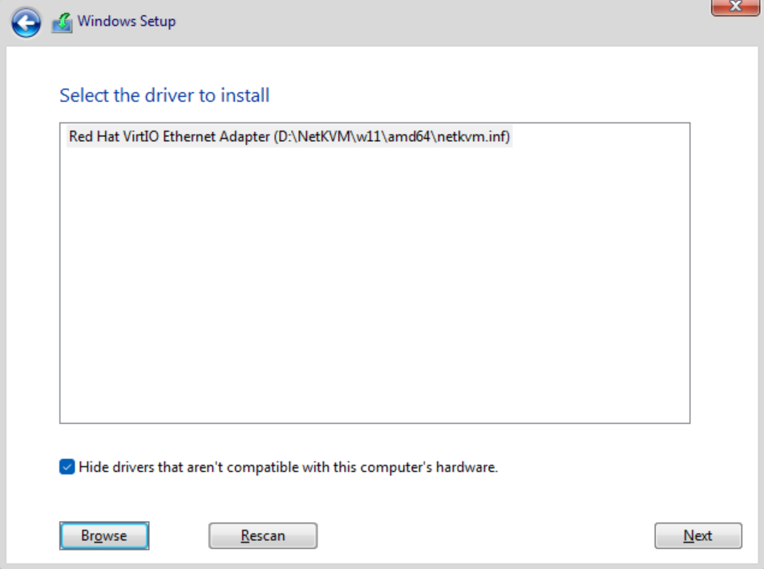
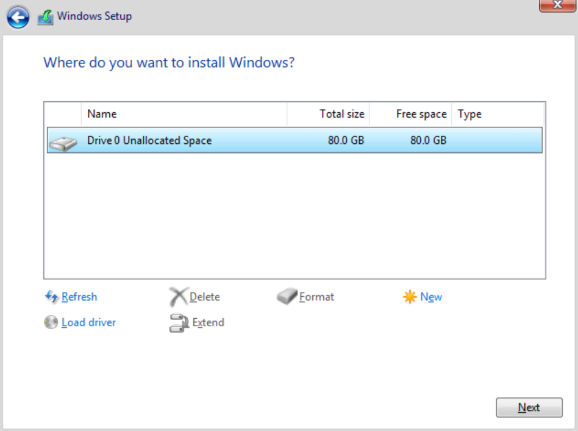

# Windows 11 VM

:::info Prerequisites

- Have [`VirtIO`](5-upload-iso.md#download-virtio-iso) and `windows` ISO's [uploaded](./5-upload-iso.md) to `Proxmox`

:::

## Create VM

Right click the node you want to create the VM.

- **General**:
  - Name: Give it a name
  - (Optional) Check `Start at boot`
  - Click <kbd>Next</kbd>
    
- **OS**:
  - Storage: Select the storage you have the `Windows` ISO
  - ISO Image: Select the `Windows` ISO
  - Type: `Windows`
  - Version: `11/2022`
  - Click <kbd>Next</kbd>
    
- **System**:
  - Machine: `q35`
  - BIOS: `OVMF (UEFI)`
  - Check `QEMU Agent`
  - Check `Add TPM`
  - TPM Storage: Select the storage for `TPM`
  - Version: `v2.0`
  - Check `Add EFI`
  - EFI Storage: Select the storage for `EFI`
  - Click <kbd>Next</kbd>
    
- **Disks**:
  - Bus/Device: `SCSI`
  - Storage: Select the storage for your `Windows` disk
  - Check `Discard`, if storage supports `Thin Provisioning`
  - Disk Size (GiB): Set Disk Size, at least 50GB
  - Check `SSD emulation`, if you checked `Discard`
  - Click <kbd>Next</kbd>
    
- **CPU**:
  - Cores: Set the core count for the VM to use
  - Type: Select `host`, if you don't plan to migrate to another node with a completely different CPU
  - Click <kbd>Next</kbd>
    
- **Memory**:
  - Memory (MiB): Set the maximum memory for the VM to use
  - Minimum memory (MiB): Set the minimum memory for the VM to use
  - Check `Ballooning Device`
  - Click <kbd>Next</kbd>
    
- **Network**:
  - Bridge: Select the NIC bridge for the VM to use
  - Model: `VirtIO (paravirtualized)`
  - Click <kbd>Next</kbd>
    

## Add `VirtIO` ISO

Navigate under the Node -> Select the VM -> `Hardware`

- Click <kbd>Add</kbd>
  
- Click <kbd>CD/DVD Drive</kbd>
- Storage: Select the storage you have the `VirtIO` ISO
- ISO Image: Select the `VirtIO` ISO
- Click <kbd>Add</kbd>
  

## Start `Windows` VM

Navigate under the Node -> Select the VM

- Click <kbd>▶️ Start</kbd>
- Click <kbd>>_ Console</kbd>
- When the window open, it will ask you to press any key.
  - Press any key in your keyboard, eg <kbd>Space</kbd>
    
- Select your Language
  
- Click <kbd>Next</kbd>
  
- Click <kbd>Install now</kbd>
- Enter your product key or click <kbd>I don't have a product key</kbd>
  
- Click <kbd>Next</kbd>
- Select the version you want to install
  
- Click <kbd>Next</kbd>
- Check `I accept...`
  
- Click <kbd>Next</kbd>
- Select `Custom: Install Windows only (advanced)`
  
- Click <kbd>Load Driver</kbd>
  
- Click <kbd>Browse</kbd>
- Expand `CD Drive (D:) virtio-win`
- Expand `amd64`
- Select `w11`
  
- Click <kbd>OK</kbd>
  
- Click <kbd>Next</kbd>
- Click <kbd>Load Driver</kbd>
  
- Click <kbd>Browse</kbd>
- Expand `CD Drive (D:) virtio-win`
- Expand `NetKVM`
- Expand `w11`
- Select `amd64`
- Click <kbd>OK</kbd>
  
- Click <kbd>Next</kbd>
- Select the `Drive 0`
  
- Click <kbd>Next</kbd>
- Wait for installation for finish
