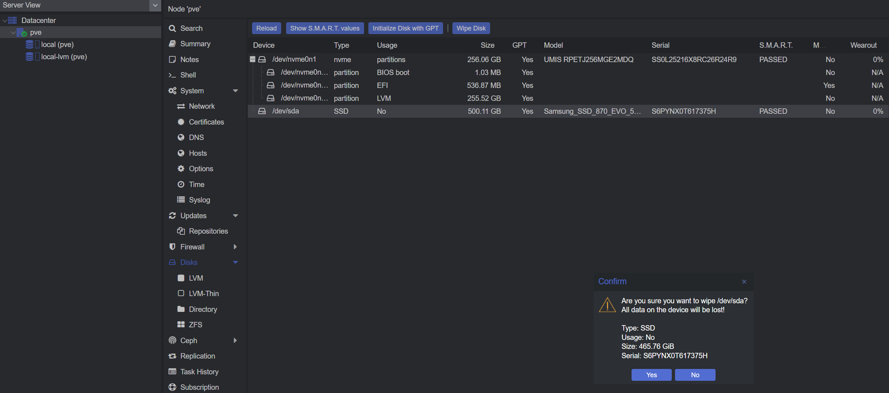
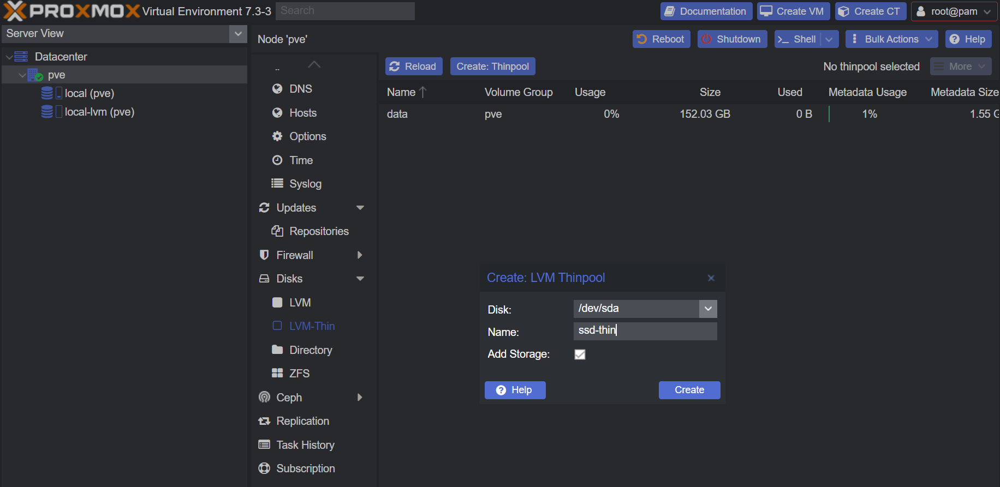

# Add additional disk

We will be adding an additional SSD for Proxmox to use.

There are a few options to go.

:::danger

Any process bellow will **wipe** data of the disk!

:::

## LVM Thin

LVM Thin cannot be used for ISOs. Only for VM Disks and CT Volumes.
But it will allow thin provisioning for disks and volumes.

Navigate under your Node to `Disks`

- Select your disk you want to add
- Click <kbd>Wipe Disk</kbd>
- Click <kbd>Yes</kbd>
  
- Select your disk again
- Click <kbd>Initialize Disk with GPT</kbd>

Navigate under your Node to `Disks` -> `LVM-Thin`

- Click <kbd>Create: Thinpool</kbd>
- Select your disk you want to add
- Give it a name
- Click <kbd>Create</kbd>
  

You are done!
