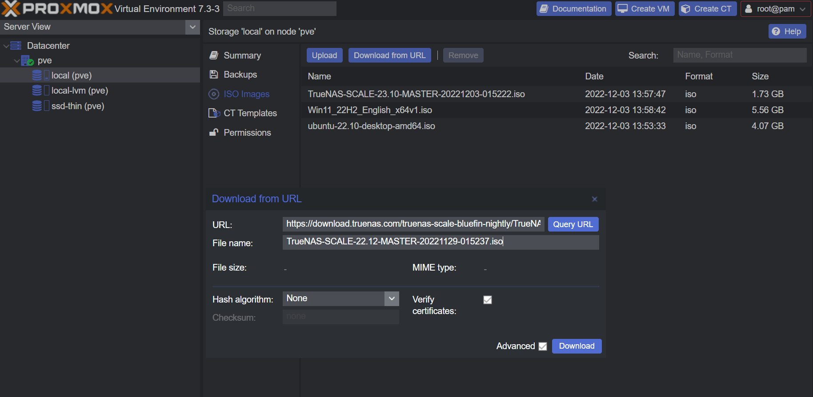

# Upload ISO's to Proxmox

Navigate to your Node -> `local(pve)` -> `ISO Images`

## Local ISO

Upload an ISO you have on your computer

- Click <kbd>Upload</kbd>
- Select the ISO image on your computer
- Click <kbd>Upload</kbd>
  

## Download from URL

Download an ISO from a URL

- Click <kbd>Download from URL</kbd>
- Paste the ISO download URL
- Give it a file name
- Click <kbd>Download</kbd>
  
