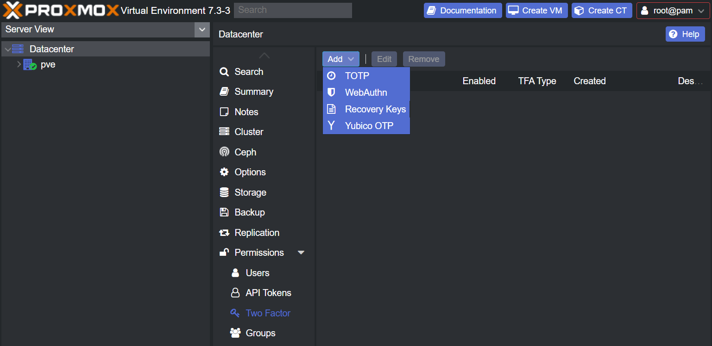
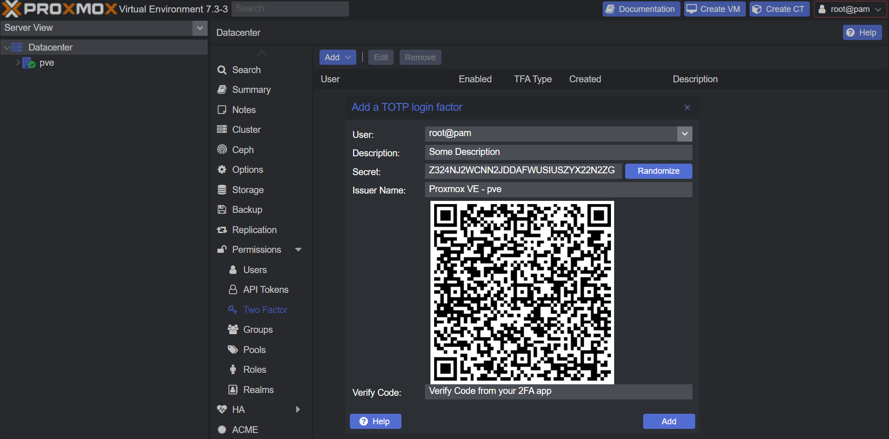
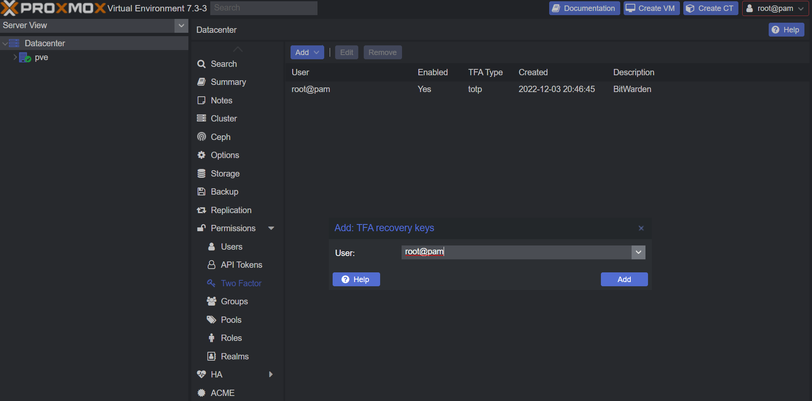

# Two Factor Authentication

`Proxmox` supports 2FA out of the box.

Navigate under `Datacenter` -> `Permissions` -> `Two Factor`

- Click <kbd>Add</kbd>
- Click <kbd>TOTP</kbd>
  
- Fill in `Description`
- Copy `Secret` or `Scan` QR code to your 2FA App
- Fill in `Verify Code` from the 2FA App
- Click <kbd>Add</kbd>
  
- Click <kbd>Add</kbd> again
- Click <kbd>Recovery Keys</kbd>
- Select your user
  
- Click <kbd>Add</kbd>
- Copy and/or print recovery keys
  
