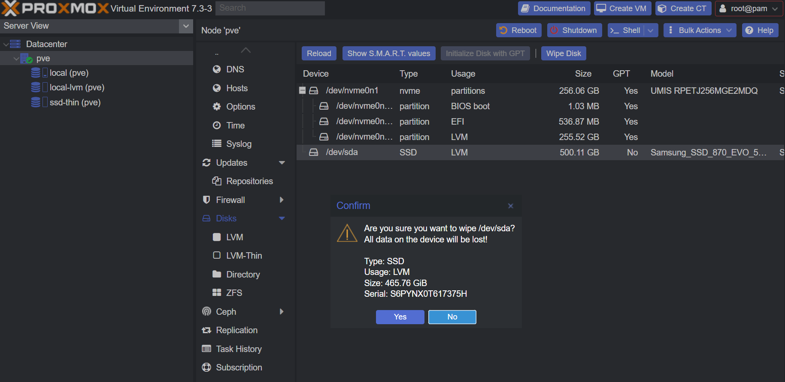
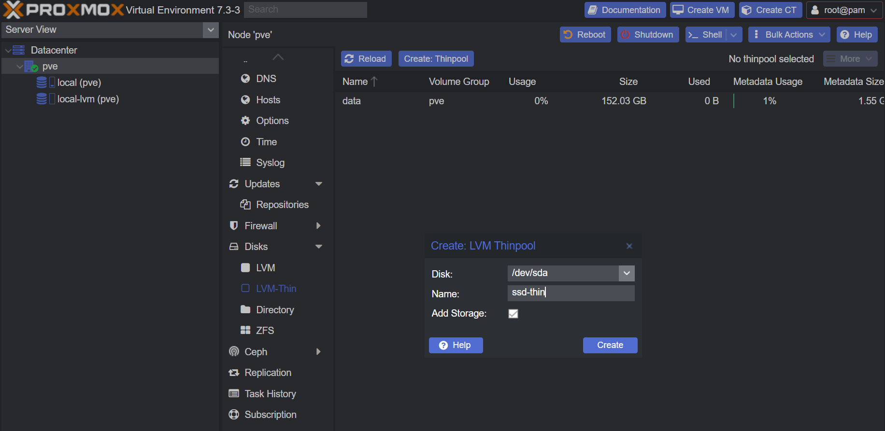
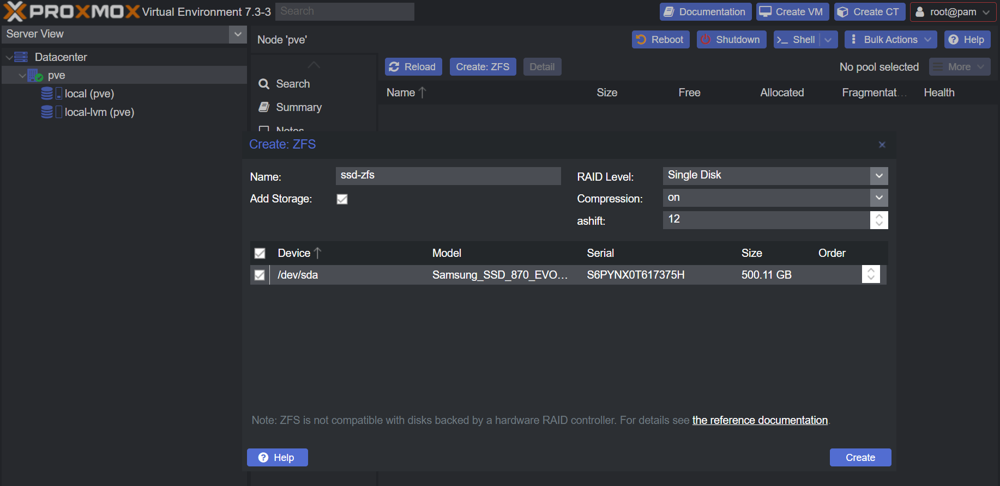

## Network Storage

### NFS

TODO:

## Disk Storage

We will be adding disk(s) for Proxmox to use.

There are a few options to go.

:::danger

The process bellow will **wipe** data of the disk!

:::

Prepare the disk(s) by wiping them.

Navigate under your `Node` to `Disks`

- Select your disk you want to add
- Click <kbd>Wipe Disk</kbd>
- Click <kbd>Yes</kbd>
  

### LVM Thin

`LVM Thin` cannot be used for ISOs. Only for VM Disks and CT Volumes.
But it will allow thin provisioning for disks and volumes.

Navigate under your `Node` to `Disks` -> `LVM-Thin`

- Click <kbd>Create: Thinpool</kbd>
- Select the disk(s) you want to add
- Give it a name
- Click <kbd>Create</kbd>
  

### ZFS

`ZFS` cannot be used for ISOs. Only for VM Disks and CT Volumes.

Navigate under your `Node` to `Disks` -> `ZFS`

- Click <kbd>Create: ZFS</kbd>
- Give it a name
- Select RAID Level
- Select the disk(s) you want to add
- Click <kbd>Create</kbd>
  
