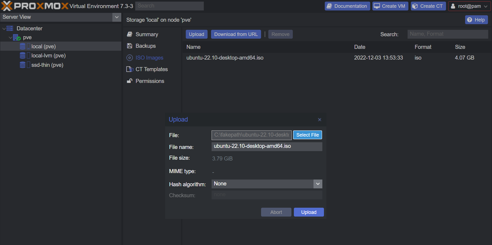
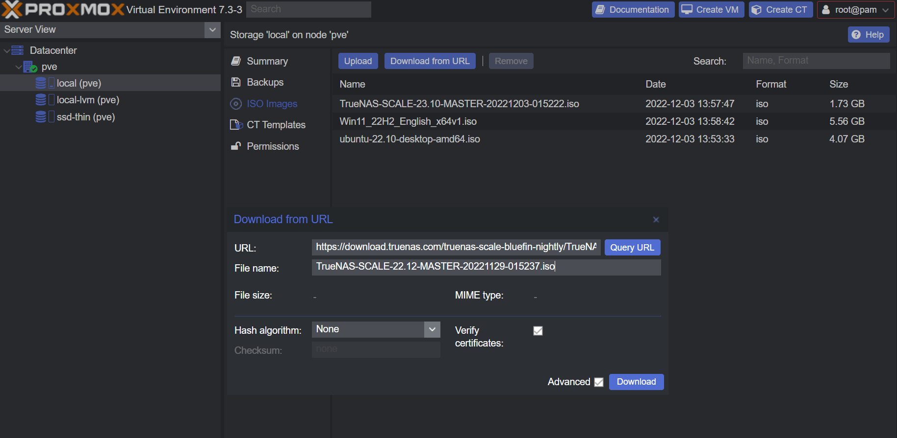
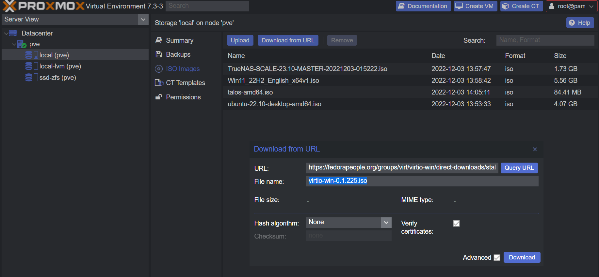

Navigate to your `Node` -> `local(pve)` -> `ISO Images`

## Local ISO

Upload an ISO you have on your computer

- Click <kbd>Upload</kbd>
- Select the ISO image on your computer
- Click <kbd>Upload</kbd>
  

## Download from URL

Download an ISO from a URL

- Click <kbd>Download from URL</kbd>
- Paste the ISO download URL
- Give it a file name
- Click <kbd>Download</kbd>
  

## Download VirtIO ISO

Visit `Proxmox`'s VirtIO wiki in [download section](https://pve.proxmox.com/wiki/Windows_VirtIO_Drivers#Installation).

Direct ISO link: `https://fedorapeople.org/groups/virt/virtio-win/direct-downloads/stable-virtio/virtio-win.iso`

- Right click `download the latest stable` and copy link
- Click <kbd>Download from URL</kbd>
- Paste the ISO download URL
- Give it a file name (eg `virtio-win-0.1.225.iso`)
- Click <kbd>Download</kbd>
  
