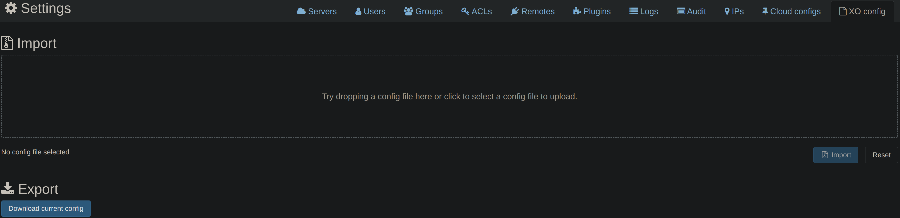
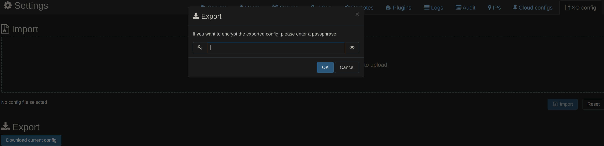
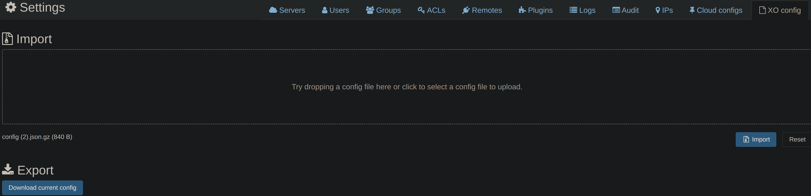
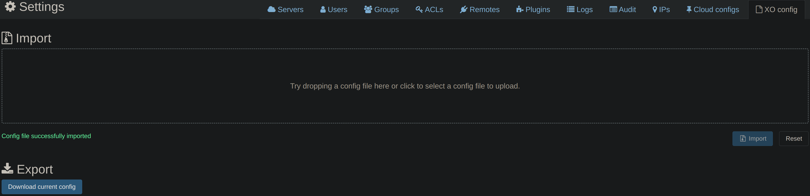

:::danger Danger

This only backs up the XOA configuration, not the VMs or their data.

:::

:::warning Warning

Backup file contains sensitive information like passwords
as plain text, so keep it safe.

:::

## Backup XOA Configuration

Navigate to `Settings` > `XO Config`

- Click <kbd>Download current config</kbd>
-
  

- (Optional) Enter a password to encrypt your backup

  

- Click <kbd>OK</kbd>

## Restore XOA Configuration

If you want to restore to a new installation, follow
the [installation guide](./install.md) and then come back here.

- Navigate to `Settings` > `XO Config`
- Drag and drop your backup file in the `Import` area

  

- Click <kbd>Import</kbd>
- You can see the name of the file you just uploaded

  

- (Optional) Enter the password you used to encrypt your backup
- Click <kbd>OK</kbd>
- You can see the success message

  

- You have successfully restored your XOA configuration
