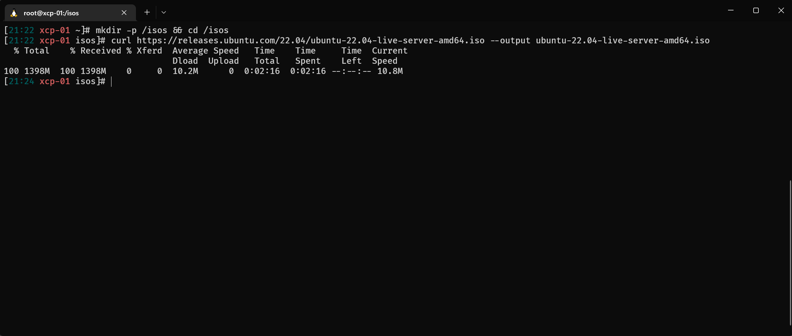
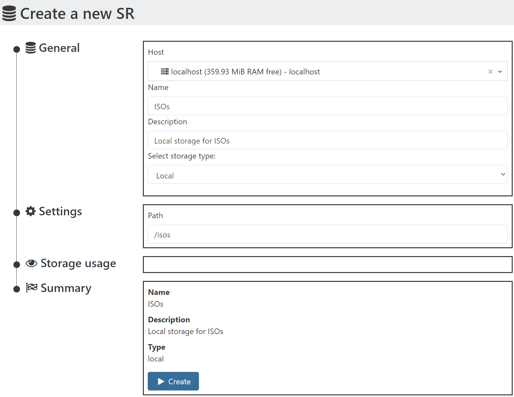

Start by SSH-ing to your `xcp-ng` host

## Create storage directory

  ```shell
  mkdir -p /isos && cd /isos
  ```

## Download ISO

  ```shell
  curl https://releases.ubuntu.com/22.04/ubuntu-22.04-live-server-amd64.iso --output ubuntu-22.04-live-server-amd64.iso
  ```



## Create ISO storage in XOA

Navigate to `➕New` > `💿Storage`

- Host: Select your host
- Name: `ISOs`
- Description: `Local storage for ISOs`
- Storage type: `ISO SR Local`
- Path: `/isos`
- Click <kbd>▶️Create</kbd>
  
