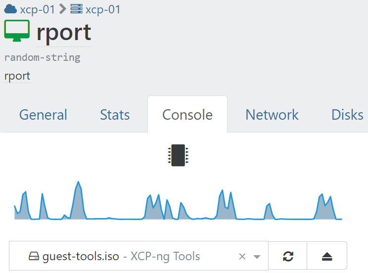

## Install guest tools (Optional)

- On XenOrchestra navigate to the console tab of your VM
- Mount the `guest-tools.iso` on the dropdown



- SSH to your VM
- Mount the `guest-tools.iso`

  ```shell
  sudo mount /dev/cdrom /mnt
  ```

- Run the install script

  ```shell
  sudo /mnt/Linux/install.sh
  ```

- Unmount the `guest-tools.iso`

  ```shell
  sudo umount /dev/cdrom
  sudo reboot
  ```

Example output:

```shell
user@vm:~$   sudo mount /dev/cdrom /mnt
sudo /mnt/Linux/install.sh
sudo umount /dev/cdrom
mount: /mnt: WARNING: source write-protected, mounted read-only.
Detected `Ubuntu 22.04 LTS' (ubuntu version 22).

The following changes will be made to this Virtual Machine:
  * packages to be installed/upgraded:
    - xe-guest-utilities_7.20.0-9_amd64.deb

Continue? [y/n] y

(Reading database ... 74231 files and directories currently installed.)
Preparing to unpack .../xe-guest-utilities_7.20.0-9_amd64.deb ...
Unpacking xe-guest-utilities (7.20.0-9) over (7.20.0-9) ...
Setting up xe-guest-utilities (7.20.0-9) ...

You should now reboot this Virtual Machine.
```
