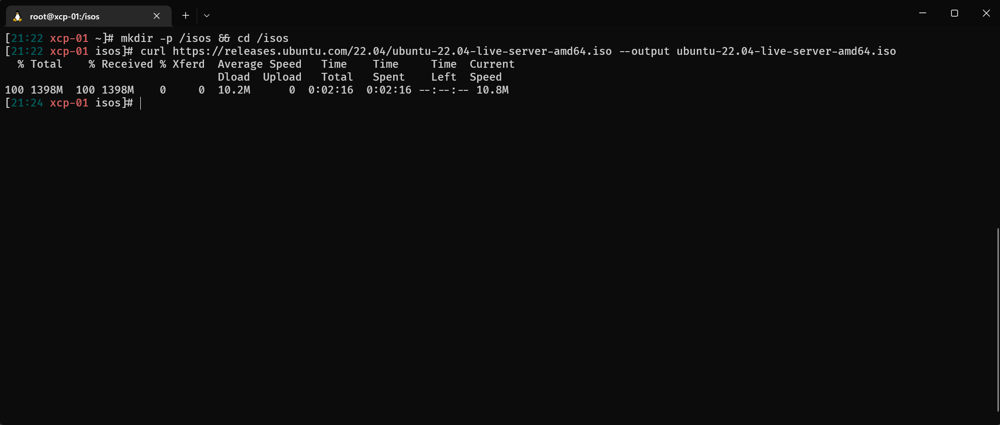
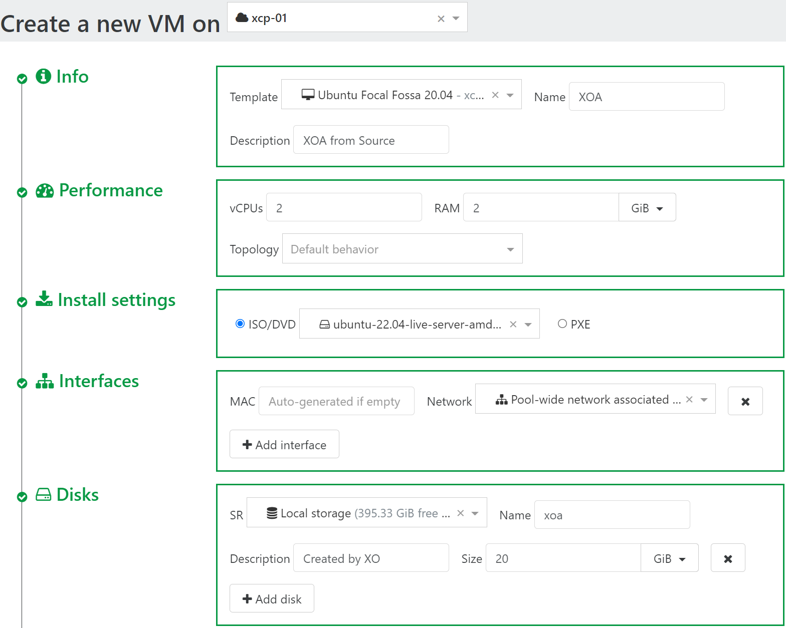

## Download the ISO

- Visit Ubuntu's web [page](https://ubuntu.com/download/server)
- Select `Option 2 - Manual server installation`
- Click <kbd>Download Ubuntu Server 22.04 LTS</kbd>
  
- Right click `download now` under `Thank you` and click `Copy link address`
  
- SSH to your `xcp-ng` host

  ```shell
  mkdir -p /isos && cd /isos
  curl https://releases.ubuntu.com/22.04/ubuntu-22.04-live-server-amd64.iso --output ubuntu-22.04-live-server-amd64.iso
  ```



## Create storage

Navigate to `➕New` > `💿Storage`

- Host: Select your host
- Name: `ISOs`
- Description: `Local storage for ISOs`
- Storage type: `ISO SR Local`
- Path: `/isos
- Click <kbd>▶️Create</kbd>


## Create VM

Navigate to `➕New` > `🖥️VMs`

- Click <kbd>New VM</kbd>
- On the top select a pool
- **Info**
  - Template: `Ubuntu Focal Fossa 20.04`
  - Name: `XOA` (Give a name for your VM)
  - Description: `XOA from Source` (Give a Description for your VM)
- **Performance**
  - vCPUs: `2`
  - RAM: `2`
- **Install settings**
  - ISO/DVD: Select `ubuntu-22.04-live-server-amd64.iso`
- **Disks**
  - Name: `xoa` (Give a name for your disk)
  - Size: `20GiB`
- **Advanced**
- Click <kbd>Show Advanced Settings</kbd>
- Check `Auto power on`
- Click <kbd>▶️Create</kbd>




## Install OS to VM

Navigate to `🏠Home` > `🖥️VMs`

- Click `XOA` VM (with descriptions `XOA from Source`)
- Navigate to `Console`
- Follow the on-screen instructions to install `Ubuntu`
