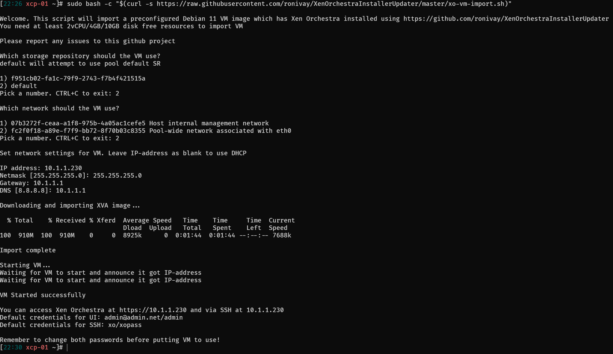
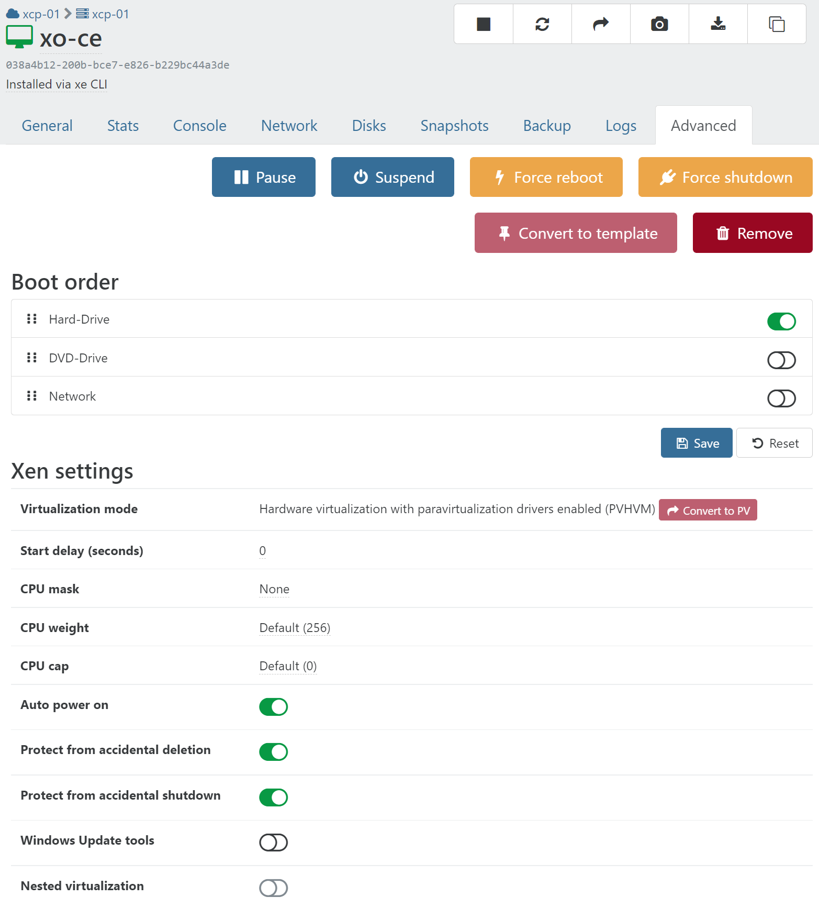

- SSH to your `xcp-ng` host
- Run the following command

  ```shell
  sudo bash -c "$(curl -s https://raw.githubusercontent.com/ronivay/XenOrchestraInstallerUpdater/master/xo-vm-import.sh)"
  ```

- Follow the on-screen instructions
- Visit `https://<ip.you-entered-on.setup>`

  

- Done

You might want to make this VM auto start when xcp-ng host boots.
Also protect from accidental deletion or shutdown.

Navigate to `🏠Home` > `🖥️VMs`

- Click `xo-ce`
- Click `Advanced`
- Toggle on `Auto power on`
- Toggle on `Protect from accidental deletion`
- Toggle on `Protect from accidental shutdown`

  

- Follow the [Quick Start](../use-xoa) guide
